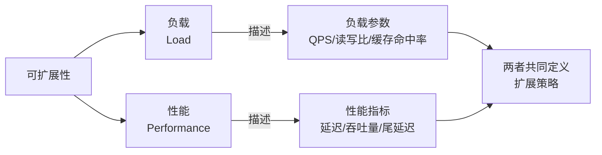
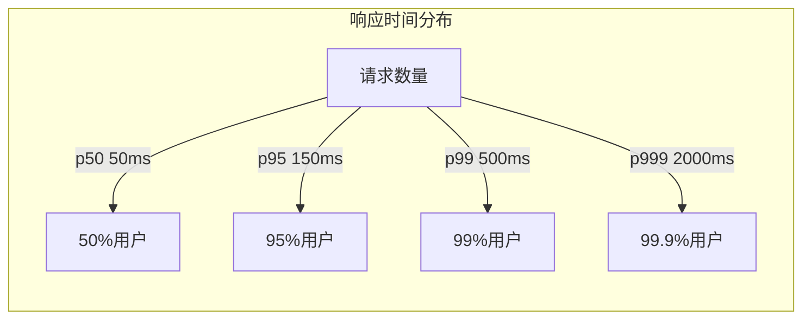
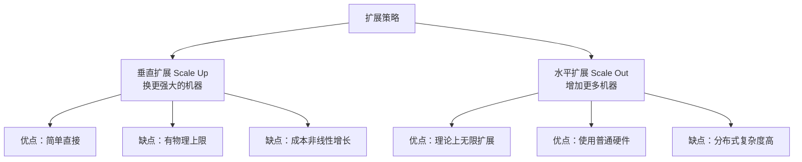
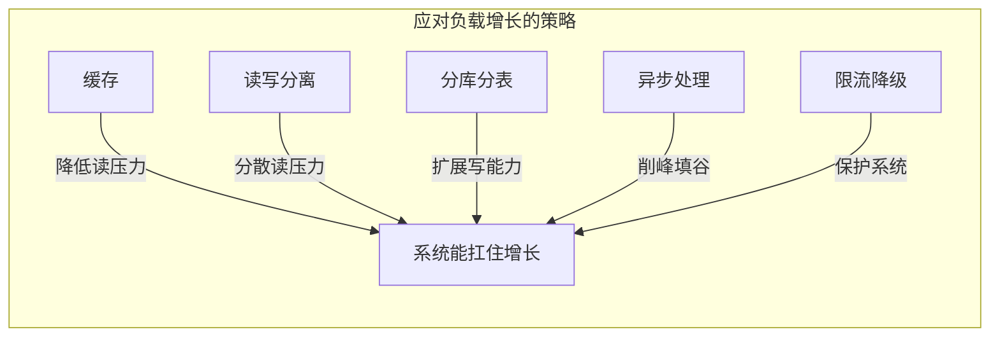

# 可扩展性——当流量暴涨10倍，你的系统扛得住吗？

> 流量暴涨10倍，系统还能不能扛住？可扩展性不是“无限扩展”，而是“优雅地应对增长”。

上一篇文章我们聊了**可靠性**——故障发生时系统如何 survive。

今天我们来聊第二个核心目标：**可扩展性（Scalability）**。

如果说可靠性关注的是“系统在面对故障时的表现”，那么可扩展性关注的是“系统在面对**负载增长**时的表现”。

你的系统今天每天处理 10 万请求，但明天可能就变成 100 万——**当流量暴涨 10 倍时，系统还能扛得住吗？**

## 一、什么是可扩展性？

### 一个被滥用的词

“可扩展”可能是技术领域最被滥用的词之一。每个数据库都说自己是“可扩展的”，每个架构都说自己是“可扩展的”。

但可扩展性**不是一个非黑即白的状态**，而是一个**持续应对变化的能力**。

用 DDIA 的话说：

> **可扩展性**指的是：系统有合理的办法来应对负载的增长——包括数据量的增长、流量的增长、复杂性的增长。

要讨论可扩展性，必须先回答两个问题：

1. **如果负载增加而系统资源不变，性能会下降多少？**
2. **如果要保持性能不变，需要增加多少资源？**

### 可扩展性的两个维度

可扩展性的讨论，**必须同时包含“负载”和“性能”两个维度**。只说“系统能扩展”却不说明扩展什么、在什么条件下扩展，是没有意义的。

## 二、描述负载：选对负载参数

负载需要用具体的**负载参数（Load Parameters）** 来量化。不同的系统关注不同的参数：

| 系统类型 | 关键负载参数 |
|---|---|
| Web 服务器 | 每秒请求数（QPS） |
| 数据库（读多写少） | 读写比率、缓存命中率 |
| 数据库（写多读少） | 每秒写入行数 |
| 聊天室 | 同时活跃用户数 |
| 视频流服务 | 并发流数、带宽消耗 |
| 分布式文件系统 | 文件数量、总存储容量 |

### 案例：Twitter 的“扇出”问题

DDIA 用了一个非常经典的案例——Twitter——来说明负载描述的重要性。

2012 年，Twitter 的负载情况：

- **发推**：约 12,000 次/秒
- **刷时间线**：约 300,000 次/秒

真正的挑战不在于总流量，而在于**扇出（Fan-out）** ——一条推文需要被插入到所有关注者的时间线中。

一个拥有 3,000 万粉丝的大 V 发一条推文，**瞬间就是 3,000 万次写入操作**。

Twitter 最初的方案是“发推时写入全局集合，读时间线时做 JOIN”——这种方式写操作轻，但读操作重。

后来改为“发推时预计算并插入每个关注者的时间线”——读操作轻了，但写操作（尤其大 V 发推时）变得极重。

最终 Twitter 采用了**两者结合**的混合方案：

- 普通用户：发推时预写入所有粉丝的时间线缓存
- 大 V：发推时只写入全局集合，粉丝读取时实时 JOIN

> 这个案例告诉我们：**没有“标准答案”，只有“适合你的负载特征的答案”。** Twitter 的负载特征（大 V 效应）决定了它的解决方案。

## 三、描述性能：别只看平均值

描述完负载之后，下一个问题是：**如何衡量性能？**

### 吞吐量 vs 响应时间

| 系统类型 | 核心性能指标 |
|---|---|
| **批处理系统** | **吞吐量（Throughput）** ——每秒处理多少数据 |
| **在线系统** | **响应时间（Response Time）** ——请求从发出到完成需要多久 |

### 为什么平均值不够？

假设一次 API 调用的平均响应时间是 100ms，看起来还不错。

但如果 99% 的请求都在 50ms 内完成，而 1% 的请求需要 5 秒——那 1% 的用户体验是灾难性的。

> **平均值掩盖了尾部的极端值。**

DDIA 强调使用**百分位数（Percentiles）** 来衡量响应时间：

| 百分位 | 含义 | 代表什么 |
|---|---|---|
| **p50（中位数）** | 50% 的请求比这个快 | “典型用户”的体验 |
| **p95** | 95% 的请求比这个快 | 体验较好的 95% 用户 |
| **p99** | 99% 的请求比这个快 | **最差 1% 用户的体验** |
| **p999** | 99.9% 的请求比这个快 | 极端尾部 |

**尾部延迟（Tail Latency）为什么重要？**

亚马逊曾经统计过：**p99 响应时间每增加 100 毫秒，销售额下降 1%。**

在规模面前，最慢的那 1% 用户，代表的可能是数以百万计的真实用户和真金白银的损失。

### 实践建议

- 在监控面板上，**同时显示 p50、p95、p99**
- 设置告警时，**不要只基于平均值**
- 优化性能时，**优先关注 p99 而不是平均值**

## 四、水平扩展 vs 垂直扩展

当负载增长时，主要有两种应对方式。

### 两种扩展策略

**垂直扩展（Scale Up）：**

- 换更大的机器（更多 CPU、更多内存、更快磁盘）
- **优点**：简单直接，不需要改架构
- **缺点**：有物理上限（最顶级的机器也有限制），成本非线性（顶级机器比普通机器贵很多）

**水平扩展（Scale Out）：**

- 增加更多机器，将负载分布到多台机器上
- **优点**：理论上可以无限扩展，使用普通硬件成本低
- **缺点**：分布式系统的所有复杂性——网络、一致性、分区、共识

### 弹性扩展

**弹性系统（Elastic System）** 可以**在检测到负载增加时自动增加计算资源**，负载下降时自动回收资源。

- 适合负载波动大的场景（如电商大促）
- 云原生环境（Kubernetes HPA）天然支持弹性扩展

### 一个关键提醒

> **无状态服务的水平扩展相对简单，但带状态的数据系统（如数据库）从单节点扩展到分布式，会引入大量的额外复杂度。**

这也是为什么 DDIA 说：**“应该尽量把数据库放在单个节点上。”**

不是不要分布式，而是在确实需要的时候才引入它。

## 五、应对负载增长的实战策略

### 策略一：缓存

- 将频繁读取的数据放在内存缓存中（Redis、Memcached）
- 有效降低数据库的读负载
- 注意缓存一致性问题（Cache Invalidation 是计算机科学的两大难题之一）

### 策略二：读/写分离

- 主库处理写入，从库处理读取
- 有效分散读压力
- 注意复制延迟问题

### 策略三：分库分表

- 将数据分散到多个数据库/表中
- 有效扩展写能力
- 引入分布式事务和跨库查询的复杂性

### 策略四：异步处理

- 将同步操作改为异步（消息队列）
- 削峰填谷，平滑处理流量高峰
- 牺牲实时性换取吞吐能力

### 策略五：限流降级

- 保护系统不被超载流量压垮
- 优先保证核心功能，非核心功能降级

## 六、写在最后

可扩展性的本质，是**提前思考和规划系统如何应对增长**——而不是在流量把系统冲垮之后再手忙脚乱地救火。

回顾一下今天的核心内容：

1. **可扩展性需要同时描述负载和性能**——只说“能扩展”没有意义
2. **选对负载参数**——QPS、读写比、缓存命中率、扇出等
3. **用百分位数衡量性能**——平均值掩盖尾部，p99 才是关键
4. **水平扩展 vs 垂直扩展**——各有优劣，分布式引入巨大复杂度
5. **多种策略组合使用**——缓存、读写分离、分库分表、异步、限流

> 正如 DDIA 所说：**“架构师的主要职责之一，就是预测负载的增长，并确保系统有办法应对这种增长。”**

下次当你设计一个系统时，不妨问自己：

- **如果流量翻 10 倍，系统的瓶颈在哪里？**
- **是数据库撑不住，还是网络带宽不够？**
- **优化方案是加机器还是改架构？**
- **增加资源后的收益是线性的还是递减的？**

这些问题的答案，决定了你的系统能活多久。

**下一篇预告：数据模型之战——关系型、文档型、图数据库怎么选？**