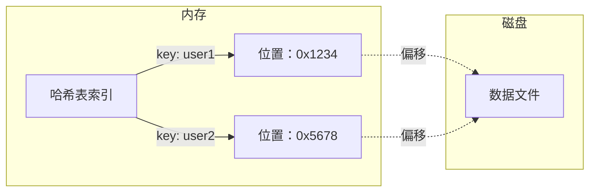
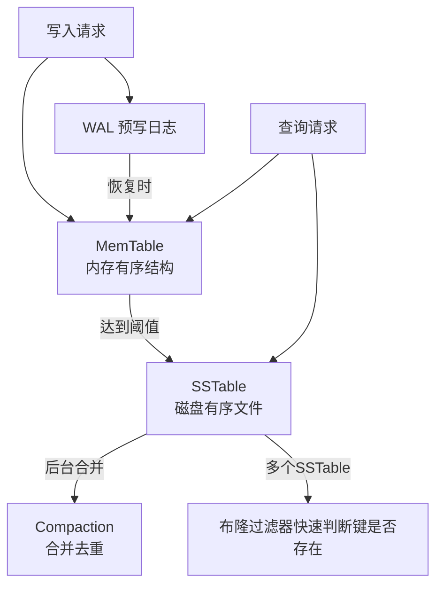

# 存储引擎探秘——LSM-Tree vs B-Tree，谁更胜一筹？

> 数据库底层的存储引擎决定了你写入和查询的速度——B-Tree 和 LSM-Tree 是两大主流，各有各的绝活。

上篇文章我们聊了数据模型——应用层看到的数据组织方式。但数据最终要落到磁盘上，**怎么存、怎么读、怎么更新**，这些由存储引擎（Storage Engine）决定。

存储引擎是数据库最核心的组件，也是性能的根基。目前主流的两大存储引擎架构是：**B-Tree** 和 **LSM-Tree**。

- **B-Tree**：几乎所有传统关系数据库（MySQL InnoDB、PostgreSQL）都在用，原地更新，擅长事务和范围查询
- **LSM-Tree**：很多 NoSQL 数据库（Cassandra、LevelDB、RocksDB）以及某些关系库的存储后端（如 MongoDB WiredTiger）在使用，追加写入，写入吞吐极高

了解这两种引擎的工作原理和适用场景，能帮你做出更明智的数据库选型。

---

## 一、从最简单的数据库开始

DDIA 用了一个非常有趣的例子来引入存储引擎的概念——一个用 Bash 写的迷你数据库：

```bash
#!/bin/bash
db_set() {
    echo "$1,$2" >> database
}
db_get() {
    grep "^$1," database | sed -e "s/^$1,//" | tail -n 1
}
```

- `db_set key value`：把键值对追加到文件末尾
- `db_get key`：从文件末尾向上搜索，找到最新的那个值

这个简单的实现，就是 **日志结构存储（Log-Structured Storage）** 的雏形：

- 写入极快（只是追加）
- 读取极慢（需要扫描整个文件）
- 需要定期压缩（防止文件无限膨胀）

大多数存储引擎本质上是在这个基本模型上做优化，核心问题都是：**如何让读也快起来？**

---

## 二、哈希索引：最简单的索引

为了让读变快，最简单的思路是建一个**索引**——就像书的目录，告诉你某个键的数据在文件的哪个位置。

最简单的索引是**内存中的哈希表**：键 → 数据在文件中的字节偏移。



这就是 **Bitcask**（Riak 的默认存储引擎）的设计思路：

- 写入：追加到日志文件，同时更新内存哈希表
- 读取：通过哈希表直接定位，一次磁盘 I/O
- 缺点：哈希表必须全部放在内存中，如果键太多就放不下

### 如何解决磁盘空间问题？

日志文件会无限增长，需要**分段压缩（Compaction）** 和**合并（Merging）** ：

- 将日志文件分成多个**段（Segment）**
- 每段达到一定大小后，不再写入，开始新的段
- 后台线程对段进行**压缩**：丢弃重复键，只保留每个键的最新值
- 多个段可以**合并**成更大的段，进一步提升空间效率

这样，整个存储系统由**多个段组成**，每个段有各自的内存哈希索引，写入时只操作当前活跃段，读取时从新到旧依次查询各段索引。

> 这种设计在 **LevelDB** 和 **RocksDB** 中得到了更精致的实现，也就是我们下一节要讲的 LSM-Tree。

---

## 三、LSM-Tree：写入优化的极致

LSM-Tree 全称是 **Log-Structured Merge-Tree**（日志结构合并树）。

它的核心思想继承自上面的分段日志结构，但做了更精致的分层和后台合并。

### LSM-Tree 的工作流程

1. **写入**：写入操作先进入内存中的**MemTable**（通常是跳表或红黑树），同时写一份**预写日志（WAL）** 以防内存数据丢失
2. **刷盘**：当 MemTable 达到阈值，将其冻结并刷到磁盘，成为一个**不可变的 SSTable（Sorted String Table）**
3. **查询**：先查 MemTable，再查磁盘上的 SSTable（从新到旧）
4. **后台合并**：后台线程将多个 SSTable 合并，丢弃过期数据



### LSM-Tree 的三大特点

- **顺序写入**：磁盘的顺序写入远快于随机写入，LSM-Tree 利用这一特性达到极高的写入吞吐
- **分层组织**：数据按层级存储，层级越高，数据越老，合并频率越低（如 LevelDB 的 Level 0~6）
- **压缩与合并**：后台持续运行，控制读放大和空间放大

### 为什么 LSM-Tree 写入那么快？

传统 B-Tree 每次写入都要随机修改磁盘上的某个页面（至少两次 I/O），而 LSM-Tree 只是顺序追加到日志和 MemTable，后台再批量合并。**随机 I/O 被转换成了顺序 I/O + 后台批处理**，因此写入吞吐大幅提升。

### 代价是什么？

- **读放大**：查询一个键可能需要检查多个 SSTable
- **压缩操作**：后台合并会占用 I/O 和 CPU，可能影响在线查询性能
- **空间放大**：同一数据的多个版本可能存在于不同层，直到被合并清理

> 💡 为了优化读性能，LSM-Tree 常用**布隆过滤器（Bloom Filter）** 快速判断某个键是否在 SSTable 中，避免不必要的磁盘读取。

---

## 四、B-Tree：平衡的经典

B-Tree 是几乎所有关系数据库的标配，也是 **原地更新**（in-place update）的代表。

### B-Tree 的结构

- 数据被分成固定大小的**页面**（通常 4KB~16KB）
- 页面之间形成**树形结构**：根节点 → 内部节点 → 叶子节点
- 每个页面包含**多个键和对应的子页面指针**（或数据位置）
- 树始终保持**平衡**：从根到任意叶子节点的路径长度一致

```mermaid
flowchart TD
    R[根节点<br>键：10, 20] --> N1[内部节点<br>键：1,5,8]
    R --> N2[内部节点<br>键：12,15,18]
    R --> N3[内部节点<br>键：22,28]
    N1 --> L1[叶子：1,2,3]
    N1 --> L2[叶子：5,6,7]
    N1 --> L3[叶子：8,9]
    N2 --> L4[叶子：12,13]
    N2 --> L5[叶子：15,16,17]
    N3 --> L6[叶子：22,25]
    N3 --> L7[叶子：28,30,32]
    L1 -.->|双向链表| L2 -.-> L3 -.-> L4 ...
```

### B-Tree 的查询与更新

- **查询**：从根开始逐层下降，通过比较键值找到目标叶子，复杂度 O(log n)
- **更新**：找到叶子页面，修改其中的数据，然后将页面写回磁盘（原地覆盖）
- **插入/删除**：可能导致页面分裂或合并，需要重新平衡树

### B-Tree 如何保证可靠性？

数据库在修改页面时，如果写入中途断电，页面可能损坏。常用的保护机制是 **预写日志（WAL）** ：

- 每次修改数据之前，先将修改操作记录到 WAL（追加到日志文件）
- 系统崩溃重启时，通过 WAL 重放未完成的操作
- 某些数据库还使用**双写缓冲**（double-write buffer）防止页面部分写入

### B-Tree 的优势

- **点查询和范围查询都很快**（叶子节点通常用链表串联，方便范围扫描）
- **事务支持成熟**（锁、MVCC、隔离级别均建立在 B-Tree 之上）
- **空间利用率高**（页面紧密存储，没有太多过期版本）

### B-Tree 的劣势

- **写入慢**：每次写入至少 2~3 次随机 I/O（查找叶子页 + 写日志 + 写数据页）
- **需要页分裂**：插入可能导致页面分裂，增加开销
- **写放大**：即使只改一行，也可能需要修改整个页面并写回

---

## 五、正面较量：B-Tree vs LSM-Tree

| 维度 | B-Tree | LSM-Tree |
|---|---|---|
| **写入吞吐** | 较低（随机 I/O 多） | **很高**（顺序写入，批量合并） |
| **点查询** | 稳定（O(log n)） | 较慢（可能查多个 SSTable，但有布隆过滤器加速） |
| **范围查询** | 快（叶子链表顺序扫描） | 快（SSTable 本身有序，但需要合并多个段） |
| **存储空间** | 较高（有空间碎片和页面内部未使用空间） | 可能更大（多版本延迟合并），但压缩后通常更紧凑 |
| **事务支持** | 成熟（锁 + MVCC） | 弱（一般不支持 ACID 事务） |
| **压缩和后台任务** | 无（或较少） | 有（合并操作会消耗 I/O，可能影响在线查询） |
| **可靠性恢复** | WAL + 双写缓冲，成熟 | WAL + 合并后的数据，也可靠 |
| **适用场景** | 在线事务处理（OLTP）、需要强事务的场景 | 高写入场景（日志、时序数据）、大数据批量导入 |

### 选型决策树

- **如果你需要强事务、高并发读写、对延迟敏感** → B-Tree（关系数据库）
- **如果你需要极高的写入吞吐、数据量极大、可以接受偶尔的查询稍慢** → LSM-Tree（如 Cassandra、HBase、RocksDB）
- **如果两者都想要** → 一些现代数据库（如 MongoDB WiredTiger、PostgreSQL 的 zheap 插件）尝试融合两者优点，但尚未出现完美方案

---

## 六、其他索引结构

除了 B-Tree 和 LSM-Tree，还有一些特殊场景的索引结构值得了解：

### 1. 列式存储（Columnar Storage）

适用于 OLAP 数据仓库。将同一列的数据存储在一起，压缩率极高，查询只读取需要的列，大幅减少 I/O。

### 2. 倒排索引（Inverted Index）

用于全文搜索（如 Elasticsearch）。对文档中的每个单词建立索引，快速定位包含该单词的文档。

### 3. 空间索引（Spatial Index）

如 R-Tree，用于地理空间查询（附近的人、多边形相交）。

### 4. 布隆过滤器（Bloom Filter）

不是索引，但常配合 LSM-Tree 使用，能快速判断键是否不在某个 SSTable 中，减少不必要的磁盘读取。

---

## 写在最后

B-Tree 和 LSM-Tree 的较量，本质上是**读写性能**与**事务能力**之间的权衡。

- **B-Tree** 均衡全面，尤其适合需要快速查询和复杂事务的应用
- **LSM-Tree** 在写入密集型场景下拥有压倒性优势，但也因此牺牲了一些读取和事务方面的便利

作为开发者，在选择数据库时不仅要看应用层的 SQL 或 API，更要关注其底层存储引擎是否匹配你的数据访问模式。

下一章我们暂时离开存储引擎，来看**数据编码与演化**——如何在不停止服务的情况下，变更数据结构。

**下一篇预告：数据编码与演化——如何做到不停机变更 Schema？**