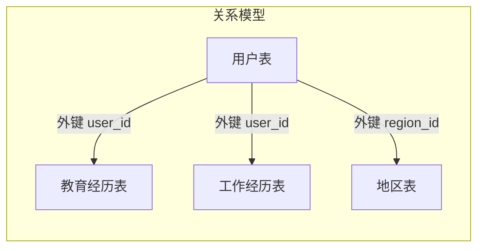
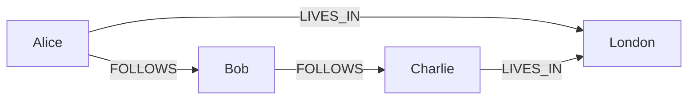

# 数据模型之战——关系型、文档型、图数据库怎么选？

> 数据模型决定了你如何思考问题——关系型、文档型、图数据库，各有各的战场。

在上一篇文章中，我们讨论了可靠性、可扩展性和可维护性——这是评价数据系统的**元标准**。但从哪里开始构建一个数据系统呢？

答案是从**数据模型**开始。

数据模型或许是软件开发中**最重要**的部分，因为它们的影响如此深远：**不仅影响软件的编写方式，更塑造了我们对问题的思考方式**。一个复杂应用程序可能有很多中间层次，但基本思想是一样的：**每个层都通过提供一个明确的数据模型来隐藏更低层次中的复杂性**。

> 💡 注：从应用开发者到硬件工程师，每个层级都在用自己的数据模型来简化问题——应用层用对象和API，DBA用表或JSON文档，数据库开发者用字节流，硬件工程师用电位和磁极。好的数据模型，本质上是**隔离复杂度**的工具。

DDIA 第二章重点介绍了三种主流的数据模型：**关系模型、文档模型和图模型**。这三种模型之间没有绝对的“谁更好”，只有“谁更适合你的场景”。今天我们就来逐一拆解。


## 一、关系模型：统治数据库世界五十年的王者

### 从 Codd 到 SQL

1970年，IBM的研究员**埃德加·科德（Edgar F. Codd）** 发表了关系模型的论文，提出了用**关系（即表）** 来组织数据的思想。此后半个多世纪，关系模型统治了数据库世界，直到今天仍然是**最主流**的数据库模型。

关系模型的核心很简单：

- 数据被组织成**关系**（SQL中称为**表**）
- 每个关系是**元组**（SQL中称为**行**）的无序集合
- 通过**外键**在不同表之间建立关联



### 关系模型的长处

关系模型之所以经久不衰，有几个核心优势：

- **数据一致性**：通过外键约束和事务，保证数据不会出现不一致
- **强大的查询能力**：SQL 的 JOIN 可以灵活地组合多张表的数据
- **成熟的生态**：五十年的积累，工具、优化器、运维经验都极其成熟
- **多对多关系的处理**：通过中间表（关联表），关系模型可以表达任意复杂的关系

### 关系模型的局限

但关系模型并非万能。它最大的问题之一，是**对象-关系不匹配**（Object-Relational Mismatch），也被称为**阻抗不匹配**（Impedance Mismatch）。

大多数应用程序使用**面向对象**的编程语言开发，而数据存在关系表中——对象有嵌套结构和继承关系，表只有二维的行和列。两者之间需要一个**笨拙的转换层**。ORM 框架（如 Hibernate、MyBatis）可以减少样板代码，但**无法完全隐藏两个模型之间的差异**。

用书里的话说：**关系模型和对象模型之间的鸿沟，就像两个不同阻抗的电路接在一起——能工作，但不顺畅。**


## 二、文档模型：为“树形数据”而生

### JSON 的崛起

进入 21 世纪，随着移动互联网的爆发，数据量和访问量呈指数级增长。传统关系数据库在**超大规模和高吞吐**场景下逐渐显露疲态。于是，**NoSQL**（最初是 Non-SQL，后来被解读为 Not Only SQL）应运而生。

推动 NoSQL 兴起的几个因素：

- **更大的数据集**：需要更强的伸缩性和更高的吞吐量
- **开源软件的普及**：冲击了传统商业数据库的市场
- **特殊的查询需求**：关系模型难以支持图的多跳分析等操作
- **对关系模型限制的不满**：渴望更具表现力的数据模型

在众多 NoSQL 模型中，**文档模型**是最具代表性的一支，以 **MongoDB** 为代表。

### 用简历理解文档模型

DDIA 用了一个非常经典的例子来说明文档模型的优势：**简历（Resume）** 。

一份简历包含：
- 个人信息（姓名、联系方式）
- 多段教育经历
- 多段工作经历
- 技能列表

如果用关系模型，你需要**至少三张表**：用户表、教育经历表、工作经历表。查询一份完整简历需要**三次查询或一次多表 JOIN**。

而用文档模型（JSON），一切都**自然地嵌套在一起**：

```json
{
  "user_id": 12345,
  "name": "张三",
  "contact": {
    "email": "zhangsan@example.com",
    "phone": "13800000000"
  },
  "education": [
    { "school": "北京大学", "degree": "学士", "year": 2020 },
    { "school": "清华大学", "degree": "硕士", "year": 2023 }
  ],
  "work_experience": [
    { "company": "字节跳动", "title": "后端工程师", "years": "2023-2026" }
  ]
}
```

> 简历的本质是一棵**树**：根节点是“人”，下面挂着“联系方式”“教育经历”“工作经历”等子节点。**JSON 天生就是一棵树**，所以非常适合表达这种一对多的结构。

### 文档模型的优势

- **更好的局部性**：一个人的所有信息集中存储，一次查询就能全部拿到
- **模式灵活（Schema-on-read）** ：不需要预先定义所有字段，可以随时添加新字段
- **更自然的表达**：对于树形数据结构，文档模型比关系模型更直观

### 文档模型的局限

文档模型最大的短板是：**不擅长处理多对多关系**。

如果数据中大量存在多对多关系（比如用户和群组、商品和分类、人和组织），文档模型就会很尴尬。它**不支持（或支持很弱）JOIN 操作**——如果数据库不支持 JOIN，应用程序就得在代码里做多次查询然后手动关联。

> 换句话说：**做 JOIN 的工作从数据库转移到了应用程序代码里**。在数据量小的时候还能应付，一旦数据量大了，应用层的 JOIN 会带来严重的性能问题。

### 文档数据库在重蹈覆辙？

DDIA 提出了一个发人深省的观点：**文档模型和 20 世纪 70 年代的层次模型（Hierarchical Model）惊人地相似**。

IBM 在 20 世纪 70 年代推出的 **IMS**（Information Management System）就是层次模型的代表。它的特点：

- 树形组织，每个子节点只能有一个父节点
- 节点之间通过类似**指针**的方式连接
- **能处理一对多，但很难处理多对多，不支持 JOIN**

这不就是今天文档模型的翻版吗？

历史总是惊人的相似。层次模型最终被关系模型取代，正是因为它在多对多关系上的无力。今天文档模型在某些场景下卷土重来，但同样的局限性依然存在。

> 💡 这一历史教训提醒我们：**技术没有银弹**。文档模型在特定场景（一对多的树形数据）下表现出色，但不要指望它能解决所有问题。


## 三、图模型：为“复杂关系”而生

当数据中的关系变得越来越复杂，多对多关系成为常态时，**图模型**就登场了。

### 什么是图模型？

图模型由两种对象组成：

- **顶点（Vertex）** ：也称为节点或实体——比如人、地点、事件
- **边（Edge）** ：也称为关系——比如“关注”“位于”“结婚”



图模型的精髓在于：**关系是一等公民**。在关系模型中，关系是通过外键隐式表达的；而在图模型中，**关系是显式的、可以独立查询的**。

### 社交网络中的图

DDIA 用社交网络来举例。在社交网络中：

- 用户是**顶点**
- “关注”关系是**边**
- 查询“我关注的人关注了谁”（二度好友）是典型的图遍历操作

如果用 Cypher（Neo4j 的查询语言）来表达：

```cypher
MATCH (me:User {id: $userId})-[:FOLLOWS]->(friend)-[:FOLLOWS]->(fof)
RETURN fof
```

这行查询的意思是：找到我（me），沿着“关注”（FOLLOWS）边找到我关注的人（friend），再沿着“关注”边找到他们关注的人（fof），返回结果。

> 在关系模型中，同样的查询需要**多次 JOIN**，而且随着关系深度的增加（三度、四度），SQL 会变得极其复杂。而在图模型中，**遍历是原生操作**——深度是多少只是路径长度的问题，查询复杂度不会指数级增长。

### 图模型的应用场景

图模型并非只有图数据库使用——很多场景本质上都依赖图结构：

- **社交网络**：用户关注、好友推荐
- **推荐系统**：用户-商品-标签的关联网络
- **知识图谱**：实体之间的关系网络
- **路径分析**：地图导航、网络路由
- **欺诈检测**：通过关系网络发现异常模式

如果数据中的**多对多关系极其复杂且不断变化**，图模型可能是最自然的选择。


## 四、怎么选？一张图看懂

三种模型没有绝对的优劣，关键是**匹配你的数据特征**。

| | 关系模型 | 文档模型 | 图模型 |
|---|---|---|---|
| **数据特征** | 结构化、关系清晰 | 树形结构、一对多 | 复杂网络、多对多 |
| **代表性数据库** | MySQL、PostgreSQL | MongoDB、Firestore | Neo4j、JanusGraph |
| **Schema** | 写时模式（Schema-on-write） | 读时模式（Schema-on-read） | 灵活 |
| **JOIN 能力** | 强 | 弱 | 极强（遍历） |
| **多对多关系** | 可以处理 | 不擅长 | 天生擅长 |
| **适用场景** | 大多数传统应用 | 内容管理、日志、配置 | 社交网络、推荐、知识图谱 |

用更简单的话来总结：

- 如果数据大多是**一对多**的树形结构，**文档模型**最合适
- 如果数据中有**多对多**关系但复杂度可控，**关系模型**能胜任
- 如果数据中的**多对多关系极其复杂**，**图模型**是最自然的选择


## 写在最后

数据模型的选择，会影响你未来几年的开发体验和系统演进能力。

有一个常见的误区是：**“我选了文档数据库，就不能再用关系数据库了”** ——事实并非如此。在可预见的未来，关系数据库会继续和各种非关系数据库共存。这种多种数据库共存的思路被称为**混合持久化（Polyglot Persistence）** 。

> 一个系统里同时使用 MySQL 做核心交易、MongoDB 存用户画像、Neo4j 做社交关系分析——**这不叫架构混乱，这叫用对了工具**。

DDIA 第二章的核心启示是：**理解每种数据模型的长处和短处，根据数据的访问模式来做选择，而不是盲目追随潮流。**

下一篇，我们将深入数据模型的底层——**存储引擎**。关系数据库和文档数据库在磁盘上到底是怎么存数据的？**B-Tree 和 LSM-Tree 谁更胜一筹？**

**下一篇预告：存储引擎探秘——LSM-Tree vs B-Tree，谁更胜一筹？**