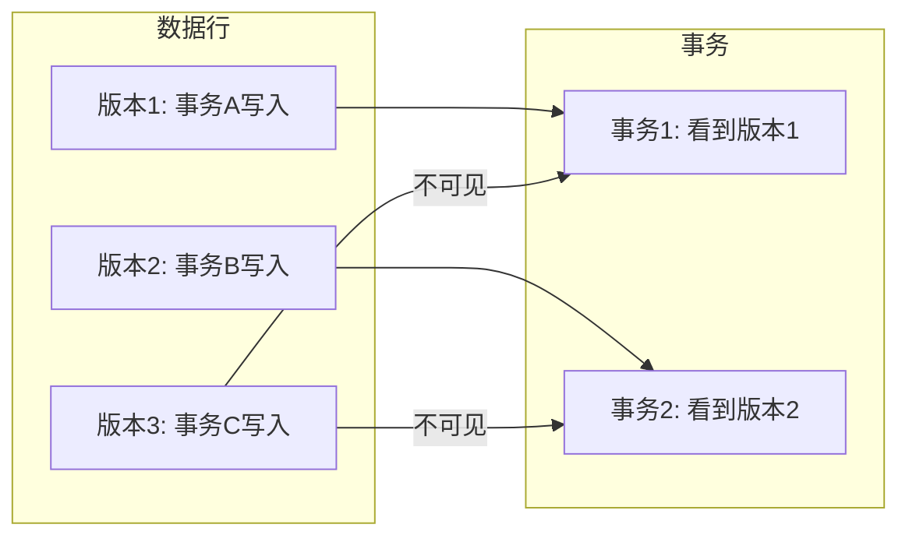
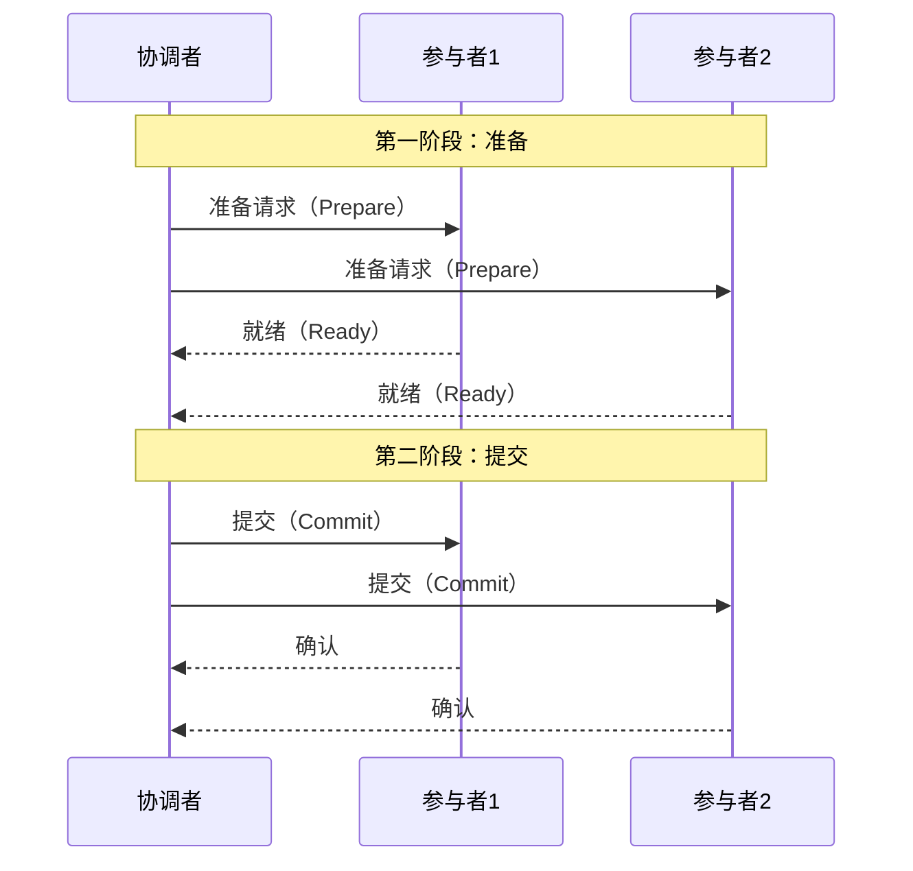

# 事务简史——从 ACID 到分布式事务

> 事务是数据库最复杂也最核心的话题——从ACID的四个字母到分布式事务的两阶段提交，每一步都是权衡。

前两篇文章我们聊了**复制**和**分区**——数据怎么在多台机器上分布。但有一个根本问题还没有回答：**当多个客户端同时读写数据时，怎么保证数据不出错？**

这个问题，就是**事务（Transaction）** 要解决的。

事务是数据库**最复杂也最核心**的话题之一。它把一组读写操作打包成一个逻辑单元——要么全部成功，要么全部失败。有了事务，应用开发者就不用担心“写到一半断电了怎么办”“两个用户同时改同一条数据怎么办”这类问题了。

但事务不是天然存在的——它是**为了简化应用编程模型而人为创造出来的**。为了理解它为什么这么复杂，我们需要从它的起源讲起。

## 一、为什么需要事务？

在数据系统中，**什么事情都可能出错**：

- **系统侧**：数据库软件或硬件随时可能失效，包括写操作进行到一半的时候
- **应用侧**：应用程序可能随时崩溃，包括在一系列操作执行到中间某一步的时候
- **网络侧**：应用和数据库之间、数据库多个节点之间的连接随时可能中断
- **并发侧**：多个客户端同时写入时，可能产生竞态条件和相互覆盖

如果没有事务，应用层就需要**自己处理以上所有问题**——这几乎是不可能的任务。

> 复杂度不会凭空消失，只会发生转移。事务就是数据库把复杂度**从应用层转移到数据库层**的一种机制。

有了事务，应用层只需要做一件事：**执行事务，如果失败了就重试**。

## 二、ACID：事务的四个承诺

说到事务，大家第一反应就是 **ACID**。这四个字母由 Theo Härder 和 Andreas Reuter 于 1983 年提出，用来描述数据库事务的容错保证。

但 DDIA 指出一个很扎心的事实：**不同数据库对 ACID 的支持并不相同**，尤其是 Isolation（隔离性）。如今，ACID 更多时候成了一个 **PR 术语**。

所以，我们需要逐一搞清楚每个字母**真正**的含义。下面这张表给出了四个特性的核心含义和负责方：

| 特性 | 核心含义 | 谁的责任 |
|---|---|---|
| **原子性（A）** | 一组操作要么全部完成，要么全部不完成（侧重故障恢复） | 数据库 |
| **一致性（C）** | 数据始终满足应用定义的不变量（如账户总和为0） | **应用程序** |
| **隔离性（I）** | 并发事务之间相互隔离，不互相干扰 | 数据库 |
| **持久性（D）** | 事务提交后，修改永久保存（即使崩溃也不丢失） | 数据库 |

### A——原子性（Atomicity）

“原子”这个词，在计算机科学中有两种完全不同的含义：

- **并发编程中的原子性**：一个线程执行的操作，另一个线程看不到中间状态
- **ACID 中的原子性**：**一组操作要么全部完成，要么全部不完成**

ACID 的原子性**不是关于并发的**——那是隔离性（I）的事。ACID 的原子性是关于**故障恢复**的。

如果一个事务在执行过程中发生了故障，原子性保证**已经执行的操作可以被全部回滚（Rollback）** 。应用层可以确定：**这个事务没有改变任何东西**。

> 举个例子：银行转账——从 A 账户扣 100 元，往 B 账户加 100 元。如果第二步失败了，原子性保证第一步也会被撤销。A 的钱不会莫名其妙地消失。

### C——一致性（Consistency）

一致性是 ACID 里**最特殊**的一个字母。

原子性、隔离性、持久性都是**数据库的属性**——数据库自己就能保证。但一致性**不是数据库的属性**，而是**应用程序的属性**。

一致性指的是：**数据必须始终满足应用程序定义的一组特定约束（不变量）** 。比如“所有账户的借贷总和必须为 0”。

> 数据库**无法阻止**你写入违反不变量的脏数据。一致性需要**应用自己**来保证——你负责正确定义事务，并确保它不破坏不变量。

用 DDIA 的话说：**字母 C 不属于 ACID**。它是一个应用层的属性，而不是数据库层的保证。

### I——隔离性（Isolation）

隔离性说的是：**多个事务并发执行时，它们应该相互隔离**。

最理想的隔离是**可串行化（Serializable）** ——让所有事务看起来就像**一个一个地串行执行**一样。这样就不会有任何并发问题。

但问题是：**完全的隔离性会导致系统并发性能很低**。所以实际数据库中，隔离性是一个**光谱**——从最弱到最强，有多个级别可以选择。

后面我们会详细展开这几种隔离级别。

### D——持久性（Durability）

持久性说的是：**一旦事务提交成功，它所做的修改就会永久保存**。

即使数据库随后崩溃、断电、硬盘损坏，数据也不应该丢失。

在实际实现中，持久性通常通过 **WAL（预写日志）** 来保证——事务提交前先写日志，日志写成功了才算提交成功。即使系统在写入数据页之前崩溃，重启后也可以通过日志恢复。

## 三、弱隔离级别：性能与正确性的权衡

理论上，最完美的隔离是**可串行化**——所有事务串行执行，没有任何并发干扰。

但现实是：**可串行化的性能太差了**。所以数据库提供了几种**弱隔离级别（Weak Isolation Levels）** ，让用户在**性能**和**正确性**之间做权衡。

### 读已提交（Read Committed）

**保证**：
1. 只能读取**已提交**的数据（**防止脏读**）
2. 只能写入**已提交**的数据（**防止脏写**）

**不保证**：
- 同一个事务中两次读取可能得到不同的结果（**不可重复读**）

**实现方式**：行级读锁（防止脏读）+ 行级写锁（防止脏写）。

### 可重复读 / 快照隔离（Snapshot Isolation）

**保证**：
- 事务中的读操作看到的是**事务开始时的快照**，即使数据被其他事务修改了也看不到
- **防止不可重复读**

**核心机制**：**MVCC（多版本并发控制）** 

MVCC 的核心思想是：**保存数据的历史版本**。每个事务看到的不是数据的最新版本，而是**符合其隔离级别的那个版本**。

MVCC 的好处是：**读不阻塞写，写也不阻塞读**。读写操作之间不再相互等待，并发性能大幅提升。

### 可串行化（Serializable）

**保证**：
- 最强隔离级别，完全服从 ACID 的隔离性要求
- 所有事务**依次逐个执行**，事务之间完全不可能产生干扰
- 防止**脏读、不可重复读和幻读**

**实现方式**：

1. **两阶段锁（2PL）** ：事务在读取或写入数据前必须获取对应的锁，直到事务结束才释放。可以防止所有并发异常，但性能开销大。

2. **可串行化快照隔离（SSI）** ：在 MVCC 的基础上增加了冲突检测，发现冲突时中止事务。性能比 2PL 好，是 PostgreSQL 等数据库采用的方式。

### 隔离级别对比

| 隔离级别 | 脏读 | 不可重复读 | 幻读 | 并发性能 |
|---|---|---|---|---|
| **读未提交** | 可能 | 可能 | 可能 | 最高 |
| **读已提交** | ✅ 防止 | 可能 | 可能 | 高 |
| **可重复读** | ✅ 防止 | ✅ 防止 | 可能 | 中 |
| **可串行化** | ✅ 防止 | ✅ 防止 | ✅ 防止 | 最低 |

## 四、分布式事务：当单机不够用了

前面讨论的事务，都是**单机事务**——所有数据在一台机器上，事务由同一个数据库管理。

但当我们把数据**分区**到多台机器上之后，一个问题就出现了：**一个事务可能涉及多个分区**。比如在电商系统中，扣库存（分区1）和创建订单（分区2）需要在同一个事务中完成。

这就是**分布式事务（Distributed Transaction）** 。

分布式事务的难点在于：**多个节点之间需要达成一致**。要么所有节点都提交，要么所有节点都回滚。这就是**原子提交（Atomic Commit）** 问题。

### 两阶段提交（2PC）

**两阶段提交（Two-Phase Commit，2PC）** 是最经典的分布式事务协议。它引入了一个**协调者（Coordinator）** 来协调所有参与者的行为。

**第一阶段（准备阶段）** ：
- 协调者向所有参与者发送事务操作请求
- 每个参与者评估自己是否能完成事务
- 如果可以，就**锁定资源、执行操作（但不提交）、写入 undo/redo 日志**，然后返回“就绪”
- 如果不可以，返回“失败”

**第二阶段（提交/回滚阶段）** ：
- 如果**所有参与者**都返回“就绪”，协调者发送“提交”指令，所有参与者正式提交
- 如果**任何一个**参与者返回“失败”，协调者发送“回滚”指令，所有参与者回滚

### 2PC 的问题

2PC 看起来很完美，但它有一个致命的弱点：**协调者是单点**。

如果协调者在第二阶段发送“提交”指令之前崩溃了，所有参与者都会**一直等待**，资源被锁住，系统陷入阻塞。

这个问题在 **三阶段提交（3PC）** 中试图通过引入超时机制来解决，但 3PC 并没有被广泛采用，因为它引入了新的复杂性问题。

### 分布式事务的现状

分布式事务在实际生产环境中**用得不多**。原因很简单：

- **性能差**：2PC 需要多次网络往返，延迟高
- **可用性低**：协调者成为单点故障
- **实现复杂**：需要处理各种边缘情况

所以很多大规模系统**放弃了分布式事务**，转而采用**最终一致性**的方案——比如 Saga 模式、TCC 模式、基于消息队列的补偿事务等。

> 分布式事务是**强一致性**的代价。在很多场景下，**最终一致性**已经足够好了，而且性能和可用性都好得多。

## 五、写在最后

事务是数据库最复杂的主题之一，因为它涉及了**并发控制**、**故障恢复**、**分布式一致性**等多个子领域。

回顾一下这条演化路径：

- **单机事务**（ACID）→ 解决了应用层的编程复杂度
- **弱隔离级别**（读已提交、快照隔离）→ 在性能和正确性之间做权衡
- **分布式事务**（2PC）→ 把事务扩展到多台机器，但代价巨大

> 事务保证和是否分布式在概念上相对正交，但在实现上，分布式系统中事务的实现难度要大得多。

DDIA 并没有给出“分布式事务很好用”的结论——恰恰相反，它提醒我们：**事务是有代价的**。在决定使用事务之前，需要**确切理解事务可以提供的安全保障，以及它们的代价**。

没有银弹。**理解权衡，做出选择**——这才是事务这个话题给我们的最大启示。

**下一篇预告：分布式系统的“部分失效”——网络延迟、时钟与故障检测**