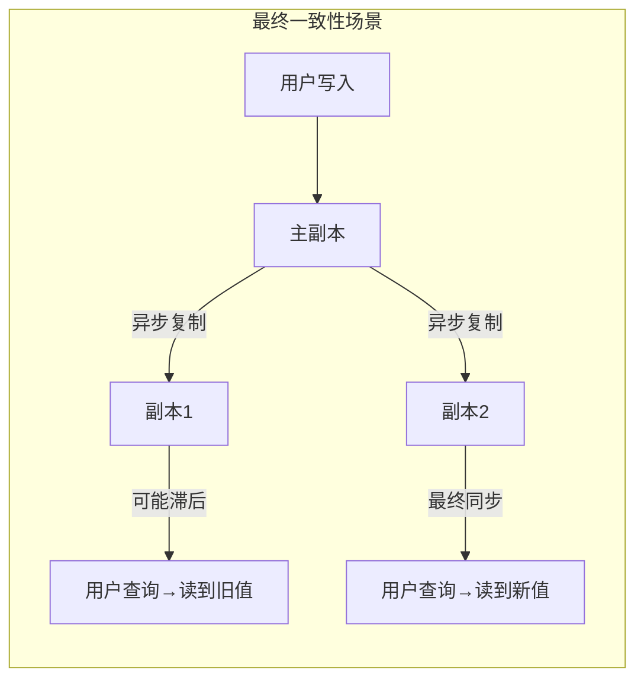
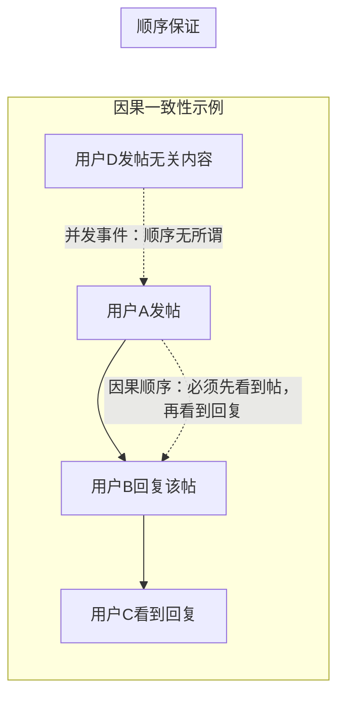
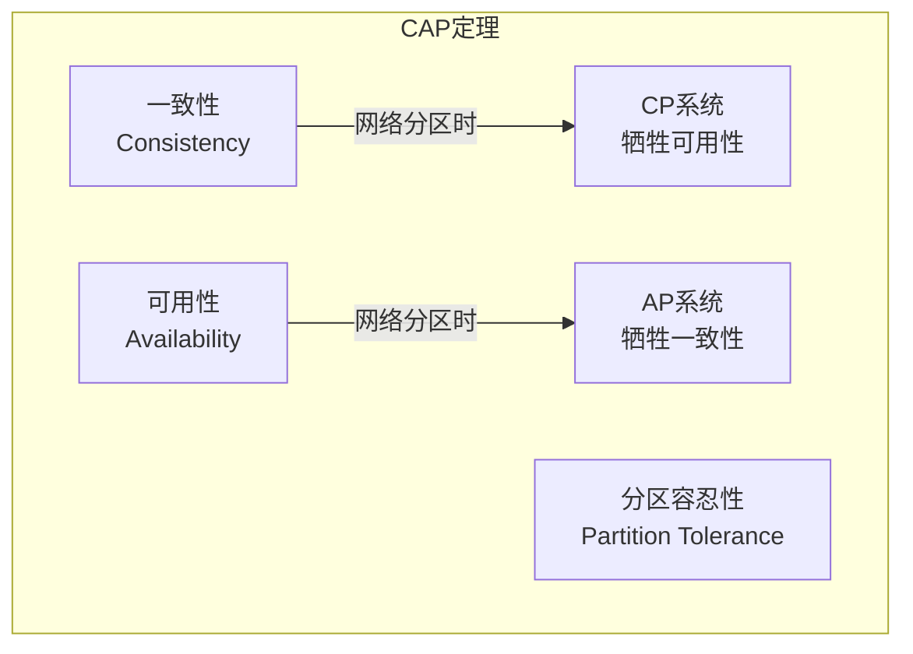

# 一致性是一个连续谱——线性一致性、因果一致性、最终一致性

> 一致性不是“有”或“没有”——它是一个从最强到最弱的光谱。线性一致性、因果一致性、最终一致性，分别适合什么场景？

上一篇文章我们聊了分布式系统的两大“天敌”：**不可靠的网络**和**不可靠的时钟**。这两个问题导致了一个核心困境：**分布式系统中的节点无法可靠地达成一致认知**。

但用户并不关心你的网络是否抖动、时钟是否同步。用户只关心一件事：**我写入的数据，什么时候能读到？读到的是不是对的？**

这个问题，就是**一致性（Consistency）** 要回答的。

在单机数据库中，一致性很简单——ACID 里的 C 保证了不变量不被破坏。但在分布式系统中，“一致性”变成了一个极其复杂且容易混淆的概念。它不再是一个“有”或“没有”的二元属性，而是一个**从强到弱的光谱（Spectrum）**。

DDIA 第九章的核心任务就是：**把这个光谱上的各个点——最终一致性、因果一致性、线性一致性——清晰地定义出来，并解释它们各自的适用场景。**

## 一、什么是“一致性模型”？

在进入具体模型之前，先理解一个核心概念：**一致性模型（Consistency Model）** 是**数据系统对应用程序做出的一份承诺**。

这份承诺说的是：**在并发读写和故障存在的条件下，你对数据的可见性和顺序可以有什么样的期待**。

- 承诺越强 → 系统需要做更多的协调工作 → 性能和可用性越差
- 承诺越弱 → 系统越自由 → 性能越好，但应用层需要处理更多的不一致

> 一致性模型是**数据库和应用程序之间的契约**。理解了这份契约，你就知道什么时候可以信任数据库，什么时候必须自己在应用层做额外的工作。

## 二、最终一致性（Eventual Consistency）：最宽松的承诺

### 定义

**最终一致性**承诺的是：**如果没有新的写入，那么经过一段不确定的时间后，所有副本最终会收敛到相同的值**。

它是**最弱**的一致性模型，也是**可用性最高**的。

### 特点

- **写入后立刻读，可能读到旧值**（因为复制有延迟）
- **“最终”没有时间保证**——可能是一秒，也可能是一小时
- **不保证顺序**——不同副本可能以不同的顺序应用写入

### 适用场景

DNS 是最终一致性的经典例子：你更新了一个域名的 IP 地址，全球各地的 DNS 服务器不会立刻同步，但“最终”都会更新。

现代分布式数据库（如 Cassandra、Riak）和许多云存储服务默认提供最终一致性。

### 优点与代价

| 优点 | 代价 |
|---|---|
| 高可用、低延迟 | 应用层需要处理不一致 |
| 分区容忍性好 | 没有时间保证 |
| 扩展性强 | 编程模型复杂 |

## 三、因果一致性（Causal Consistency）：最小“有用”的一致性

### 定义

**因果一致性**承诺的是：**如果事件 A 在因果上导致了事件 B（A 发生在 B 之前），那么所有节点都必须先看到 A，再看到 B**。

它比最终一致性强，因为它保证了**有因果关系的事件之间的顺序**。但它比线性一致性弱，因为它不要求**没有因果关系的事件**之间有全局顺序。

### 因果关系的判定

什么是“因果关系”？核心是 **“发生在……之前”（Happens-Before）** 关系：

- **同一个进程内**：如果事件 A 先发生，事件 B 后发生，那么 A → B
- **消息传递**：如果进程 P1 发送了消息 M，进程 P2 收到了 M，那么“发送 M”发生在“收到 M”之前
- **传递性**：如果 A → B 且 B → C，那么 A → C

如果两个事件之间不存在 Happens-Before 关系，它们就是**并发的（Concurrent）** ，系统可以任意排序。

### 实现机制：版本向量

因果一致性的实现通常依赖于**版本向量（Version Vector）** 或**向量时钟（Vector Clock）**：

- 每个进程维护一个计数器
- 每个数据版本携带一个**因果上下文（Causal Context）** ，记录了该版本依赖哪些进程的哪些版本
- 节点收到更新时，检查因果上下文，决定是否可以应用，还是需要等待

### 为什么说它是“最小有用”的一致性？

因为没有因果关系的事件之间不需要排序，系统可以自由并行处理，性能开销远小于全局强一致性。同时，它保证了用户**在直觉上不会感到“乱”** ——你不会先看到回复再看到原帖。

> 因果一致性是目前分布式系统中**性价比最高**的一致性模型之一。它避免了最终一致性的反直觉行为，又比线性一致性便宜得多。

## 四、线性一致性（Linearizability）：最强的一致性承诺

### 定义

**线性一致性**承诺的是：**系统表现得好像只有一个数据副本**。任何操作（读或写）都在某个时间点原子性地生效，所有客户端看到的操作顺序是完全一致的。

它是**最强**的一致性模型，也是**代价最高**的。

### 核心特性

- **实时顺序**：如果操作 A 在操作 B 开始之前已经完成，那么 A 必须在 B 之前生效
- **全局顺序**：所有操作被排成一个**单一的全序（Total Order）** ，所有客户端看到的顺序一致
- **原子性**：每个操作在某个时刻瞬间生效，不存在中间状态

### 什么时候需要线性一致性？

线性一致性在以下场景中**不可或缺**：

1. **分布式锁**：如果锁服务不是线性一致的，两个客户端可能同时获得锁
2. **唯一性约束**：用户名唯一、库存扣减等场景，需要原子性的“比较并设置”
3. **跨通道协调**：例如，文件存储服务 + 消息通知，如果存储不一致，通知可能指向一个尚不存在或已过期的文件
4. **银行扣款**：当交易需要严格按顺序执行时

### 为什么线性一致性如此昂贵？

实现线性一致性意味着系统必须在**读取或写入时进行全局协调**：

- 主从复制中，**读操作也必须走主库**，否则无法保证读到最新数据
- 写入操作需要**至少 Quorum 确认**，并且必须确保没有过时的数据被返回
- 网络分区发生时，线性一致的系统通常**必须牺牲可用性**（宁可不可用，也不返回错误数据）

### 线性一致性与 CAP 定理

这正是 **CAP 定理** 的核心：在**网络分区（P）** 发生时，系统只能在**一致性（C）** 和**可用性（A）** 之间二选一。

CP 系统（如 Zookeeper、HBase）在线性一致性和分区容忍性之间选择了前者——宁可拒绝请求，也不返回不一致的数据。AP 系统（如 Cassandra、Riak）则选择了后者——宁可返回可能不一致的数据，也要保证系统可用。

## 五、一致性光谱总览

| 一致性模型 | 顺序保证 | 性能代价 | 典型系统 |
|---|---|---|---|
| **最终一致性** | 无保证（最终收敛） | 最低 | DNS、Cassandra（默认） |
| **因果一致性** | 因果关系有序 | 低 | 部分分布式数据库 |
| **线性一致性** | 全局全序（实时） | **最高** | Zookeeper、etcd、Spanner |

用一个更直观的比喻来理解这三个层次：

- **最终一致性**：你说了一句话，不同的人在不同时间听到，有人先听到有人后听到，但最终所有人都听到了同样的话
- **因果一致性**：你先说了“大家好”，然后说了“我是张三”，所有人都必须先听到“大家好”再听到“我是张三”，但不同的人听到这两句话的时间可以不同
- **线性一致性**：所有人听到每句话的时间和顺序都完全一致，就像在同一个房间里听一个人说话一样

## 六、写在最后

一致性是分布式系统中最容易被误解的概念之一。人们常问：“这个数据库强一致吗？”——但真正的问题应该是：“在什么场景下，我需要什么级别的一致性？”

DDIA 第九章给我们的核心启示是：

- **如果你的业务逻辑依赖于顺序**（如分布式锁、唯一性约束），**使用线性一致性**，接受它的性能代价
- **如果你需要逻辑上合理的用户体验**（如社交 Feed 的评论和回复），**因果一致性**是性价比最高的选择
- **如果你的业务能容忍短暂的不一致**（如 DNS、缓存、数据分析），**最终一致性**足够好，且能带来最佳性能和可用性

> 一致性模型的选择，本质上是在 **“应用开发的便利性”** 和 **“数据库运行的效率”** 之间做权衡。越强的一致性，数据库替你做得越多，但性能越差；越弱的一致性，数据库替你做得越少，但性能和可用性越高。

没有最好的一致性模型，只有**最适合你业务场景**的一致性模型。

**下一篇预告：共识算法剖析——从 Paxos 到 Raft**