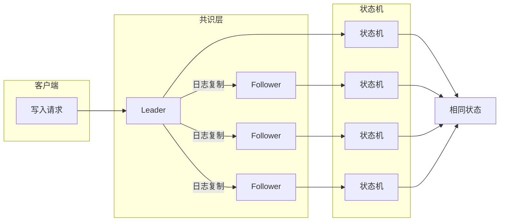
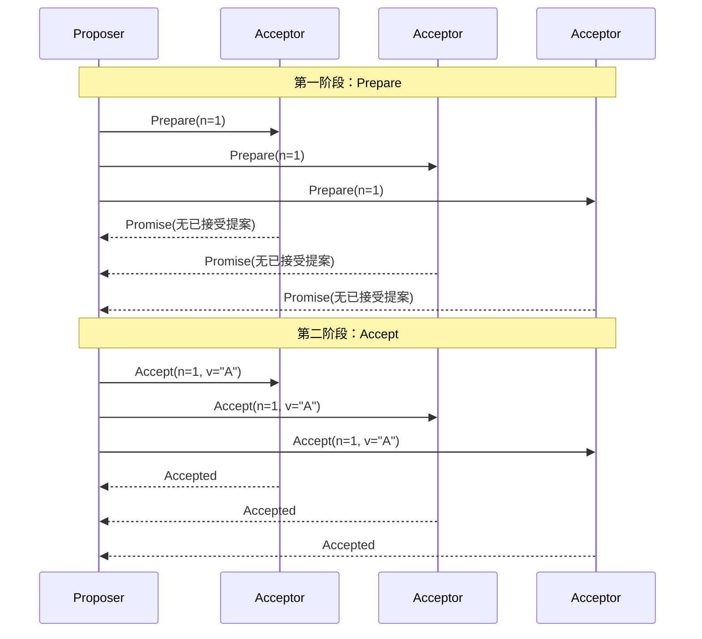
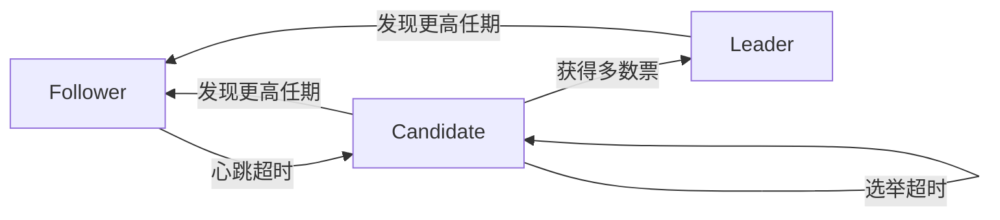
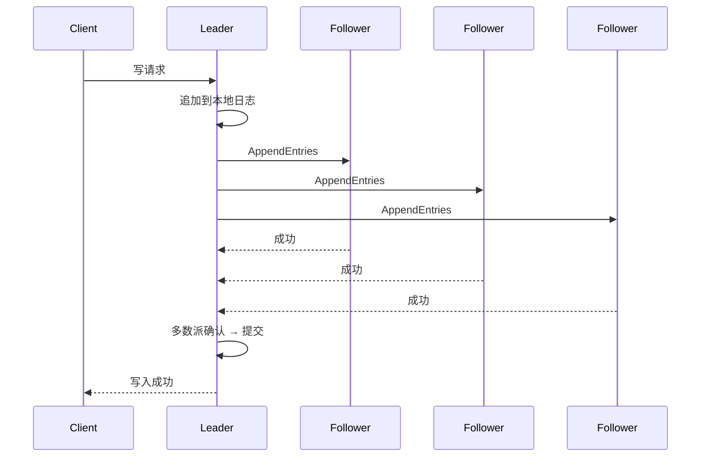

# 共识算法剖析——从 Paxos 到 Raft

> Paxos 是分布式共识的理论基石，Raft 是工程实践的黄金标准——从 Paxos 到 Raft，共识算法走过了从“可证明”到“可理解”的进化之路。

上一篇文章我们聊了**一致性模型**的光谱——从最终一致性到线性一致性。但你有没有想过：**一个分布式系统如何“实现”线性一致性？**

答案是：**共识算法（Consensus Algorithm）** 。

共识算法是分布式系统中最核心也最精妙的部分。它让一组机器**在面对节点故障、网络延迟、消息丢失的情况下，依然能够就某个值达成一致**。

DDIA 第九章重点介绍了两种共识算法：**Paxos** 和 **Raft**。Paxos 是理论上的开创者，Raft 是工程上的集大成者。今天我们就来拆解这两个算法，看看它们是怎么工作的，以及为什么 Raft 最终赢得了工程界的青睐。

## 一、为什么需要共识？

### 复制状态机

共识算法的核心应用场景是**复制状态机（Replicated State Machine）** 。

想象一下：你有一个服务，部署在 5 台机器上。如果每台机器都从**相同的初始状态**开始，并且**按相同的顺序执行相同的命令**，那么最终它们的状态一定完全相同。

共识算法要解决的就是**“按相同的顺序执行相同的命令”** 这个问题。它保证：

- **安全性（Safety）** ：所有节点最终达成一致，且不会达成错误的一致
- **可用性（Liveness）** ：只要多数节点正常工作，系统就能持续运行

### 共识问题 vs 两阶段提交

共识算法和上一篇文章提到的**两阶段提交（2PC）** 有什么区别？

- **2PC** 解决的是**原子提交**——多个节点要么全部提交，要么全部回滚。它**不处理节点故障**，协调者挂了整个系统就卡死。
- **共识算法**解决的是**在故障存在的情况下**多个节点就某个值达成一致。它**容忍少数节点故障**。

> 2PC 是“全或无”，共识是“多数派说了算”。这是两者最本质的区别。

## 二、Paxos：分布式共识的“理论巅峰”

### 历史背景

Paxos 算法由 **Leslie Lamport**（就是大名鼎鼎的 LaTeX 中的“La”）在 1989 年提出。

Lamport 用一种非常独特的方式发表了这篇论文——他虚构了一个叫做 **Paxos** 的希腊小岛，岛上有一个议会通过表决来达成共识。议员可能离开，信使可能走丢，或者重复传递消息——这些正好对应了分布式系统中的节点故障和网络故障。

> 这个充满想象力的比喻让论文极具可读性，但也让**理解 Paxos 本身变得异常困难**。直到 Lamport 后来用更直白的语言重新描述了算法，Paxos 才逐渐被业界接受。

### Paxos 的角色

Paxos 定义了三种角色：

| 角色 | 职责 |
|---|---|
| **Proposer（提案者）** | 提出一个值，希望被集群接受 |
| **Acceptor（接受者）** | 对提案进行投票，决定是否接受 |
| **Learner（学习者）** | 学习最终被选中的值，不参与投票 |

> 一个节点可以同时扮演多种角色。这些角色**并不固化在某个节点上**，而是根据场景动态承担。

### Basic Paxos 的两阶段流程

Basic Paxos 的核心流程分为两个阶段：

**第一阶段：Prepare（准备阶段）**

1. Proposer 生成一个提案编号 `n`（必须全局唯一且递增）
2. Proposer 向**所有** Acceptor 发送 `Prepare(n)` 请求
3. 每个 Acceptor 收到 `Prepare(n)` 后：
   - 如果 `n` 大于它之前见过的所有提案编号，就**承诺**不再接受编号小于 `n` 的提案，并返回它**已经接受过的最高编号提案**（如果有的话）
   - 否则，忽略该请求

**第二阶段：Accept（接受阶段）**

1. 如果 Proposer 收到了**多数派** Acceptor 的承诺，它就从返回的提案中选择**编号最高的那个值**作为本次要提议的值 `v`（如果所有返回都没有值，则使用 Proposer 自己最初的值）
2. Proposer 向所有 Acceptor 发送 `Accept(n, v)` 请求
3. 每个 Acceptor 收到 `Accept(n, v)` 后：
   - 如果它**没有承诺过**不接受编号 `n`（即没有见过比 `n` 更大的 Prepare），就**接受**这个提案
   - 否则，忽略该请求

### 为什么 Paxos 能保证一致性？

Paxos 的正确性依赖于一个关键性质：**任意两轮成功的提案，其提议的值必然相同**。

为什么？因为如果提案 `(n1, v1)` 已经被多数派接受，那么任何编号更大的提案 `n2` 在执行 Prepare 阶段时，必然能从**多数派**中的至少一个 Acceptor 那里得知 `(n1, v1)`。根据协议，Proposer 必须使用这个已知的最高编号提案的值 `v1` 作为自己的提议值。

这个数学证明保证了**一旦一个值被选定，后续所有提案都只能提议同一个值**。

### Paxos 的问题

Paxos 在理论上近乎完美，但在工程实践中却有几个致命问题：

**1. 极其难以理解**

Paxos 的论文充满了希腊城邦的隐喻，算法本身又极其抽象。**即使是资深工程师，也需要反复阅读多遍才能理解其精髓**。

**2. 活锁（Livelock）问题**

在 Basic Paxos 中，如果两个 Proposer 互不相让地争相提出编号更高的提案，就会产生**活锁**——系统一直在运转，但永远无法达成共识。

**3. 实现复杂**

Paxos 的定义是**单实例（Single Instance）** 的——它只解决“就一个值达成共识”的问题。在实际系统中，我们需要连续就**一系列值**（比如日志条目）达成共识。这就是 **Multi-Paxos**。但 Multi-Paxos 并没有一个标准化的描述，不同实现有不同变体，这进一步增加了工程难度。

## 三、Raft：为“可理解性”而生的共识算法

### 诞生背景

2013 年，**Diego Ongaro** 和 **John Ousterhout** 发表了 Raft 算法。

他们的核心动机很简单：**Paxos 太难懂了，我们需要一个更容易理解和实现的共识算法**。Raft 的目标是**提供和 Paxos 相同的功能和性能，但结构和理解难度完全不同**。

> Raft 从问世开始就备受关注，被认为是所有共识算法中**工程实现最友好**的选择。如果你正在设计一个分布式系统，正在寻找一个简单、有效的共识算法，Raft 是强烈推荐的首选。

### Raft 的三大模块

Raft 将共识问题**分解为三个相对独立的子问题**：

1. **Leader 选举（Leader Election）** ：如何选出一个唯一的领导者
2. **日志复制（Log Replication）** ：Leader 如何将日志复制到所有 Follower
3. **安全性（Safety）** ：如何保证在各种故障下系统仍然正确

### 角色与状态

Raft 定义了三种角色：

| 角色 | 职责 |
|---|---|
| **Leader（领导者）** | 处理所有客户端请求，决定日志的顺序 |
| **Follower（跟随者）** | 被动接收 Leader 的日志复制，不主动发起任何操作 |
| **Candidate（候选人）** | 选举过程中的临时角色，向其他节点拉票 |

所有节点**从 Follower 状态启动**。如果一段时间没有收到 Leader 的心跳，Follower 就会变成 Candidate，发起新一轮选举。

### Leader 选举

Raft 使用**任期号（Term）** 和**随机超时**来选举 Leader：

1. 每个节点都有一个**随机的选举超时时间**（比如 150ms-300ms）
2. Follower 在这个时间内没有收到 Leader 的心跳，就变成 Candidate
3. Candidate **给自己投一票**，然后向其他节点请求投票
4. 如果获得**多数派**的票，就成为新的 Leader
5. 如果选举超时（多个 Candidate 同时竞选，票数分散），就**增加任期号**，重新开始选举

**随机超时**是 Raft 的一个精妙设计。它大大降低了多个节点同时发起选举的概率，从而减少了选举冲突。

### 日志复制

选举出 Leader 之后，所有**客户端请求都发给 Leader**：

1. Leader 收到客户端的写请求，将其作为一个**日志条目（Log Entry）** 追加到自己的日志中
2. Leader **并行**向所有 Follower 发送 AppendEntries RPC，要求复制这条日志
3. 当 Leader 确认**多数派** Follower 已经成功复制了这条日志后，**提交（Commit）** 该日志
4. Leader 将结果返回给客户端

**日志的强一致性**：Raft 要求所有 Follower 的日志与 Leader **完全一致**。如果 Follower 的日志和 Leader 不一致，Leader 会**强制覆盖** Follower 的日志，直到它们完全对齐。

### Raft 为什么更“可理解”？

相比 Paxos，Raft 的几个设计选择极大地降低了理解难度：

| 设计选择 | Paxos | Raft |
|---|---|---|
| **领导者** | 可选（Multi-Paxos 引入） | **强制**，所有写入必须经过 Leader |
| **日志顺序** | 可乱序提交 | **严格顺序**，按索引提交 |
| **角色** | Proposer/Acceptor/Learner 可重叠 | Leader/Follower/Candidate 清晰分离 |
| **模块化** | 高度耦合 | 三大子问题独立 |
| **活锁问题** | Basic Paxos 存在 | 随机超时 + 强 Leader 规避 |

> Raft 的“强 Leader”模型简化了问题。虽然 Leader 选举期间系统不可用，但一旦选出 Leader，后续的日志复制就变得非常直接。

## 四、Paxos vs Raft：怎么选？

### 理论 vs 工程

| 维度 | Paxos | Raft |
|---|---|---|
| **理论地位** | 共识算法的**理论基石** | Raft 是 Paxos 的**工程化变种** |
| **理解难度** | **极高**，论文晦涩 | **较低**，论文中有伪代码 |
| **实现复杂度** | 高（Multi-Paxos 无标准描述） | **低**（三大模块清晰） |
| **社区生态** | Chubby（Google 内部） | **etcd、TiDB、Kubernetes** |
| **适用场景** | 对一致性有极致理论要求的系统 | **绝大多数分布式系统** |

### 实际选型建议

- **如果你在写论文或做理论研究** → Paxos 是必须掌握的基础
- **如果你在构建生产级分布式系统** → **Raft 是首选**
- **如果你需要与其他 Paxos 系统（如 ZooKeeper）集成** → 可能需要理解 Paxos 及其变体（ZAB）

> Raft 目前是**使用最为广泛的分布式共识算法**。etcd、Consul、TiDB 等知名项目都在使用 Raft。etcd 的 Raft 实现更是工业级的标杆。

## 五、延伸：ZAB 协议

在讨论共识算法时，不得不提 **ZAB（ZooKeeper Atomic Broadcast）** 协议——ZooKeeper 底层使用的共识协议。

ZAB 和 Raft 有很多相似之处：
- 都是**基于 Leader** 的协议
- 都分为**选举和广播**两个阶段
- 都保证日志的顺序一致性

但 ZAB 和 Raft 也有区别：

| 特性 | ZAB | Raft |
|---|---|---|
| **设计目标** | 主备系统一致性 | 通用共识 |
| **角色** | Leader/Follower | Leader/Follower/Candidate |
| **阶段划分** | 恢复/广播 | 选举/日志复制/安全性 |

> ZAB 借鉴了 Paxos 的核心思想（如“领导者选举”“多数派确认”），但做了针对 ZooKeeper 场景的简化和优化。

## 六、写在最后

共识算法是分布式系统的**皇冠明珠**。它让不可靠的机器集群能够表现得像一个可靠的、强一致的系统。

Paxos 和 Raft 的关系，有点像**理论物理学和工程学**的关系：
- **Paxos** 提供了坚实（且优美）的数学基础——它证明了共识问题是**可解的**
- **Raft** 则把这个理论变成了**工程师能真正理解和实现**的代码

> Paxos 侧重理论上的正确性，算法结构零散，难以直观理解。而 Raft 子问题拆分明确，状态空间小（日志无空洞、冲突少），无需理解复杂的“单决议/多决议”嵌套逻辑。

如果你正在设计一个需要强一致性的分布式系统，**不要自己实现 Paxos**。用 Raft，或者直接用 etcd 这样的成熟实现。

共识算法是分布式系统最后一块拼图。理解它，你就理解了分布式系统最核心的难题——**如何在不可靠的世界里达成可靠的共识**。

**下一篇预告：数据系统的未来——Flink、Snowflake 与 AI 时代的挑战**