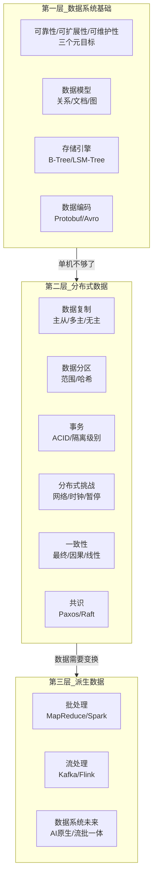
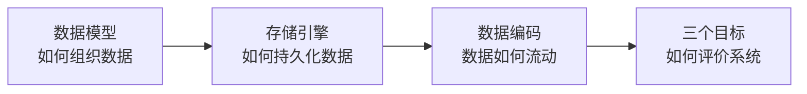
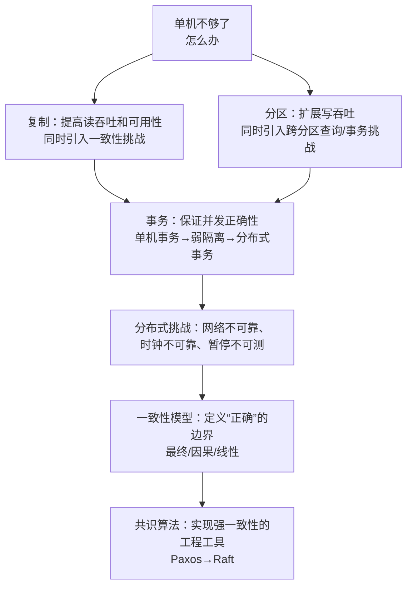
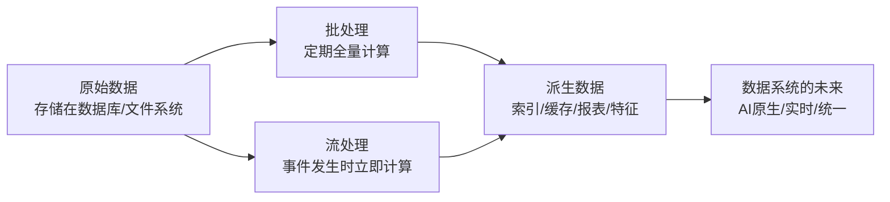

# DDIA 核心思想串讲——全书知识体系一张图

> 十四篇文章，十四个主题——今天我们用一张全景图把 DDIA 的所有知识点串联起来，看看它们之间到底有什么逻辑关系。

前十五篇文章，我们把 DDIA 的各个部分拆解了一遍：可靠性、可扩展性、可维护性；数据模型与存储引擎；复制、分区、事务、一致性、共识；批处理与流处理；以及整个数据系统的生态全景。

但你可能会问：**这些知识点之间到底是什么关系？** 它们不是孤立的，而是一环扣一环的。

今天这篇文章，我们做一个**核心思想串讲**——把全书的知识体系串成一张图，看看 DDIA 到底在教我们什么。

## 一、全书的逻辑主线

DDIA 的三大部分，其实对应着数据系统的**三个层次的问题**：

- **第一部分（数据系统基础）** 问的是：**单机上的数据系统应该是什么样子的？**
- **第二部分（分布式数据）** 问的是：**当单机不够用时，怎么把数据分布到多台机器上？**
- **第三部分（派生数据）** 问的是：**数据如何变换、流动、产生新的价值？**

每一部分的答案，都建立在前一部分的基础之上。

## 二、第一部分串讲：从数据到存储

### 核心逻辑链

第一部分回答的核心问题是：**数据怎么存、怎么读、怎么写、怎么变？**

这条逻辑链是：

### 各章定位

| 章节 | 核心问题 | 关键答案 |
|---|---|---|
| **第1章：三大目标** | 什么是“好”的数据系统？ | 可靠性、可扩展性、可维护性 |
| **第2章：数据模型** | 数据以什么形式呈现给应用？ | 关系型、文档型、图型——各有适用场景 |
| **第3章：存储引擎** | 数据在磁盘上怎么存？ | B-Tree（原地更新） vs LSM-Tree（追加写入） |
| **第4章：数据编码** | 数据在进程间怎么传？ | Protobuf、Thrift、Avro——兼容性是关键 |

### 贯穿主题：权衡

第一部分反复出现的一个主题是**权衡**：

- 关系模型 vs 文档模型：**查询能力 vs 数据局部性**
- B-Tree vs LSM-Tree：**读性能 vs 写性能**
- 同步复制 vs 异步复制：**一致性 vs 性能**
- Schema-on-write vs Schema-on-read：**写入时校验 vs 读取时解析**

> 没有“最好”的方案，只有“最适合你场景”的方案——这是 DDIA 教给我们的第一课。

## 三、第二部分串讲：从单机到分布式

### 核心逻辑链

第二部分回答的核心问题是：**当数据量超过单机容量时，如何分布到多台机器上，同时保证系统的正确性？**

这条逻辑链是：

### 各章定位

| 章节 | 核心问题 | 关键答案 |
|---|---|---|
| **第5章：复制** | 数据在多个节点间怎么同步？ | 主从（简单）、多主（复杂）、无主（去中心） |
| **第6章：分区** | 数据在多个节点间怎么拆分？ | 范围分区、哈希分区——各有优劣 |
| **第7章：事务** | 并发读写时怎么保证正确性？ | ACID → 弱隔离级别 → 分布式事务（2PC） |
| **第8章：分布式挑战** | 分布式系统有什么特殊困难？ | 网络、时钟、暂停——三个不确定性来源 |
| **第9章：一致性** | 什么是“正确”的分布式行为？ | 最终一致性 → 因果一致性 → 线性一致性 |
| **第10章：共识** | 如何实现强一致？ | Paxos（理论） → Raft（工程） |

### 贯穿主题：不确定性

第二部分反复出现的一个主题是**不确定性**：

- 复制中：你无法确定从库的数据是否最新——**数据一致性是不确定的**
- 分区中：你无法确定一个查询需要访问哪些节点——**查询路径是不确定的**
- 分布式事务中：你无法确定一个节点是死了还是慢了——**节点状态是不确定的**
- 时钟中：你无法确定两个节点的时间谁更“正确”——**时间顺序是不确定的**
- 共识中：你无法确定哪个节点会当选 Leader——**选举结果是不确定的**

> 分布式系统的本质，就是在**不确定性中建立确定性**。复制、事务、一致性、共识——所有的机制都在做同一件事：**让不确定的世界对应用层呈现出确定的样子**。

## 四、第三部分串讲：从静态到动态

### 核心逻辑链

第三部分回答的核心问题是：**数据如何从“存储状态”变成“流动价值”？**

### 各章定位

| 章节 | 核心问题 | 关键答案 |
|---|---|---|
| **第10章：批处理** | 如何对海量历史数据进行计算？ | Unix管道 → MapReduce → Spark/数据流引擎 |
| **第11章：流处理** | 如何对实时数据进行计算？ | 消息系统（Kafka）→ 流计算（Flink） |
| **第12章：数据系统生态** | 各种系统如何协同工作？ | OLTP/OLAP/HTAP/NoSQL/NewSQL/数据湖 |
| **第13章：数据系统未来** | AI时代数据系统往哪里走？ | AI原生、流批一体、统一智能底座 |

### 贯穿主题：流动

第三部分反复出现的一个主题是**流动**：

- 批处理：数据从输入流向输出——**静态数据的流动**
- 流处理：数据从事件源流向消费者——**动态数据的流动**
- 派生数据：数据从原始形态流向价值形态——**数据价值的流动**
- 流表二象性：流和表可以互相转化——**数据形态的流动**

> 如果说前两部分关注的是**数据如何静止**（存储、索引、事务），那么第三部分关注的是**数据如何运动**（计算、变换、派生）。静止的数据是资产，流动的数据才是价值。

## 五、贯穿全书的三条核心线索

除了三部分各自的逻辑主线，还有三条线索贯穿全书。

### 线索一：权衡（Trade-off）

DDIA 每一章都在讲权衡：

- 可用性 vs 一致性
- 读性能 vs 写性能
- 可扩展性 vs 可维护性
- 强一致性 vs 高性能
- 低延迟 vs 高吞吐
- 灵活性 vs 简单性

> 系统设计不是“找最佳方案”，而是“在约束条件下做出最合理的取舍”。

### 线索二：抽象（Abstraction）

DDIA 讲的是**数据系统的层次结构**：

| 层 | 抽象 |
|---|---|
| 应用层 | 数据模型（表/文档/图） |
| 存储层 | 存储引擎（B-Tree/LSM-Tree） |
| 通信层 | 编码格式（Protobuf/Avro） |
| 分布式层 | 一致性模型（线性/因果/最终） |
| 计算层 | 处理模型（批处理/流处理） |

每一层都在**向上层隐藏复杂性**，同时**向下层提出新的要求**。这种层次化的思维方式，是理解复杂系统的关键。

### 线索三：不变的挑战 + 变化的解决方案

DDIA 最深刻的一点是：**它区分了“不变的挑战”和“变化的解决方案”**。

**不变的挑战：**
- 硬件会故障
- 网络会中断
- 数据会增长
- 需求会变化
- 并发会冲突

**变化的解决方案：**
- 从 B-Tree 到 LSM-Tree
- 从主从复制到 Raft 共识
- 从 MapReduce 到 Flink
- 从数据仓库到数据湖到湖仓一体
- 从关系数据库到 NoSQL 到 NewSQL

> 理解“不变的挑战”，你就能理解任何新的解决方案；只追逐“变化的解决方案”，你永远在追赶潮流。

## 六、写在最后

十四篇文章，我们把 DDIA 的每一章都拆解了一遍。

回顾这个系列，最想让你记住的是：

1. **DDIA 不是一本工具书**——它不讲 Redis 怎么用、Kafka 怎么配，它讲的是“为什么”和“如何选”。
2. **DDIA 的核心是思维框架**——可靠性、可扩展性、可维护性三个元目标；权衡是贯穿始终的方法论；层次化和抽象化是理解复杂系统的工具。
3. **DDIA 的价值在于帮你建立认知地图**——遇到新的数据系统技术时，你就能快速定位它在哪个层次、解决哪个问题、有什么权衡。

> 正如一位读者所说：**“读完 DDIA 后，我再看到一个数据库产品，不会先问‘它有什么功能’，而是先问‘它做出了什么权衡’。”**

这个系列到这里已经走完了 DDIA 的主体内容。如果你是从第一篇一路读过来的，恭喜你——你已经建立了一套完整的数据系统认知框架。这个框架的价值，会在你未来的每一次技术选型、每一次架构评审、每一次系统设计中持续发挥作用。

**下一篇预告：从理论到实践——如何用 DDIA 的思维做技术选型？**