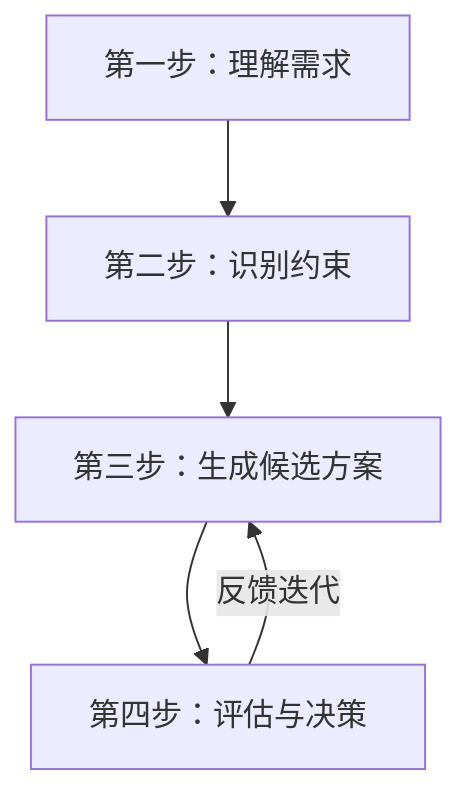
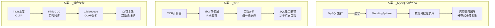

# 从理论到实践——如何用 DDIA 的思维做技术选型？

> 理论知识学完了，但面对真实业务场景时该怎么选？这篇文章用一个完整案例，带你走一遍 DDIA 思维框架下的技术选型全流程。

前十六篇文章，我们走完了 DDIA 的全部理论知识：

- 三个元目标：可靠性、可扩展性、可维护性
- 数据模型、存储引擎、数据编码
- 复制、分区、事务、一致性、共识
- 批处理、流处理、数据系统生态

但你可能还有一个问题：**这些知识我都懂了，但面对一个真实的业务场景时，该怎么用？**

今天这篇文章，我们就把 DDIA 的思维框架**落地为一个可操作的技术选型方法论**——然后通过一个完整的案例，走一遍从需求分析到方案落地的全过程。

## 一、为什么技术选型这么难？

### 常见的技术选型困境

你有没有经历过这样的场景：

- 团队里有人推荐 MongoDB，有人说 PostgreSQL 就够了，还有人建议上 TiDB——**谁也说服不了谁**
- 你选了一个看起来很“先进”的技术，结果运维成本高到爆炸——**被坑了**
- 业务发展超出预期，当初的选型成了瓶颈——**需要迁移，代价巨大**

技术选型之所以难，是因为它**不是纯技术问题**，而是在**约束条件下做决策**的问题。

### 选型失败的常见原因

- **追逐热点**：别人用什么我就用什么，不分析自己的场景
- **低估复杂度**：只看到了新技术的优点，没看到它引入的运维和开发成本
- **忽视现有约束**：团队能力、基础设施、预算限制
- **缺乏可演化性思维**：只考虑当下，没考虑未来两三年的变化

## 二、DDIA 思维框架下的选型方法论

DDIA 提供了一个非常清晰的思维框架，我们可以把它转化为一个**四步选型法**：

### 第一步：理解需求——问正确的问题

在评估任何技术之前，先问自己这些问题：

**数据特征**
- 数据量有多大？目前多大？三年后预计多大？
- 数据的增长速度有多快？
- 数据是结构化、半结构化还是非结构化？
- 数据之间有关系吗？关系有多复杂？

**读写模式**
- 读多写少，还是写多读少？读写比例大约是多少？
- 主要的查询模式是什么？（点查、范围查、全文检索、图遍历？）
- 查询的延迟要求是什么？（毫秒级、秒级、分钟级？）
- 写入的吞吐要求是什么？

**事务与一致性**
- 是否需要 ACID 事务？
- 跨多个实体的操作是否需要原子性？
- 一致性要求有多强？（强一致、因果一致、最终一致？）

**可用性与扩展性**
- 系统需要达到几个 9 的可用性？
- 是否需要多机房、多地域部署？
- 流量峰值是平时的多少倍？

### 第二步：识别约束——坦诚面对现实

技术选型不是“在真空中选最优”，而是在**约束条件下选最合适**。

**团队约束**
- 团队对这个技术栈的熟悉程度如何？
- 有足够的运维经验吗？
- 如果遇到问题，社区支持够吗？

**基础设施约束**
- 现有的运维体系（监控、部署、日志）是否支持这项技术？
- 成本预算如何？（硬件成本、云服务成本、人力成本）

**业务约束**
- 上线时间要求有多紧迫？
- 迁移老数据的难度有多大？
- 未来可能的演化方向是什么？

### 第三步：生成候选方案

基于第一步的需求和第二步的约束，列出 2-3 个可行的候选方案。

> 不要只列一个方案，也不要列太多（超过 5 个就没法深度对比了）。2-3 个方案是最佳数量。

每个方案应该是一个**完整的架构方案**，而不仅仅是“用哪个数据库”——包括存储、计算、同步、容灾、监控等全部环节。

### 第四步：评估与决策

用 DDIA 的三个元标准来评估每个方案：

| 评估维度 | 关键问题 |
|---|---|
| **可靠性** | 这个方案在故障面前表现如何？容灾方案是什么？ |
| **可扩展性** | 业务量增长 10 倍后，这个方案还行吗？扩缩容方便吗？ |
| **可维护性** | 团队能运维好它吗？出问题了能快速定位和修复吗？ |

然后根据**权重**做决策——不是所有维度权重都一样。如果这个系统对业务至关重要，可靠性可能就是最高权重；如果是内部工具，维护成本可能是最高权重。

## 三、完整案例：电商订单系统的技术选型

现在，我们用这套方法论走一遍真实的技术选型过程。

### 场景描述

一家电商公司正在设计新一代的订单系统。业务特征：

- **订单量**：目前每天 10 万单，预计三年后每天 100 万单
- **用户规模**：活跃用户 500 万，高峰时段（大促）并发用户数翻 10 倍
- **数据特征**：订单数据结构化明确，有明确的 Schema
- **数据关系**：订单关联用户、商品、支付、物流等多张表
- **查询模式**：点查为主（根据订单 ID 查订单详情），但也有运营后台的复杂分析查询

### 需求分析

**数据特征**：
- 结构化数据，Schema 明确且稳定
- 关联关系复杂（多表 JOIN）

**读写模式**：
- 读写均衡，但读略多（用户查订单、运营查数据）
- 点查询为主（查单笔订单），但运营侧有范围查询和聚合
- 写入延迟要求：毫秒级（用户下单必须快）
- 查询延迟要求：用户端毫秒级，运营端秒级可接受

**事务与一致性**：
- **强事务要求**：订单创建涉及扣库存、锁优惠券、生成订单等多步操作，必须 ACID
- **强一致性要求**：订单状态不能出现不一致

**可用性与扩展性**：
- 可用性要求：99.99%（电商核心业务）
- 大促流量是平时的 10 倍，需要能弹性扩容

### 约束识别

- 团队对 MySQL/PostgreSQL 非常熟悉，对分布式数据库经验有限
- 现有基础设施已包含 Kubernetes 集群和监控体系
- 项目要求 3 个月内上线
- 预算有限，云资源成本需要可控

### 候选方案生成

**方案一：MySQL 分库分表 + 中间件**

- 核心：MySQL + ShardingSphere/MyCAT 做分库分表
- 优点：团队熟悉，上线最快，成本最低
- 缺点：分库分表后跨库查询/事务困难，运维复杂

**方案二：NewSQL（TiDB）**

- 核心：TiDB 作为原生分布式数据库
- 优点：完整 SQL 支持 + ACID + 自动水平扩展
- 缺点：团队不熟悉，运维需要学习成本，成本相对较高

**方案三：混合架构（OLTP + OLAP 分离）**

- 核心：TiDB（订单主库） + Flink CDC（同步） + ClickHouse（分析库）
- 优点：各有专攻，OLTP 和 OLAP 互不干扰
- 缺点：架构复杂，多了一套数据同步链路，运维成本高

### 基于 DDIA 框架的评估

**可靠性对比**

| | 方案一（MySQL分库分表） | 方案二（TiDB） | 方案三（混合架构） |
|---|---|---|---|
| 主库故障 | 需要人工切换，有切换时间 | Raft 自动故障转移（秒级） | Raft 自动故障转移 |
| 数据一致性 | 分布式事务弱（XA 性能差） | **强一致事务** | 主库强一致，分析库最终一致 |
| 备份恢复 | 成熟方案 | 成熟方案 | 两套系统分别备份，复杂 |

**可扩展性对比**

| | 方案一（MySQL分库分表） | 方案二（TiDB） | 方案三（混合架构） |
|---|---|---|---|
| 水平扩容 | 需要重新规划分片，涉及数据迁移 | **自动扩缩容** | 自动扩缩容（主库 TiDB） |
| 读扩展 | 读写分离 + 从库扩容 | 增加 TiDB 计算节点 | 增加查询节点 |
| 分析查询 | 影响 OLTP 性能 | 影响 OLTP 性能（同一套引擎） | **分析查询隔离** |

**可维护性对比**

| | 方案一（MySQL分库分表） | 方案二（TiDB） | 方案三（混合架构） |
|---|---|---|---|
| 团队熟悉度 | **高** | 中 | 低 |
| 运维复杂度 | 中（需要管理分片） | 低（原生分布式） | **高**（两套系统） |
| 问题排查 | 熟悉 MySQL 生态 | 需要学习分布式运维 | 需要同时懂 TiDB 和 ClickHouse |
| 上线时间 | **最快** | 中 | 最慢 |

### 决策

结合权重分析（**可靠性 > 可扩展性 > 可维护性**，且上线时间紧迫）：

- **方案一**（MySQL 分库分表）：可靠性有隐患（分布式事务弱），扩展性需要人工介入——**排除**
- **方案三**（混合架构）：可靠性最高，但运维复杂度太高，上线时间紧——**暂不考虑**
- **方案二**（TiDB）：可靠性高（Raft 强一致 + 自动故障转移），扩展性好（自动分片 + 弹性扩缩容），可维护性尚可（虽不熟悉但社区成熟、文档完善）——**选择方案二**

> 最终决策：**选择 TiDB 作为订单系统的核心数据库**，同时保留数据同步到数仓做长期分析的规划（但不是第一期的范围）。

## 四、技术选型的常见误区

### 误区一：唯性能论

“这个数据库 TPS 是另一个的 10 倍，所以选它！”

性能重要，但不是唯一标准。一个 TPS 极高的数据库，可能牺牲了事务能力或一致性。如果它不适合你的业务逻辑，性能再高也没用。

### 误区二：唯热度论

“大家都在用 MongoDB，我们也用 MongoDB！”

别人的场景不等于你的场景。MongoDB 适合文档型数据，但如果你需要复杂 JOIN 和多表事务，它就是错误的选择。

### 误区三：忽视运维成本

“先上线再说，运维的事以后再说！”

技术选型时被忽视的运维成本，往往会在系统上线后成为最大的痛苦来源。选一个团队不熟悉的技术，意味着：
- 出问题时无人能修
- 监控体系要重搭
- 招聘难度增加
- 离职风险高

### 误区四：一次选型，终身不变

“选了就定了，以后不能换了！”

技术选型不是终身制。业务在变，技术在变，当初的选择可能不再合适。要在系统设计时**预留演化空间**——比如通过防腐层（Anti-Corruption Layer）隔离外部依赖，降低未来迁移的成本。

## 五、写在最后

技术选型不是“找一个最好的技术”，而是“在约束条件下做最合理的决策”。

DDIA 教给我们的，不是某个数据库的配置参数，而是一套**思考框架**：

1. **从业务需求出发**，而不是从技术偏好出发
2. **识别所有约束**，包括团队、基础设施、时间、预算
3. **用 DDIA 的三元标准**（可靠性、可扩展性、可维护性）评估方案
4. **接受权衡**——没有完美的方案，只有“最适合当下”的方案

下次你面临技术选型时，不妨问问自己：

- **如果不考虑任何技术偏好，纯从业务需求出发，我应该选什么？**
- **如果三年后业务量涨了 10 倍，这个选择还成立吗？**
- **如果核心成员离职了，这个系统还能被维护吗？**

这三个问题问完，你的技术选型就不会差太远。

**下一篇预告：读完后该读什么？——DDIA 延伸阅读指南**