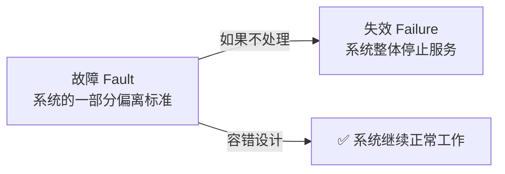
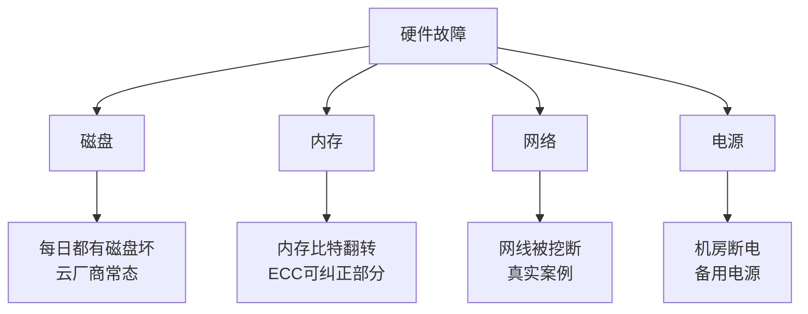
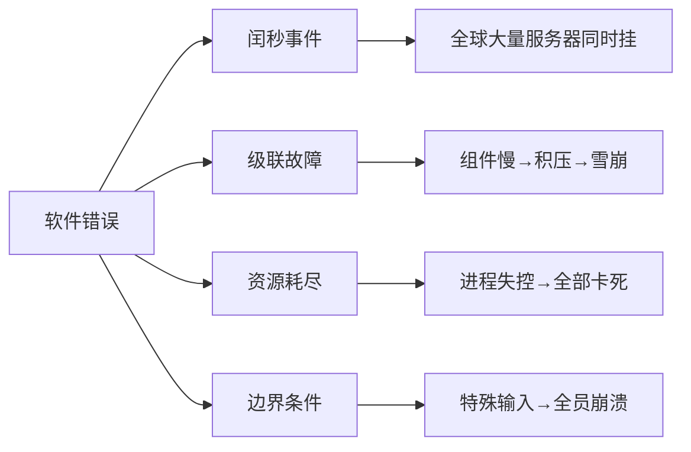
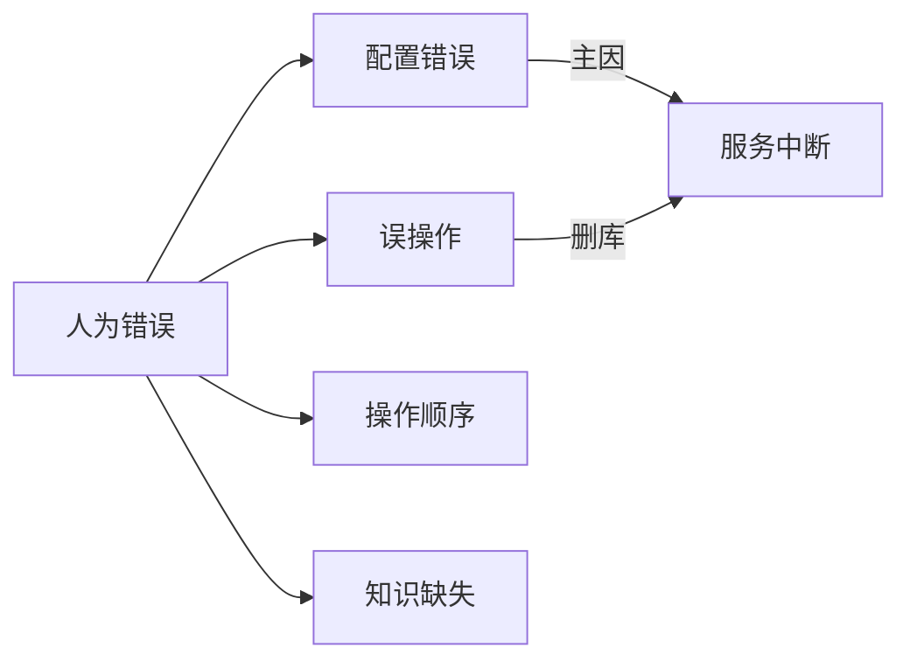
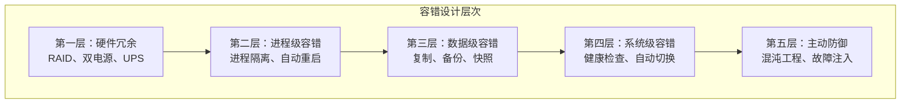

# 可靠性——当故障来临，系统如何 survive？

> 硬件会坏、软件有 bug、人会犯错——可靠性不是让故障不发生，而是在故障发生时，系统能优雅地活下来。

在上一篇文章中，我们介绍了评价数据系统的三个元目标：**可靠性、可扩展性、可维护性**。

其中，**可靠性（Reliability）** 是三个目标中最基础的。一个不可靠的系统，不管它多么可扩展、多么可维护，都没有意义。

今天我们就来深入聊聊可靠性——**当故障来临时，一个系统如何 survive？**

## 一、可靠性：你真的理解这个词吗？

### 直觉 vs 定义

大多数人听到“可靠性”的第一反应是：“系统不挂。”

但这是一个**过于简化**的理解。世界上不存在永不挂的系统。你家里的路由器都会偶尔重启，更何况是运行在成千上万台机器上的大规模数据系统。

在分布式系统领域，可靠性的准确定义是：

> **即使发生了故障（Fault），系统仍然能够正确提供服务，不引发服务失效（Failure）。**

注意这里的两个关键词：

- **故障（Fault）** ：系统的一部分状态偏离了标准——比如一块硬盘坏了、一段代码出了 bug、有人配错了参数
- **失效（Failure）** ：系统作为一个整体停止向用户提供服务

可靠系统的目标是：**允许故障发生，但不让它升级为失效。**

> 如果一个系统能够预料并应对故障，我们称之为**容错（Fault-tolerant）** 或**韧性（Resilient）** 。注意：容错≠容忍所有故障——我们只针对**特定类型**的故障做容错设计。

### 可靠性不是“不出事”，而是“出事能扛住”

打个比方：一架飞机在飞行途中一个引擎熄火了，但飞机仍然能安全降落——这架飞机是**可靠**的。相反，一架从不熄火但一旦熄火就坠毁的飞机，是**不可靠**的。

同样的道理适用于数据系统：**故障一定会发生，关键是故障发生后系统还能不能正常工作。**

## 二、三类故障来源

DDIA 将故障分为三大类。理解这些分类，是设计容错方案的第一步。

### 1. 硬件故障（Hardware Faults）

这是最“传统”的一类故障。

在一个拥有 10,000 个磁盘的存储集群中，如果磁盘的平均无故障时间是 10-15 年，那么**平均每天都会有一个磁盘出故障**。这不是小概率事件，是确定事件。

**典型硬件故障：**

- 硬盘崩溃（坏道、电机故障、固件 bug）
- 内存错误（比特翻转、ECC 校验失败）
- 网络设备故障（交换机/路由器死机、网线松动）
- 机房电力故障（UPS 失效、柴油发电机启动失败）
- 过热导致的 CPU 降频或关机

**传统应对策略：**

- **硬件冗余**：RAID 磁盘阵列、双路电源、双网卡绑定
- **热插拔**：允许不停机更换故障硬件
- **备用发电机 + 不间断电源（UPS）**

**云时代的思路转变：**

云平台更倾向于**优先考虑灵活性和弹性，而不是单机可靠性**。云厂商的设计哲学是：**与其追求每一台机器都不坏，不如让系统在机器坏了之后能自动恢复。**

> 这就是为什么 AWS 说“EC2 实例会随时终止”，Google 说“虚拟机是牲口，不是宠物”。你不需要担心某台机器坏了——你的系统应该能自动处理。

### 2. 软件错误（Software Errors）

硬件故障是**随机的、相互独立的**——一块硬盘坏了不会导致另一块硬盘同时坏（除非是同一批次的固件 bug）。

但软件错误不同——它们是**系统性的**。

**典型软件错误：**

- **闰秒事件（2012 年 6 月 30 日）** ：由于 Linux 内核的一个错误，全球大量服务器同时挂掉
- **级联故障（Cascading Failure）** ：某个组件变慢 → 上游开始积压请求 → 上游耗尽资源 → 更多组件变慢 → 雪崩
- **共享资源耗尽**：一个失控进程吃掉所有 CPU/内存/连接池，导致其他进程无法工作
- **边界条件 bug**：某个特殊输入导致所有实例同时崩溃（比如 JSON 解析器遇到特定字符序列）
- **配置错误**：一个配置变更推送到所有节点，导致集群同时出现问题

**应对策略：**

硬件故障靠冗余，软件故障靠**设计**：

- **仔细审视系统中的假设和交互**（比如不要假设网络延迟总是 < 1ms）
- **彻底测试**（单元测试、集成测试、混沌测试）
- **进程隔离**（在容器或虚拟机中运行，限制资源使用）
- **允许进程崩溃并重启**（快速失败，不要半死不活）
- **持续的生产环境监控**（尽早发现问题）
- **灰度发布和渐进式变更**（不要一次推送到所有节点）

> 软件错误往往比硬件故障更难排查——因为它们**潜伏时间长、触发条件罕见、影响范围广**。一个好的容错系统，需要对软件错误有专门的防御设计。

### 3. 人为错误（Human Errors）

设计系统的是人，运维系统的也是人。而**人是不可靠的**。

一项针对大型互联网服务的研究发现：**运维配置错误是导致服务中断的首要原因**，硬件故障只占 10%-25%。

“删库跑路”不只是一个段子——它背后反映的是人为错误的巨大破坏力。

**典型人为错误：**

- **配置错误**：改错了一个参数 → 集群崩了
- **误操作**：执行了错误的命令 → 删了不该删的数据
- **操作顺序错误**：先做 A 再做 B，但做反了 → 状态不一致
- **知识缺失**：不清楚某个操作的影响 → 盲目操作导致故障

**应对策略：**

- **以最小化犯错机会的方式来设计系统**：比如提供管理后台而不是让工程师直接连数据库执行 SQL
- **将容易出错的地方解耦**：比如把测试环境和生产环境彻底隔离
- **充分的测试**：在沙箱环境验证变更
- **监控和告警**：发现异常行为时立即告警
- **操作审计和回滚能力**：所有操作有日志，可以一键回滚
- **培训和文档**：让更多人知道“什么不能做”

> 有一句话说得很好：**一个好的系统，应该让犯错变得困难，让恢复变得容易。**

## 三、容错设计的层次

容错不是单一的技术，而是一个**分层递进**的设计体系。从最基础到最先进，可以分为以下层次。

**第一层：硬件冗余**

最基础的容错手段。RAID 磁盘阵列、双路供电、双网卡绑定——这些都已经成为数据中心的标配。

成本相对较低，但只能应对**单点硬件故障**，无法应对软件错误或大规模断电。

**第二层：进程级容错**

- **进程隔离**：使用容器或虚拟机将不同服务隔开，一个进程崩溃不影响其他进程
- **自动重启**：进程崩溃后由守护进程（如 systemd）或编排系统（如 Kubernetes）自动重启
- **资源限制**：通过 cgroups 限制 CPU/内存使用，防止一个进程耗尽所有资源

**第三层：数据级容错**

- **数据复制**：将数据复制到多个节点，一个节点故障时其他节点可以继续服务
- **定期备份**：备份到远程存储，数据损坏时可以恢复
- **快照**：定期对数据做快照，方便回滚到某个时间点

**第四层：系统级容错**

- **健康检查**：定期检查服务是否健康，不健康则摘除
- **自动故障转移**：主节点故障时自动切换到备节点
- **限流和降级**：流量过大时优先保证核心功能
- **熔断器**：某个下游服务不可用时，快速失败而不是等待超时

**第五层：主动防御**

这是最“高级”的容错手段——**主动制造故障来验证容错设计是否有效**。

- **混沌工程**：Netflix 的 Chaos Monkey 每天随机杀死生产环境中的实例，验证系统是否能自动恢复
- **故障注入**：模拟网络延迟、磁盘满、CPU 高负载等场景，测试系统的应对能力
- **宕机演练**：定期进行大规模的宕机演练，验证多机房容灾方案

## 四、实际案例：云厂商如何处理硬件故障

理论讲完了，我们看看实际的云厂商是怎么做的。

### AWS 的设计哲学

AWS 有一个广为人知的设计原则：**“Everything fails, all the time.”**

在这个假设下，AWS 的所有服务都被设计成**可以容忍单个 AZ（可用区）甚至整个 Region（地域）的故障**：

- EC2 实例可以随时终止，但 Auto Scaling Group 会自动补充新实例
- S3 的数据自动跨多个 AZ 复制，单 AZ 故障不影响数据可用性
- RDS 支持 Multi-AZ 部署，主库故障时自动切换到备库

AWS 还公开分享过一个真实的硬件故障数据：**在一个有 10 万个磁盘的集群中，每天有约 10 块磁盘出现故障**。这不是灾难，而是日常。

### Google 的“自动修复”文化

Google 的 SRE（Site Reliability Engineering）方法论强调：**用自动化代替人工运维**。

- 硬件故障由自动化系统检测和处理，不需要人工介入
- 机器坏了就自动下线，自动添加到维修队列
- 服务自动重新调度到健康的机器上

> Google 甚至有“Chubby”（分布式锁服务）的趣闻：早期 Chubby 依赖人工运维，团队过得很痛苦。后来他们把运维流程全部自动化，才真正解放出来。

### Netflix 的 Chaos Engineering

Netflix 是混沌工程的先驱。他们的工具链包括：

- **Chaos Monkey**：随机终止生产环境中的实例
- **Chaos Kong**：模拟整个 AZ 的故障
- **ChAP（Chaos Automation Platform）** ：自动化执行混沌实验

Netflix 的目标是：**让系统对故障产生“免疫力”** ——就像疫苗一样，通过小规模的故障注入，让系统获得抵抗大规模故障的能力。

> 这个思路的转变非常关键：**不是“防止故障发生”，而是“习惯故障存在”。**

## 五、写在最后

可靠性不是一句口号，而是一个需要**系统性设计**的目标。

回顾一下今天的核心内容：

1. **可靠性的本质**：不是不让故障发生，而是在故障发生时系统能继续工作
2. **三大故障来源**：硬件故障（随机独立）、软件错误（系统性）、人为错误（最常见的主因）
3. **容错设计五层次**：硬件冗余 → 进程隔离 → 数据复制 → 系统切换 → 混沌工程

> 正如 Netflix 的工程师所说：**“可靠性不是关于没有故障，而是关于从故障中恢复的能力。”**

下次当你设计一个系统时，不妨问自己：

- **如果这台机器突然断电，会发生什么？**
- **如果这个数据库主库挂了，系统还能用吗？**
- **如果有人不小心执行了 DROP TABLE，数据能恢复吗？**
- **如果流量突然暴涨 10 倍，系统会崩溃还是优雅降级？**

这些问题的答案，决定了你的系统到底有多可靠。

**下一篇预告：可扩展性——当流量暴涨10倍，你的系统扛得住吗？**
