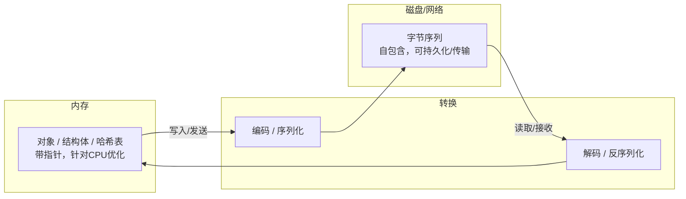
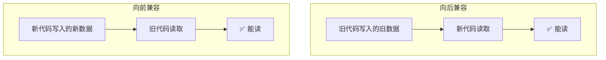
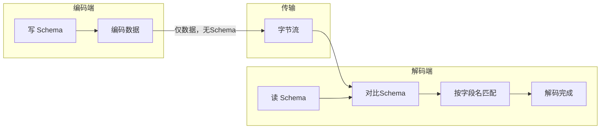

# 数据编码与演化——如何做到不停机变更 Schema？

> 数据格式变了，代码也变了，但老数据还在、老客户端还在——如何不停机完成这一切？

前三篇文章我们聊了：什么样的系统是“好”系统、有哪些数据模型可选、数据在磁盘上怎么存。但还有一个问题没有被回答：**数据格式变了怎么办？**

应用程序总是在变化的。新功能上线、业务逻辑调整、对需求的理解加深——**修改程序，往往也意味着修改数据格式**。关系数据库通过 `ALTER TABLE` 来变更 Schema，但在生产环境中，**任何时间点都有且仅有一个正确的模式**——你不能说停就停。

DDIA 第四章的核心命题就是：**如何在不停止服务的情况下，让数据和代码一起演化？**

答案藏在两个关键词里：**编码（Encoding）** 和 **兼容性（Compatibility）** 。


## 一、为什么需要编码？

### 内存 vs 存储/网络

程序中的数据有**两种存在形式**：

- **在内存中**：数据存在于对象、结构体、哈希表、树等数据结构中——针对 CPU 的高效访问进行了优化（通常使用指针）
- **在磁盘或网络中**：数据必须被编码为**某种自包含的字节序列**（如 JSON 文档）

为什么需要这种转换？因为**每个进程都有自己独立的地址空间，一个进程中的指针对任何其他进程都没有意义**。指针指向的是内存地址，换了进程、换了机器，这个地址就毫无意义。



从内存表示到字节序列的转换称为**编码（Encoding）** ，也叫**序列化（Serialization）** 或**编组（Marshalling）** ；反过来称为**解码（Decoding）** ，也叫**反序列化（Deserialization）** 或**解析（Parsing）** 。

> 💡 为什么不用“序列化”这个更常见的词？因为在数据库事务的上下文中，“序列化”已经有别的含义了（可串行化隔离级别）。DDIA 统一使用“编码”来避免歧义。

### 编码要解决两个问题

一个好的编码方案需要同时回答两个问题：

1. **如何编码才能节省空间、提高性能？** ——这是效率问题
2. **如何编码才能适应数据的演化和兼容？** ——这是可维护性问题

本章的重点是第二个问题——**如何让编码支持演化**。


## 二、向前兼容 vs 向后兼容

### 两个容易混淆的概念

在讨论编码格式之前，必须先厘清两个核心概念：

- **向后兼容（Backward Compatibility）** ：**新代码**可以读取**旧代码**写入的数据
- **向前兼容（Forward Compatibility）** ：**旧代码**可以读取**新代码**写入的数据

> 💡 为什么这么容易混淆？因为中文里的“前”和“后”有歧义——到底是指“之前”（过去）还是“之后”（将来）？有人建议翻译为“**兼容过去**”和“**兼容将来**”，可能更清晰一些。



**向后兼容相对容易**——因为时间总是向前流逝，版本总是升级，升级后的代码总要处理历史积压的旧数据。

**向前兼容更难**——旧代码不认识新数据格式中的新字段，需要有能力“忽略”它们而不崩溃。

### 为什么两者都很重要？

在一个**不停机**的系统里，新旧版本的代码**同时存在**是常态：

- **服务端**：灰度发布时，新旧版本的服务同时运行
- **客户端**：用户不会同时升级 App，新旧客户端并存

因此，**双向兼容**是系统可演化性的基础。Martin Kleppmann 在书中给出了一个实用建议：

> **数据格式要向后兼容，服务 API 要向前兼容。**


## 三、主流编码格式巡礼

### 3.1 语言内置的编码

很多编程语言内置了序列化机制：

- Java：`java.io.Serializable`
- Python：`pickle`
- Ruby：`Marshal`

**优点**：使用方便，几乎不需要额外配置。

**缺点**却很致命：

- **语言绑定**：其他语言无法读取
- **安全问题**：解码时可能实例化任意类，存在远程代码执行风险
- **兼容性差**：版本控制不方便
- **效率不高**

这些内置格式**只适合临时使用**，不适合作为跨系统、长期存储的数据格式。

### 3.2 文本格式：JSON、XML、CSV

这是最“亲民”的一类编码格式——**人类可读**。

**共同优点**：
- 肉眼可读，调试方便
- 跨语言支持广泛
- 无需预定义 Schema（或 Schema 可选）

**共同缺点**：

| 问题 | 说明 |
|---|---|
| **数值类型模糊** | XML 和 CSV 不区分数字和字符串；JSON 不区分整数和浮点数 |
| **大数支持差** | 处理超过 2⁵³ 的整数时会丢失精度 |
| **二进制支持差** | 需要通过 Base64 编码绕过去 |
| **Schema 支持** | XML 和 JSON 有可选的 Schema，但增加了复杂度；CSV 根本没有 Schema |
| **冗余度高** | 大量花括号、引号、标签占据了空间 |

虽然问题不少，但**可读性是王道**——JSON 已经成为 Web API 的事实标准。很多日志格式也是 JSON 的。

#### JSON 的二进制变体

为了兼顾 JSON 的灵活性和二进制的高效，出现了一批 JSON 的二进制变种：MessagePack、BSON、BJSON、UBJSON、Smile 等。

一个简单的 JSON 对象：

```json
{
  "userName": "Martin",
  "favoriteNumber": 1337,
  "interests": ["daydreaming", "hacking"]
}
```

文本 JSON 编码约 **81 字节**，用 MessagePack 编码可压缩到 **66 字节**。提升有限，但聊胜于无。

### 3.3 二进制 Schema 格式：Thrift、Protocol Buffers、Avro

这是本章的重头戏——**为大规模、高要求的生产环境设计的编码格式**。

#### Thrift 和 Protocol Buffers

Facebook 在 2007 年开源了 **Thrift**，Google 在 2008 年开源了 **Protocol Buffers**（protobuf）。两者设计思路非常相似：

- 都需要一个 **Schema**（模式）来描述数据结构
- 使用 **IDL（接口定义语言）** 来定义 Schema
- 编码后的数据是**二进制**的，紧凑且高效
- 通过 **字段标签（Field Tag）** 来标识字段

**Thrift 的 IDL 示例**：

```
struct Person {
  1: string userName,
  2: optional i64 favoriteNumber,
  3: list<string> interests
}
```

**Protocol Buffers 的 IDL 示例**：

```protobuf
message Person {
  required string user_name = 1;
  optional int64 favorite_number = 2;
  repeated string interests = 3;
}
```

> 🔑 **关键设计：字段标签**。每个字段都有一个编号（如 `1`、`2`、`3`）。编码时只存字段编号 + 值，不存字段名。这样，即使字段名改了，只要编号不变，新旧代码就能互相识别。

**兼容性规则**：

| 操作 | 兼容性 |
|---|---|
| 添加新字段（有默认值） | ✅ 向后兼容 |
| 删除字段（非 required） | ⚠️ 小心处理 |
| 修改字段类型 | ❌ 不兼容 |
| 修改字段编号 | ❌ 不兼容 |
| 字段重命名 | ✅ 兼容（编号不变） |

#### Avro：不走寻常路

**Avro** 是 Apache 的项目，最初为 Hadoop 生态设计，现在也被 Kafka 广泛使用。

Avro 和 Thrift/Protobuf 最大的区别是：**没有字段标签**。

那 Avro 怎么知道哪个字段对应哪个呢？答案是：**靠字段名和顺序**。

**Avro 的 Schema（JSON 格式）** ：

```json
{
  "type": "record",
  "name": "Person",
  "fields": [
    {"name": "userName", "type": "string"},
    {"name": "favoriteNumber", "type": ["null", "long"], "default": null},
    {"name": "interests", "type": {"type": "array", "items": "string"}}
  ]
}
```

编码时，Avro 按照 Schema 中字段的顺序，依次写入每个字段的值——**没有字段编号，没有字段名，只有数据**。

那如何实现兼容呢？**读写双方各自维护一个 Schema**：

- **写 Schema**：编码时使用的 Schema
- **读 Schema**：解码时使用的 Schema

Avro 在解码时，会**对比两个 Schema**，按字段名进行匹配：

- 读 Schema 中有、写 Schema 中没有的字段 → 使用默认值
- 写 Schema 中有、读 Schema 中没有的字段 → 直接忽略



**Avro 的优势**：

- **不需要代码生成**：可以动态解析 Schema
- **Schema 演化灵活**：只要字段名匹配即可
- **适合大规模数据处理**：Hadoop、Kafka 生态的首选

**Avro 的代价**：

- **读写 Schema 必须同时存在**
- 如果 Schema 不兼容（如字段名变了），解码会失败


## 四、三种主流二进制格式的对比

| 维度 | Thrift | Protocol Buffers | Avro |
|---|---|---|---|
| **出身** | Facebook | Google | Apache |
| **字段标识** | 字段编号 | 字段编号 | **字段名（无编号）** |
| **Schema 必需** | ✅ | ✅ | ✅ |
| **代码生成** | 需要 | 需要 | **可选** |
| **兼容性机制** | 字段编号映射 | 字段编号映射 | **读写 Schema 对比** |
| **典型场景** | 内部 RPC | gRPC、微服务 | Kafka、Hadoop |
| **动态 Schema** | ❌ | ❌ | ✅ |

### 怎么选？

- **需要高性能 RPC、微服务通信** → Protobuf（gRPC 生态成熟）或 Thrift
- **需要大规模数据流处理、与 Kafka/Hadoop 集成** → Avro
- **需要动态解析、不想生成代码** → Avro
- **对外 API、需要人类可读** → JSON（别为了性能牺牲调试体验）


## 五、数据流模式：数据怎么“跑”？

编码不是孤立存在的——**数据需要在不同的进程之间流动**。DDIA 归纳了三种典型的数据流模式：

### 5.1 经由数据库的数据流

**特点**：写入进程编码数据 → 存入数据库 → 读取进程解码数据。

**核心挑战**：**数据的生命周期往往超过代码的生命周期**。

一段数据可能在数据库里躺好几年，而在这期间代码已经升级了十几个版本。读取时，数据库可能需要在**旧格式数据**上填充新字段的默认值。

**典型问题**：新代码写入了一个带新字段的行，随后旧代码（在滚动升级期间）覆盖了这行数据——新字段就丢了。

### 5.2 经由服务调用的数据流（REST / RPC）

**特点**：客户端通过网络请求服务端。

**两种主流风格**：

- **REST**：基于 HTTP，强调资源，使用 URL + HTTP 方法，简洁、流行
- **SOAP**：基于 XML 的复杂协议，逐渐被 REST 取代
- **RPC**：远程过程调用，如 gRPC（基于 Protobuf）、Thrift

**核心挑战**：服务端和客户端可能版本不同步（尤其是在微服务架构中）。

**最佳实践**：使用 IDL（如 Protobuf）定义接口契约。

### 5.3 经由异步消息传递的数据流

**特点**：通过消息队列（如 Kafka、RabbitMQ）在进程间传递数据。

**核心挑战**：消息的生产者和消费者可能独立升级，版本不同步是常态。

**最佳实践**：配合 **Schema Registry**（如 Kafka + Avro + Confluent Schema Registry）管理消息格式的版本演化。


## 六、写在最后

> **“不是支持演化的数据系统，都只能活在短命的原型阶段。”** —— Martin Kleppmann

这句话很狠，但很真实。**不支持演化的系统，活不长。**

DDIA 第四章告诉我们几件重要的事：

1. **编码是数据流动的基石**——内存中的数据要走向磁盘或网络，必须编码
2. **兼容性是系统演化的生命线**——向前兼容很难，但必须做到
3. **没有完美的编码格式**——JSON 可读但低效，Protobuf 高效但需代码生成，Avro 灵活但需同时维护 Schema
4. **数据流模式决定了兼容性的挑战形式**——数据库、服务调用、消息队列，各有各的坑

在实际工作中，每次加字段、改接口之前，问自己三个问题：

- **老数据能读吗？** （向后兼容）
- **老客户端能读吗？** （向前兼容）
- **降级后还能工作吗？** 

这三个问题问完，你的系统离“可演化”就更近了一步。

**下一篇预告：数据复制——主从、多主、无主三种架构的权衡**