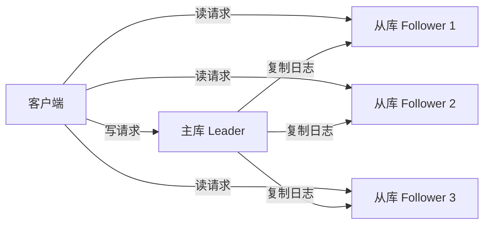

# 数据复制——主从、多主、无主三种架构的权衡

> 数据复制是分布式系统的基石——主从、多主、无主三种架构，各自解决了什么问题，又带来了什么新的麻烦？

前五篇文章我们完成了“数据系统基础”部分——从三大目标、数据模型、存储引擎到数据编码。从这一篇开始，我们正式进入本书的第二部分：**分布式数据**。

如果说第一部分的主题是“单机怎么玩”，那么第二部分的主题就是“多机怎么玩”。而数据复制，是所有分布式系统要解决的**第一个问题**。

复制（Replication）是指**将同一份数据复制多份，放到通过网络互联的多个机器上去**。为什么要这么做？三个核心原因：

- **降低延迟**：让数据在物理上接近用户
- **提高可用性**：部分节点故障，系统仍能工作
- **扩展读吞吐**：多个副本可以分担读流量

听起来很美好，但复制的核心难题是：**数据是会变的**。如果数据只复制一次就不再变化，那很简单——但现实中的数据每分每秒都在更新。如何将**变更**同步到所有副本，才是真正的挑战。

DDIA 第五章介绍了三种主流的复制算法：**主从复制（单主）、多主复制、无主复制**。今天我们就来逐一拆解。


## 一、主从复制（Single-Leader）：最主流的方案

### 工作原理

主从复制（也叫**基于领导者的复制**）是绝大多数关系数据库的标配——MySQL、PostgreSQL、MongoDB 都在用。

它的核心思想很简单：**指定一个节点为主库（Leader），其他为从库（Follower）** 。



工作流程分三步：

1. **写入**：客户端将写请求发送给主库，主库将数据写入本地存储
2. **复制**：主库将数据变更作为**复制日志**（或变更流）发送给所有从库
3. **应用**：每个从库从主库拉取日志，**按照相同的顺序**应用所有写入，更新本地副本

读取时，客户端可以向主库或从库查询——但**只有主库能接受写操作**。

### 同步 vs 异步：一场关于可靠性的选择

复制系统的一个重要设计决策是：**复制是同步发生还是异步发生？**

- **同步复制**：主库等待从库确认写入完成后，才返回客户端成功。优点是**从库和主库始终一致**；缺点是**如果从库故障，主库必须阻塞所有写入**，等待从库恢复。
- **异步复制**：主库写入后立即返回，不等待从库确认。优点是**性能好、可用性高**；缺点是**主库故障时可能丢失尚未复制的数据**。

现实中，**完全同步所有从库是不切实际的**——任何一个从库故障都会阻塞整个系统。所以大多数系统采用**半同步（Semi-synchronous）** 方案：

> **一个从库同步 + 其他从库异步**。这样既保证了**至少两个节点**拥有最新数据，又不会因为某个从库故障而阻塞写入。

### 复制滞后：异步的代价

如果选择了异步复制（大多数生产系统都这么干），就会引入一个问题：**复制滞后（Replication Lag）** ——从库的数据落后于主库。

如果用户正好从落后的从库读取数据，就会读到**过期信息**。这就是所谓的**最终一致性**——数据不会立即一致，但“最终”会一致。

复制滞后会引发三类典型异常：

| 异常 | 描述 | 示例 |
|---|---|---|
| **读己之写** | 用户写完后马上读，可能读不到自己的写入 | 提交评论后刷新页面，评论消失了 |
| **单调读** | 用户多次读取，可能看到数据“回退” | 先读到新版本，再读到旧版本 |
| **前缀一致读** | 写入顺序被打乱 | 先看到回复，再看到原帖 |

解决方案也很直接：**确保读请求走主库**（对于读己之写），或者**确保从同一个从库读取**（对于单调读）。

> 💡 主从复制是最成熟的方案，适合绝大多数场景。但它的致命弱点是：**所有写入都经过单点**。如果主库挂了，系统就不可写了——直到新的主库被选举出来。


## 二、多主复制（Multi-Leader）：当单点成为瓶颈

### 为什么需要多个主库？

主从复制最大的问题是**所有写入都要经过主库**。如果主库在地理上与用户相距甚远，写入延迟就会很高。

解决办法很直接：**每个数据中心放一个主库**。

多主复制（Multi-Leader Replication）就是**有多个可以接受写入的主副本**，每个主副本在接收到写入之后，都要转发给所有其他副本。

但要注意：**在单个数据中心内，多主模型意义不大——复杂度超过了收益**。它只在特定场景下才有价值。

### 典型应用场景

**1. 多数据中心部署**

如果数据库横跨多个数据中心，单主模型下写入必须跨地域传到主库，延迟很高。每个数据中心配一个主库，写入本地数据中心即可，异步复制到其他数据中心。

**2. 离线工作的客户端**

日历应用、笔记应用——用户在飞机上离线编辑，联网后同步到云端。每个设备本质上都是一个“主副本”，可以独立接受写入。

**3. 协同编辑**

Google Docs 允许多人同时编辑同一文档。每个用户的本地副本就是一个“主”，可以独立写入，联网后解决冲突。

### 写入冲突：多主模型最大的坑

多主模型最棘手的问题是：**如何处理写入冲突？**

设想一个 Wiki 页面标题的修改：

- 用户 A 在东京将标题从 A 改为 B
- 用户 B 在纽约将标题从 A 改为 C

两个修改都在各自的主库上成功了。等到异步复制时，才发现冲突——**但为时已晚**。

在主从模型中，冲突可以**同步检测**：第二个写入要么阻塞等待，要么失败重试。但在多主模型中，**写入在不同主库上已经成功了**，没法回头。

### 冲突解决策略

常见的冲突解决策略包括：

- **冲突避免**：将特定数据的所有写入都路由到同一个主库——但这会削弱多主的优势
- **最后写入获胜（LWW）** ：用时间戳决定谁赢——**简单但有数据丢失风险**
- **版本向量**：记录操作的因果历史，用于合并冲突
- **应用层解决**：让应用代码决定如何合并，或者交给用户解决

DDIA 指出，多主复制在工程实践中**用得相对较少**，因为**很难保证自增主键、触发器和完整性约束的一致性**。

> 💡 多主复制适合**写入冲突少、可以接受复杂冲突解决逻辑**的场景。不要为了“看起来更分布式”而用它——**它带来的复杂性远超你的想象**。


## 三、无主复制（Leaderless）：彻底去中心化

### 抛弃主库

无主复制（Leaderless Replication）走了一条更激进的路：**彻底不要主库，所有节点平等**。

这种架构的代表是 **Amazon Dynamo**，以及受它启发的 **Cassandra** 和 **Riak**。

客户端**向多个节点并行发送读写请求**。

### Quorum 机制：用数学保证一致性

无主复制用 **Quorum（法定人数）** 机制来保证数据一致性。

假设有 N 个副本，定义两个参数：

- **W**：每次写入至少需要确认的节点数
- **R**：每次读取至少需要查询的节点数

只要满足 **W + R > N**，就能保证**读取时至少有一个节点包含最新的写入**——因为读到的 R 个节点和写入的 W 个节点必然有重叠。

```mermaid
flowchart LR
    subgraph N=5个副本
        W1[写入确认 W=3]
        R1[读取查询 R=3]
    end
    W1 -->|交集| O[重叠 ≥1]
    R1 -->|交集| O
    O -->|保证| C[读到最新数据]
```

举个例子：N=5，W=3，R=3。写入时至少 3 个节点确认成功，读取时至少查询 3 个节点——**交集至少 1 个节点**，一定能读到最新版本。

### 如何修复不一致？

无主复制允许节点之间的数据不一致，但提供了两种修复机制：

- **读修复（Read Repair）** ：客户端读取时发现多个节点返回了不同版本的数据，就把最新版本写回旧节点。**适合读多写少的场景**。
- **反熵（Anti-Entropy）** ：后台进程持续比对节点间的数据，发现不一致就修复。**适合修复那些很少被读取的“冷数据”**。

> 💡 不是所有系统都实现了反熵。比如 Voldemort 就没有——那些很少被访问的数据可能**永远得不到修复**。

### 无主复制的优缺点

**优点**：
- **极高的可用性**：没有单点故障
- **低延迟**：客户端可以访问最近的节点

**缺点**：
- **一致性复杂**：需要仔细权衡 W、R 的取值
- **资源开销大**：冗余读写增加网络和计算负载


## 四、三种架构对比

| 维度 | 主从复制 | 多主复制 | 无主复制 |
|---|---|---|---|
| **写入点** | 1 个 | 多个 | 所有节点 |
| **一致性** | 强（同步）/最终（异步） | 最终（需处理冲突） | 最终（Quorum 可调） |
| **写入冲突** | 无（单点序列化） | **有，需专门处理** | **有，需版本向量等** |
| **可用性** | 主库故障需切换 | 高（多主） | **极高**（无单点） |
| **复杂度** | 低 | **高** | 中 |
| **典型系统** | MySQL、PostgreSQL、MongoDB | CouchDB | Cassandra、Riak、Dynamo |

### 选型建议

- **绝大多数场景选主从复制**——成熟、稳定、够用
- **多数据中心、离线场景考虑多主**——但要接受冲突处理的复杂度
- **极致可用性、可容忍最终一致性选无主**——比如 IoT、社交 Feed


## 写在最后

数据复制是分布式系统的**第一块多米诺骨牌**——你选择了什么样的复制架构，就决定了后续要面对什么样的问题。

- **主从复制**简单可靠，是 80% 场景的最佳选择
- **多主复制**解决了单点写入的瓶颈，但引入了冲突处理的巨大复杂度
- **无主复制**提供了最高的可用性，但需要你接受最终一致性

没有“最好”的复制架构，只有“最不坏”的选择。**理解每种方案的权衡，根据你的业务场景做决策**——这才是 DDIA 要教给你的核心能力。

下一篇文章，我们将讨论数据复制的“兄弟”问题——**数据分区**。当一份数据大到单机放不下时，怎么拆、怎么查？

**下一篇预告：数据分区——如何将海量数据拆分到多台机器？**