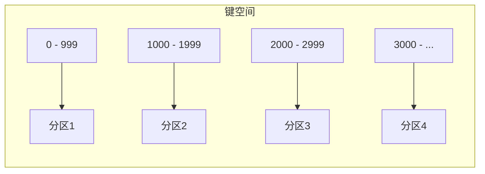
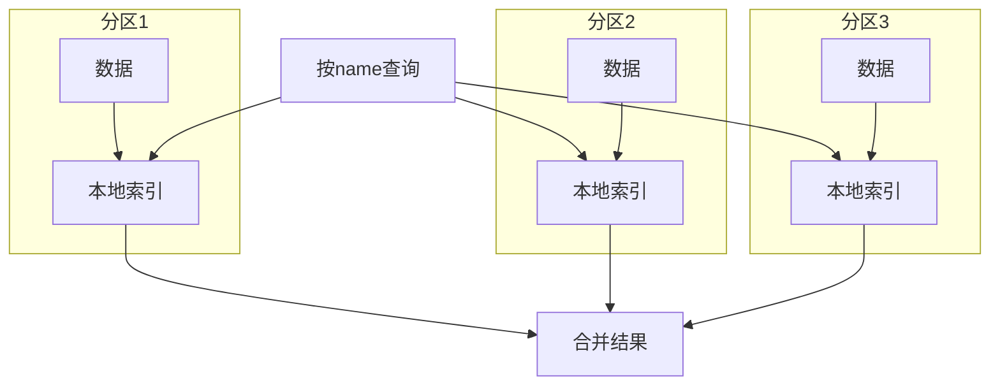
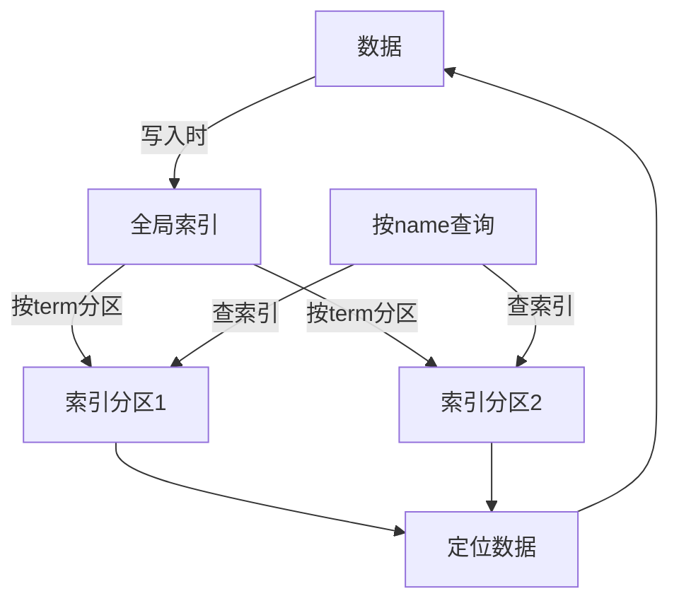
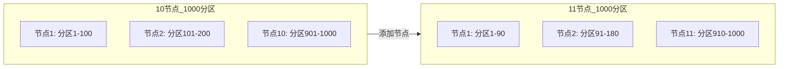

# 数据分区——如何将海量数据拆分到多台机器？

> 数据复制解决了高可用和读扩展，数据分区解决了单机放不下的问题——但怎么分、怎么查、怎么扩容，每一个都是坑。

上一篇文章我们聊了**数据复制**——把同一份数据复制多份，解决高可用和读扩展的问题。

但复制解决不了另一个问题：**单机放不下**。

当数据量达到 TB 甚至 PB 级别，一台机器的磁盘装不下；当 QPS 达到十万甚至百万级别，一台机器的 CPU 也处理不过来。

这时候需要的是**分区（Partitioning）** ——把数据拆成多份，分散到多台机器上。分区也叫**分片（Sharding）** ，本质上是一回事。

分区和复制通常是**组合使用**的：每个分区在多个节点上各有副本，既保证了可扩展性，又保证了容错性。

DDIA 第六章的核心问题是：**数据怎么分？分完之后怎么查？节点变了怎么办？**

## 一、为什么需要分区？

一句话：**单机扛不住了**。

具体来说有三个方面：

- **存储容量**：一台机器的磁盘装不下所有数据
- **内存限制**：索引放不进内存，查询就慢
- **CPU 瓶颈**：单机的处理能力有上限，写请求处理不过来

分区的目标很明确：**将数据和查询负载均匀地分布在各个节点上**。

如果每个节点公平地分享数据和负载，那么理论上，10 个节点应该能够处理 10 倍的数据量和 10 倍的读写吞吐量。这就是**水平扩展（Scale Out）** 的核心价值。

### 偏斜与热点：分区最大的敌人

理想很丰满，现实很骨感。分区最大的挑战是**数据分布不均**。

如果某些分区比其他分区有更多的数据或查询，这种情况叫做**偏斜（Skew）** 。偏斜会导致某些节点负载过高，成为整个系统的**热点（Hot Spot）** 。

> 极端情况下，一个热点节点可能承担了 90% 的请求，而其他 9 个节点几乎空闲——**整个系统的吞吐被一个节点卡死**。

避免热点的最简单方法是将记录**随机分配给节点**——这样数据肯定均匀。但代价是：**查询时不知道数据在哪个节点上，必须查询所有节点**。

所以，真正的挑战是：**在“均匀分布”和“高效查询”之间找到平衡**。

## 二、两种主流分区策略

### 策略一：按键范围分区（Key Range Partitioning）

**核心思想**：为每个分区分配一段连续的键范围。

就像百科全书按字母顺序分卷——A-C 一卷，D-F 一卷。每个分区负责从某个最小值到某个最大值的所有键。

**优点**：
- **范围查询高效**：要查 user_id 在 1000 到 2000 之间的用户，只需要访问分区 2
- **键有序**：可以利用键的排序特性，比如按时间戳分区，查询某段时间的数据很方便
- **动态扩展友好**：当某个分区数据量太大时，可以将其分裂成两个更小的分区

**缺点**：
- **热点风险高**：如果某个范围的键被频繁访问，对应的分区就会成为热点
- **数据分布可能不均**：比如按用户名首字母分区，“J”和“M”开头的用户可能远多于“X”和“Z”

**典型系统**：Bigtable、HBase、RethinkDB，以及 2.4 版本之前的 MongoDB

### 策略二：按键哈希分区（Hash Partitioning）

**核心思想**：对键计算哈希值，然后根据哈希值来决定分区。

一个好的哈希函数（如 MD5、Fowler-Noll-Vo）可以把偏斜的数据均匀打散。

**优点**：
- **分布均匀**：哈希函数能把数据均匀地分配到各个分区，大大降低热点风险

**缺点**：
- **范围查询失效**：键的排序被打乱了，范围查询要么不支持，要么需要查询所有分区再汇总
- **扩容麻烦**：如果直接用 `hash(key) % N`（N 是节点数），增加节点后几乎所有数据都要重新分配

**典型系统**：Cassandra（部分）、Riak、MongoDB（3.0 之后默认）

### 策略三：混合方案——组合主键

很多系统其实**两种策略都用**——用组合主键（Compound Primary Key）来兼顾两者的优点。

比如在社交网络中，主键设计为 `(user_id, update_timestamp)`：

- 用 `user_id` 的哈希值决定数据去哪个分区——**保证同一用户的数据在同一个分区**
- 在同一分区内，按 `update_timestamp` 排序——**方便按时间范围查询该用户的更新**

这样既享受了哈希分区的负载均衡，又保留了范围内的查询能力。

> 这是 Cassandra 和 HBase 等系统广泛使用的设计模式。

## 三、二级索引的难题

分区之后，**主键查询**很容易——根据主键算出分区，直接去对应节点查就行。

但**非主键查询**就麻烦了。比如用户表按 `user_id` 分区，但你想按 `name` 查用户——这个查询该去哪个分区？

这就是**二级索引（Secondary Index）** 在分区系统中面临的挑战。DDIA 介绍了两种方案。

### 方案一：本地索引（Local Index）

**做法**：每个分区**独立维护**自己的二级索引，只索引本分区内的数据。

**优点**：
- **写操作简单**：更新数据时，只需更新同分区的索引
- **维护方便**：每个分区独立负责，没有跨分区的依赖

**缺点**：
- **读操作昂贵**：查询时必须**访问所有分区**的索引，然后把结果合并
- **尾延迟放大**：最慢的那个分区决定了整个查询的响应时间

这种“查所有分区再合并”的模式，在 DDIA 中被称为 **scatter/gather**。

### 方案二：全局索引（Global Index）

**做法**：建立**全局的**二级索引，索引本身也按某种规则分区，分散到多个节点上。

**优点**：
- **读操作高效**：查询时只需访问对应的索引分区，不用扫所有数据分区

**缺点**：
- **写操作复杂**：一次数据写入可能需要更新**多个**索引分区（一条记录可能有多个二级索引字段）
- **需要分布式事务**：确保数据和索引的一致性，这本身就很难

> 本地索引是“**写容易，读困难**”，全局索引是“**读容易，写困难**”。没有完美方案，只有适合你读写比例的方案。

## 四、再平衡（Rebalancing）：集群变了怎么办？

集群不是一成不变的：

- 流量增长了，需要**增加节点**
- 业务收缩了，可以**减少节点**
- 某个节点宕机了，需要**替换**

当节点数变化时，**分区需要重新分配**——这个过程叫**再平衡（Rebalancing）** 。

再平衡有三个核心要求：

1. **负载均匀**：再平衡后，数据和查询要均匀分布
2. **持续可用**：过程中不能停服务
3. **最小化迁移**：尽量减少数据移动，降低网络和磁盘开销

### 方案一：固定数量分区

**做法**：提前创建**远多于节点数**的分区（比如 1000 个分区，10 个节点，每个节点分 100 个）。

- 增加节点时：新节点从每个老节点**“偷”** 一些分区，直到再次均匀
- 减少节点时：反过来，把要下线的节点的分区分配给其他节点

**关键点**：**分区的数量不变，变的是分区和节点的映射关系**。

**优点**：
- **数据迁移量可控**：只移动部分分区，不是全部数据
- **实现简单**：分区数量固定，映射关系清晰

**缺点**：
- **分区数要提前规划**：太多了管理开销大，太少了扩展能力有限

> 这是 **Elasticsearch** 和 **Kafka** 等系统的做法。Kafka 的分区数在创建 Topic 时就固定了，扩容时只能增加节点来分担已有分区。

### 方案二：动态分区

**做法**：不预先固定分区数量和边界，而是**根据数据量动态调整**。

- 分区数据量超过阈值 → **分裂**成两个分区
- 分区数据量低于阈值 → **合并**两个相邻分区

**优点**：
- **自适应**：数据量小的时候分区少，数据量大的时候分区多
- **无需提前规划**：系统自动管理

**缺点**：
- **实现复杂**：需要监控每个分区的大小并自动触发分裂/合并
- **分裂期间可能影响性能**

> 这是 **HBase** 和 **MongoDB** 等系统的做法。

### 方案三：按节点比例分区

**做法**：分区数和节点数**成正比**——比如每个节点固定有 100 个分区。

增加节点时，重新计算分区边界，数据重新分配。

**缺点**：节点数变化时，**所有数据都要重新分区**，迁移量巨大。

> 这种方案在实践中**几乎不被采用**。

### 关于一致性哈希

**一致性哈希（Consistent Hashing）** 是分布式系统中经常被提及的概念。

DDIA 对它的评价比较谨慎：一致性哈希的动态平衡特性可能会使分区再平衡**变得不可控**。

因此，许多实际系统（如 Cassandra）采用的做法是：**创建比节点更多的分区，为每个节点分配多个分区**。这种方法本质上是一致性哈希的一种变体，但更可控。

## 五、请求路由：客户端怎么找到数据？

分区做好了，数据也均衡了，但还有一个问题：**客户端怎么知道某个 key 在哪个节点上？**

这个问题在 DDIA 中被称为**请求路由（Request Routing）** 。

有三种典型方案：

### 方案一：客户端感知

客户端**本地维护**分区到节点的映射关系，直接向正确的节点发送请求。

- **优点**：零额外网络跳转，延迟最低
- **缺点**：客户端需要感知集群变化，实现复杂

### 方案二：路由层

客户端请求先发给一个**路由层**（Routing Tier），路由层查表后转发到正确的节点。

- **优点**：客户端简单，不感知集群细节
- **缺点**：多一次网络跳转，路由层可能成为瓶颈

### 方案三：任意节点转发

客户端可以**随机连接任意节点**，如果该节点不是目标节点，就帮客户端**转发**请求。

- **优点**：客户端最简单
- **缺点**：额外的网络跳转，且对路由节点有压力

### 元数据管理：谁来维护映射关系？

无论哪种方案，都需要一个地方存储“分区 → 节点”的映射关系。

常见做法是依赖 **ZooKeeper** 或 **etcd** 这类共识服务来维护元数据。Kafka、HBase、Elasticsearch 等都依赖 ZooKeeper 来做服务发现。

另一种做法是使用 **Gossip 协议**（如 Cassandra），节点之间通过点对点的方式传播元数据变化。

## 六、写在最后

分区是分布式系统的**第二块基石**（第一块是复制）。它让系统能够**水平扩展**，突破单机的物理上限。

但分区的代价是**复杂度**：

| 维度 | 单机 | 分区系统 |
|---|---|---|
| **查询** | 简单，一个 SQL 搞定 | 可能跨分区，需要 scatter/gather |
| **事务** | ACID 完整支持 | 跨分区事务极难 |
| **索引** | 简单 | 本地索引 vs 全局索引的艰难选择 |
| **扩容** | 换机器 | 再平衡，数据迁移 |
| **可用性** | 单点故障 | 部分节点故障不影响整体 |

> 正如 Martin Kleppmann 所说：**分区系统的难点不在“怎么分”，而在“之后的一切操作”如何适配**。

做好分区，需要回答好三个问题：

1. **怎么分？** ——范围分区还是哈希分区？【第2节】
2. **怎么查？** ——二级索引用本地还是全局？【第3节】
3. **怎么变？** ——节点增减时如何再平衡？【第4节】

没有标准答案，只有适合你业务场景的权衡。**选好分区键、预估好分区数、设计好路由方案**——这三件事做好了，分区系统就成功了一大半。

下一篇，我们将进入数据库最核心也最复杂的话题——**事务**。ACID 到底是什么？隔离级别有多少种？分布式事务为什么这么难？

**下一篇预告：事务简史——从 ACID 到分布式事务**