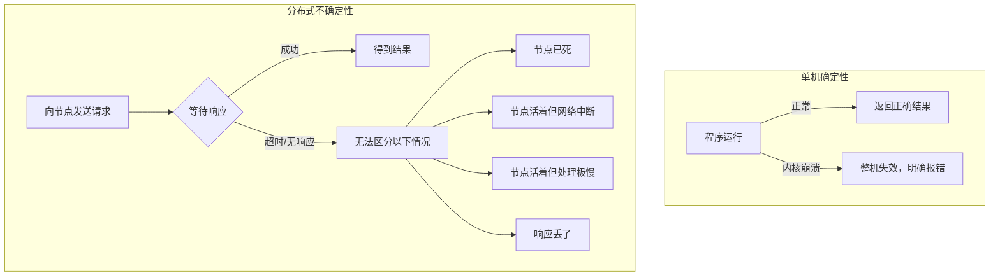
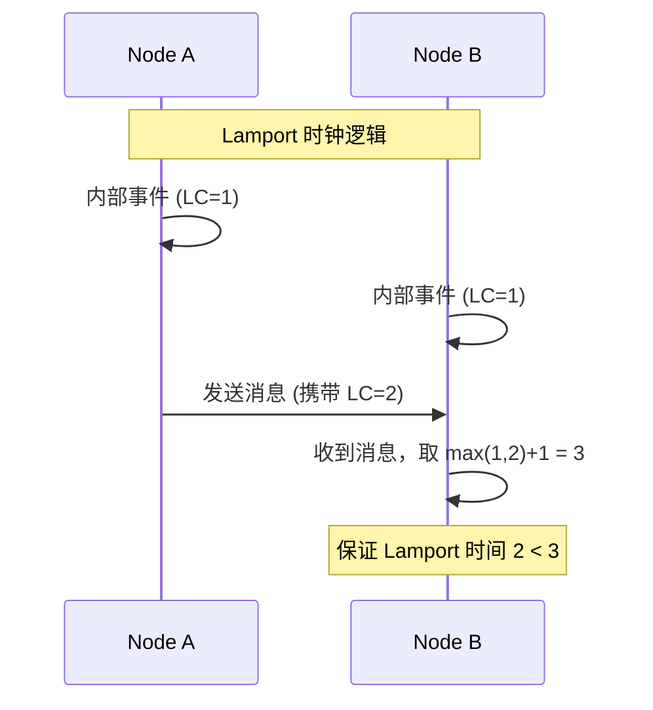

# 分布式系统的“部分失效”——网络延迟、时钟与故障检测

> 在分布式系统中，最可怕的不是整个系统崩溃，而是“部分失效”——你永远不知道一个节点是死了、慢了，还是网络断了。

前两篇我们讨论了数据复制、分区和事务。你可能已经注意到一个趋势：**当系统从单机走向分布式，一切确定性的东西都开始变得模糊不清。**

在单机上，一切都有明确的界限：内存是内存，磁盘是磁盘，程序要么运行要么崩溃。但在分布式系统中，**部分失效（Partial Failure）** 是常态——有些节点正常工作，有些节点却出了问题，而你甚至无法可靠地分辨出到底是哪一种情况。

DDIA 第八章（注：指原书第8章，即分布式系统的挑战）的核心命题就是：**在不可靠的网络、不可靠的时钟和不可预测的暂停面前，分布式系统如何做出正确的决策？**

## 一、单机与分布式：确定性与不确定性的分水岭

在单机系统中，程序员面对的是相对规整的“物理法则”：

- 如果硬件工作正常，相同的操作总是产生相同的结果
- 如果发生了故障（如内核崩溃），整个机器都会挂掉——**要么全好，要么全坏**
- 决定性的错误边界清晰，排查相对直接

但在分布式系统中，一切都变了：

> 在分布式系统中，**“不知道”比“知道挂了”更常见**。当你发出一个请求却没有收到响应时，你永远无法确定是对方没收到、收到了没处理完、还是处理完了响应在路上丢了。

这种不确定性，是分布式系统所有复杂性的根源。

## 二、不可靠的网络：TCP 并不能拯救你

### 网络故障是常态，不是意外

大多数人在学习网络编程时都被告知：**TCP 是可靠的**。它会自动重传丢包，保证数据按序到达。

但在数据中心的规模下，“可靠”是相对的。**网络中断是家常便饭**：

- 交换机配置错误
- 网线松动或损坏
- 网络拥塞导致丢包
- 交换机固件升级
- 机架间的光纤被意外切断

在云环境中，**网络分区（Network Partition）** 甚至不是故障——它是一种需要时刻应对的**运行模式**。

### 超时设置：猜谜游戏

由于无法区分“节点死了”和“网络慢了”，分布式系统只能依赖于**超时（Timeout）** 。但设置超时本身就是一个世纪难题：

- **超时太短**：会把正常的网络抖动误判为故障，导致“假死”节点被踢出集群，引发不必要的重平衡
- **超时太长**：故障节点迟迟不被发现，系统可用性下降

更糟糕的是，网络的延迟并不是固定的。它像天气一样波动：
- 白天流量高峰时延迟高
- 垃圾回收（GC）会导致偶发的长暂停
- 数据中心的网络抖动可能瞬间让延迟从 1ms 飙升到 1s

> **行业实践**：现代分布式系统（如 Cassandra、Akka）倾向于使用**自适应超时（Adaptive Timeout）** 。它们会动态跟踪网络响应的历史延迟分布（如移动平均和标准差），自动调整超时阈值，而不是依赖人工拍脑袋配置的固定值。

## 三、不可靠的时钟：时间在分布式世界里是相对的

在单机上，你调用 `System.currentTimeMillis()` 获得一个时间戳，它似乎就是“当前时间”。

但在分布式系统中，**没有一个节点拥有绝对正确的时间**。

### 两种时钟

DDIA 非常清晰地区分了两种时钟：

| 时钟类型 | 原理 | 特点 | 典型方法 |
|---|---|---|---|
| **墙钟时间（Wall-Clock Time）** | 与 NTP 服务器同步，反映实际日期时间 | 可能**回拨**（闰秒、NTP 调整） | `System.currentTimeMillis()` |
| **单调时钟（Monotonic Clock）** | 从系统启动开始计算流逝的时间 | 永远**向前**（单调递增），不受 NTP 影响 | `System.nanoTime()` |

- **墙钟时间**适合给用户看（“2026-08-03 15:30”），但**绝对不适合做排序或判断先后**。因为它可能回拨，如果 Node A 发生了时间回拨，它发出的“我比你新”的时间戳就是谎言。
- **单调时钟**适合测量**时间间隔**（这段代码跑了多久），但不适合表示“现在几点了”。

### 为什么时钟同步不可靠？

即使是 NTP（网络时间协议），在复杂的网络环境下，时钟同步误差也可能达到 **100 毫秒甚至几秒**。当发生闰秒时，Google 等公司甚至不得不通过“闰秒抹除”（在一天内缓慢加速/减速时钟）来避免系统崩溃。

**时间戳排序的陷阱**：

假设有两个节点 Node A 和 Node B：
1. Node A（本地时间 10:00:00.100）产生了一个事件 E1
2. 由于网络延迟，消息到达 Node B 时，Node B 的本地时钟是 10:00:00.050（比 Node A 慢）

如果 Node B 记录 E1 的时间戳为 10:00:00.050，而 Node B 自己在 10:00:00.080 产生的事件 E2 反而有了更晚的时间戳。**在全局视角下，时间的因果顺序完全颠倒了**。

### 解决方案：逻辑时钟

既然物理时钟不可靠，分布式系统的大牛们发明了**逻辑时钟（Logical Clock）**，其中最著名的是 **Lamport 时间戳**。

Lamport 时间戳的核心思想是：**如果事件 A 导致事件 B（因果关系），那么 A 的时间戳必须小于 B 的时间戳**。

它不依赖于物理时钟，而是通过**计数器**来标记事件的先后次序。它确保了**因果一致性**：如果 A 导致了 B，那么 L(A) < L(B)。虽然它无法解决并发事件（没有因果关系的两个事件）的排序，但它足以构建强大的分布式算法（如分布式锁的选举）。

## 四、暂停与故障检测：进程随时可能被“冻住”

在单机上，你申请了锁，持有锁期间你可以放心地操作。但在分布式系统中，**持有锁可能因为一次 GC 暂停而失效**。

### GC 暂停的毁灭性影响

假设你在使用分布式锁：

1. 节点 A 从 Zookeeper 获取了锁，有效期 30 秒
2. 节点 A 开始处理任务，但触发了长达 **40 秒** 的 Full GC（完全停止响应）
3. 30 秒后，Zookeeper 认为 A 已死，释放了锁
4. 节点 B 获取了锁，开始处理**相同的任务**
5. 40 秒后，A 苏醒，它**依然认为**自己持有锁，开始写入数据
6. **两个节点同时写入，数据损坏**

> 这就是著名的**“分布式锁与 GC 暂停”** 问题。它证明了：**在分布式系统中，你不能依靠一个节点的“主观感觉”来判断它是否仍然拥有权限**。

### 故障检测的演变：从固定超时到 Phi Accrual

为了解决这种不确定性，系统需要更智能的故障检测。

经典的 Phi Accrual 故障检测器（在 Cassandra 和 Akka 中使用）抛弃了“死活”的二元判断，它使用**可疑度（Suspicion Level）** 来衡量一个节点的状态：
- 它会持续收集节点之间的心跳间隔时间（历史数据）
- 计算当前实际延迟在历史分布中的概率（即 Phi 值）
- 如果延迟远超历史均值，Phi 值升高，节点被认为“可疑”
- 应用层可以设置一个阈值来决定何时将节点标记为下线

这比固定超时强大得多：在网络波动时，它不会贸然判死；在网络极度稳定时，它又能快速发现真正死掉的节点。

## 五、写在最后

DDIA 第八章（分布式系统的挑战）是全书的“警世恒言”。它告诉我们：**在分布式系统中，“知识”是脆弱的，你永远无法确定“真理”。**

我们无法让网络变得完美，无法让时钟完全同步，也无法杜绝 GC 暂停。我们唯一能做的，是**承认这些限制，并用算法来适应它们**。

- 面对**网络问题**：接受超时只是猜测，设计具有幂等性的 API，并采用自适应检测机制
- 面对**时钟问题**：抛弃“全局时间”的幻想，使用单调时钟测量时间间隔，使用逻辑时钟（Lamport/向量时钟）建立因果关系
- 面对**暂停问题**：设计有“超时”与“续租”机制的协议（如 fencing token），容忍并检测幽灵复活

> 这一章并没有给出完美的解决方案，而是帮助我们建立正确的**心态**：在分布式系统中，没有确定性，只有概率性的判断。好的系统不是不犯错，而是能**在不确定中优雅地降级，并安全地恢复**。

**下一篇预告：一致性是一个连续谱——线性一致性、因果一致性、最终一致性**