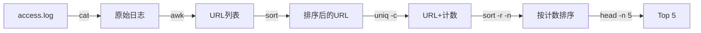
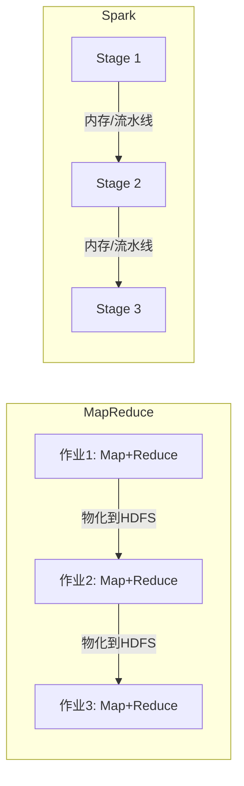

# 批处理——MapReduce 及其超越

> 批处理是数据系统的“压舱石”——从 Unix 管道到 MapReduce，再到 Spark 和 Flink，批处理的演化史就是大数据技术的缩影。

前十一篇文章，我们完成了 DDIA 的前两个部分：**数据系统基础**和**分布式数据**。

从这一篇开始，我们进入全书的第三部分：**派生数据（Derived Data）**。

如果说前两部分回答的是“**数据怎么存、怎么读、怎么写**”，那么第三部分回答的是“**数据怎么变、怎么流、怎么用**”。

而批处理（Batch Processing），是派生数据的**第一种形态**。

> 💡 在 DDIA 的框架中，批处理系统和流处理系统都属于**派生数据系统**——它们不直接存储原始数据，而是通过对原始数据的**变换（Transformation）** 来产生新的、有价值的数据集。这些派生数据可以被索引、被缓存、被用于分析。


## 一、什么是批处理？

批处理不是什么新鲜事物——它比互联网还要古老。

简单来说，**批处理**就是：**拿大量的输入数据，跑一个作业（Job）来处理它，生成一些输出数据**。

批处理系统通常也叫**离线系统（Offline System）** 。它的工作通常需要一段较长的时间——从几分钟到几天。所以，**通常不会有用户坐在那里等待作业完成**。相反，批处理作业通常是**周期性运行**的——比如每天凌晨跑一次。

### 批处理 vs OLTP

在 DDIA 的框架中，系统被划分为三种类型：

| 维度 | 在线系统（OLTP） | 批处理系统（离线） | 流处理系统（准实时） |
|---|---|---|---|
| **核心指标** | 响应时间、可用性 | **吞吐量** | 延迟 |
| **数据特征** | 小、随机读写 | **超大、全表扫描** | 持续、无界 |
| **典型操作** | 点查、点写、事务 | **聚合、连接、全量计算** | 事件驱动 |
| **用户等待** | 是（在线等待） | **否（离线运行）** | 部分 |
| **容错机制** | 事务、锁、回滚 | **重算即可** | 检查点 |

批处理系统的核心衡量指标是**吞吐量（Throughput）** ——每秒能处理多少数据。延迟不是它关心的重点。

### 批处理的典型场景

批处理适合哪些场景？

- **日志分析**：每天分析几十 TB 的访问日志，统计 PV、UV、热门页面
- **数据仓库 ETL**：从多个数据源提取数据，清洗、转换、加载到数仓
- **特征工程**：为机器学习模型批量生成训练特征
- **报表生成**：每日、每周的经营分析报表
- **索引构建**：为搜索引擎批量构建倒排索引


## 二、Unix 工具：最早的批处理哲学

在讨论 MapReduce 之前，DDIA 先带我们回顾了一个你可能每天都在用、但从未认真思考过的东西——**Unix 命令行工具**。

### 一个经典的例子

假设你的 Nginx 服务器每天产生大量访问日志，每行格式如下：

```
216.58.210.78 - - [27/Feb/2015:17:55:11 +0000] "GET /css/typography.css HTTP/1.1" 200 3377 "http://martin.kleppmann.com/" "Mozilla/5.0..."
```

你想找出**访问量最高的 5 个页面**。用 Unix 命令怎么做？

```bash
cat /var/log/nginx/access.log | \
  awk '{print $7}' | \
  sort | \
  uniq -c | \
  sort -r -n | \
  head -n 5
```

这条命令链做的事情：

1. `cat`：读取日志文件
2. `awk '{print $7}'`：提取第 7 列（请求的 URL 路径）
3. `sort`：按 URL 排序
4. `uniq -c`：统计每个 URL 出现的次数
5. `sort -r -n`：按出现次数逆序排序
6. `head -n 5`：取前 5 行



**特点**：简单、强大、几分钟内完成。而且，**输入文件不会被修改**——你可以随时重跑，得到相同的结果。

### Unix 哲学：管道思想的精髓

Unix 管道的发明者 Doug McIlroy 在 1964 年就说过一句名言：**让数据像水管一样流动**。

Unix 哲学的几条核心原则：

1. **每个程序做好一件事**——要做新工作，写新程序，而不是给老程序加功能
2. **程序的输出是另一个程序的输入**——不要混入无关信息，不要用严格的列数据或二进制格式
3. **尽早尝试，快速迭代**——先跑起来看看结果，不行就改

Unix 工具通过**标准输入输出（stdin/stdout）** 连接在一起。这种**统一接口**的设计，让任意工具可以任意组合——这就是**可组合性（Composability）** 。

> 当你把 Unix 管道和 MapReduce 放在一起看时，会发现惊人的相似：**MapReduce 本质上就是把 Unix 管道的思想搬到了分布式系统上**。不同的是，Unix 管道在一台机器上跑，MapReduce 在上千台机器上跑。

### 排序 vs 内存哈希：一个经典权衡

如果用 Ruby 脚本实现同样的统计功能，代码会是这样：

```ruby
counts = Hash.new(0)
File.open('/var/log/nginx/access.log') do |file|
  file.each do |line|
    url = line.split[6]
    counts[url] += 1
  end
end
top5 = counts.map{|url, count| [count, url]}.sort.reverse[0...5]
```

这段代码在内存中维护了一个哈希表。当数据量小的时候，这种方式快得飞起。但当数据量**超过可用内存**时，问题就来了——程序会频繁触发 GC 甚至 OOM。

而 Unix 的 `sort` 命令**不依赖内存哈希表**，它通过**外部排序**将数据溢出到磁盘。GNU 的 `sort` 甚至能利用多个 CPU 核进行并行排序。

> 这个对比揭示了一个核心思想：**批处理系统必须能够处理“工作集大于内存”的场景**。这是 Unix 工具和后来的 MapReduce 共同的设计前提。


## 三、MapReduce：把 Unix 管道搬上分布式集群

### 诞生背景

2004 年，Google 发表了一篇题为 **"MapReduce: Simplified Data Processing on Large Clusters"** 的论文。

MapReduce 的核心思想很简单：**把 Unix 管道的数据处理模式，扩展到由上千台普通计算机组成的集群上**。

但和 Unix 管道有几个关键区别：

- MapReduce **跨越多台机器并行计算**
- 程序员只需写 **Map 和 Reduce 函数**，框架负责处理**数据分发、容错、调度**等复杂问题
- MapReduce 的输入输出都存储在**分布式文件系统（如 HDFS）** 上

### MapReduce 的工作流程

一个 MapReduce 作业分为三个阶段：

**1. Map 阶段**

- 输入数据被分成多个**分片（Split）** ，每个分片由一个 Map 任务处理
- Map 任务读取每条记录，调用用户定义的 **Mapper 函数**，输出键值对（Key-Value pair）
- Map 任务的调度器会**尽量在存储输入数据的机器上运行**，利用**数据局部性（Data Locality）** 减少网络传输

**2. Shuffle 阶段**

- 框架将所有 Map 输出的键值对**按 Key 分组**
- 相同 Key 的所有 Value 被**聚合**到一起，发送给同一个 Reducer
- 这个阶段涉及大量的**网络传输和排序**

**3. Reduce 阶段**

- 每个 Reducer 收到一组 Key 及其对应的 Value 列表
- 调用用户定义的 **Reducer 函数**，输出最终结果

```mermaid
flowchart TD
    subgraph 输入
        I[输入数据分片1] --> M1[Map任务]
        I2[输入数据分片2] --> M2[Map任务]
        I3[输入数据分片3] --> M3[Map任务]
    end
    subgraph Shuffle
        M1 -->|(key1, v1)| S[按Key分组+排序]
        M2 -->|(key2, v2)| S
        M3 -->|(key1, v3)| S
        S -->|key1: [v1, v3]| R1[Reduce任务]
        S -->|key2: [v2]| R2[Reduce任务]
    end
    subgraph 输出
        R1 --> O1[输出文件1]
        R2 --> O2[输出文件2]
    end
```

### 一个具体例子：统计 IP 访问次数

假设你要统计日志中每个 IP 的访问次数：

- **Map**：输入 `(行号, 日志行)` → 输出 `(IP, 1)`
- **Shuffle**：将相同 IP 的 `1` 聚合到一起 → `(IP, [1,1,1,...])`
- **Reduce**：对每个 IP 的列表求和 → `(IP, total)`

### MapReduce 的容错机制

MapReduce 的容错设计非常“粗暴”但有效：

- **任务失败就重跑**——不修复内存状态，直接重新执行失败的任务
- **依赖两个前提**：输入数据**不可变** + 操作**确定性**（同样的输入永远产生同样的输出）
- 这种设计让容错变得极其简单——**重算即可**

> 相比之下，传统的并行数据库如果某个节点故障，可能需要复杂的恢复协议。MapReduce 选择了一条更简单的路：**既然重算这么便宜，为什么要搞复杂的恢复逻辑？**


## 四、MapReduce 的局限

MapReduce 虽然革命性，但它有不少问题。

### 问题一：物化中间状态

MapReduce 作业的输出是写入分布式文件系统的**物化文件（Materialized File）** 。

这意味着：**一个作业必须等前驱作业完全结束后才能启动**。如果有一个“掉队任务”（Straggler）拖慢了整个作业，后续所有作业都要等它。

而 Unix 管道的进程是**同时启动**的，输出一旦生成就被消费。

### 问题二：多余的 Map 任务

在多阶段工作流中，**前一个阶段的 Reducer 输出，往往直接就是下一个阶段 Mapper 的输入**——而 Mapper 可能什么都没做，只是把数据重新分区和排序。

这完全是多余的。

### 问题三：过度复制

中间状态被存储在分布式文件系统上，意味着这些临时数据被**复制到多个节点**。对于临时数据来说，这太“隆重”了。


## 五、数据流引擎：超越 MapReduce

为了解决 MapReduce 的这些问题，新一代的**数据流引擎（Dataflow Engine）** 应运而生。

代表性系统包括：**Spark、Tez、Flink**。

### 核心改进

数据流引擎和 MapReduce 的关键区别在于：

- **把整个工作流作为一个作业**来处理，而不是拆成独立的子作业
- **不再严格区分 Map 和 Reduce 阶段**，而是使用更灵活的**算子（Operator）**
- **减少中间状态的物化**，尽可能在内存中传递数据

Spark 在这方面走得最远——它提出了 **RDD（弹性分布式数据集）** 的概念：

- **内存计算优先**：只有必要时才写磁盘
- **记录操作链（Lineage）** ：知道每个 RDD 是怎么来的，故障时可以重新计算
- **丰富的算子**：`map`、`filter`、`join`、`groupBy`……远比 Map 和 Reduce 两个函数丰富



Spark 的批处理速度可以比 Hadoop MapReduce **快数倍甚至数十倍**。而且 Spark 的 API 更加丰富和易用。

### 数据流引擎的容错

和 MapReduce 一样，数据流引擎也依赖**不可变输入**和**确定性操作**来实现容错。不同的是，它们可以利用 **Lineage（血缘关系）** 只重新计算丢失的那部分数据，而不是从头再来。


## 六、批处理的关键设计理念

DDIA 第十章总结了批处理系统的几个核心设计理念。

### 1. 可重放性（Reproducibility）

批处理任务应该是**可重复执行**的——同样的输入，产生同样的输出。

这就要求：
- **输入不可变**：数据写入后不再修改
- **纯函数**：作业不产生副作用（不修改外部状态）
- **确定性**：同样的输入永远产生同样的输出

> 可重放性不仅是调试的便利，更是**系统可维护性的基石**。当你的批处理作业出了 bug，你可以修复代码后**重新跑一遍**，而不需要“修复”已经产生的错误数据。

### 2. 不可变输入 + 物化输出

批处理系统**不修改输入**，只生成新的输出文件。这种方式有几个好处：

- **容错简单**：任务失败了，直接重跑，不用担心数据损坏
- **调试方便**：可以随时检查中间输出
- **版本可追溯**：每个输出都有明确的版本

### 3. 数据局部性

在处理海量数据时，**把计算搬到数据所在的地方**，比把数据搬到计算所在的地方要便宜得多。

MapReduce 的调度器会优先在**存储输入数据副本的机器上**启动 Mapper。这就是**数据局部性（Data Locality）** 的核心思想。


## 七、写在最后

批处理是数据系统的**压舱石**。

- **Unix 工具**教会我们：**可组合的小工具 + 统一接口 = 强大的数据处理能力**
- **MapReduce** 把这个思想搬到了**分布式集群**上
- **Spark 等数据流引擎**解决了 MapReduce 的痛点，让批处理**更快、更灵活**

但批处理有一个根本性的局限：**输入必须是有界的（Bounded）** 。它处理的是“已经存在的数据”，而不是“正在发生的数据”。

如果数据是**持续不断产生的**（比如用户的每一次点击、传感器的每一个读数），批处理就力不从心了——你总不能等到明天再处理今天凌晨的日志吧？

这就引出了派生数据的**第二种形态**：**流处理（Stream Processing）** 。

**下一篇预告：流处理——从 Kafka 到 Flink，实时数据处理的演进**