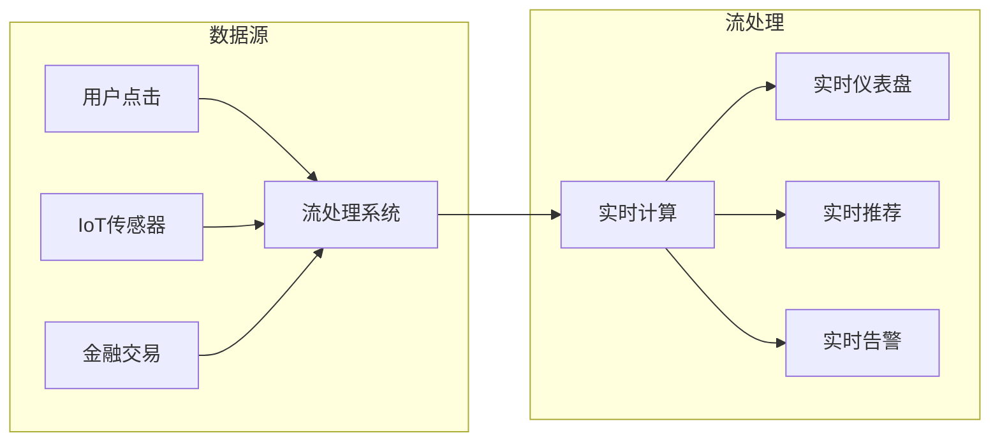
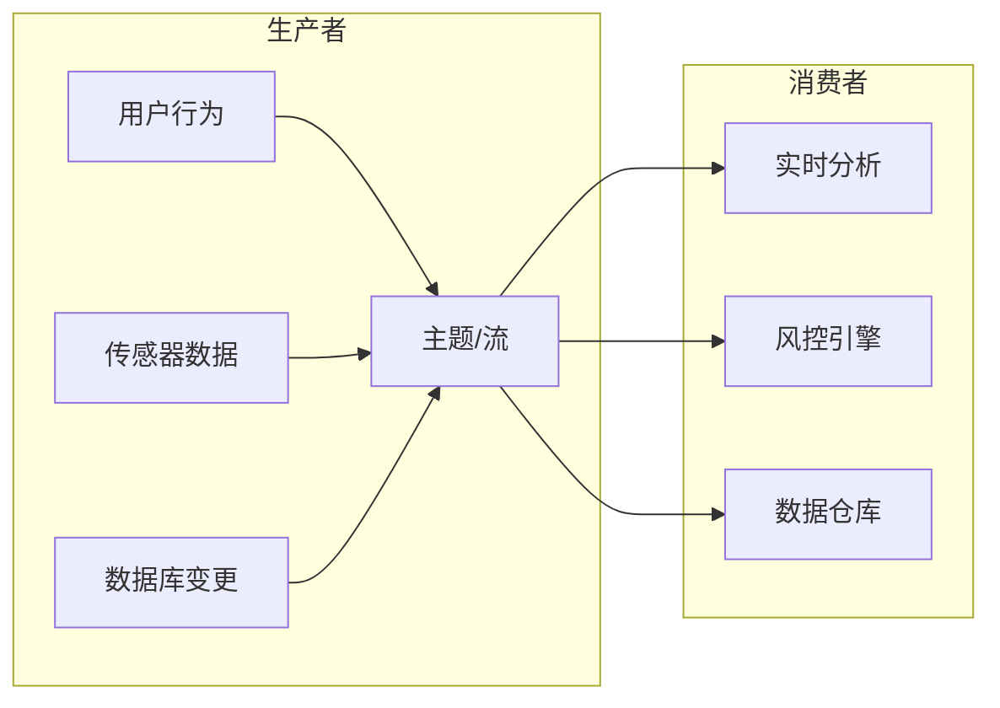
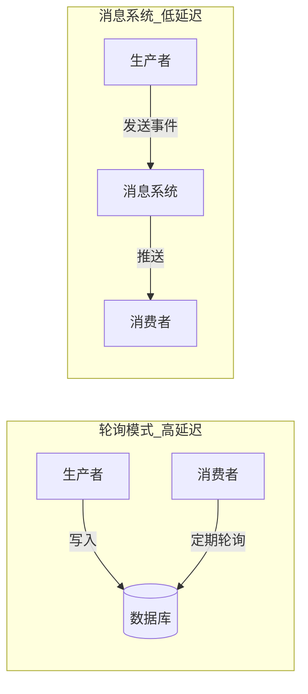
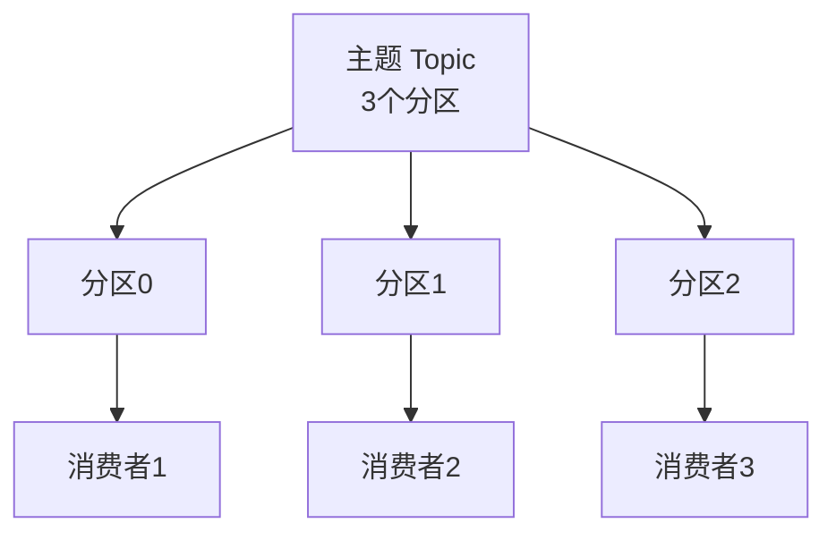
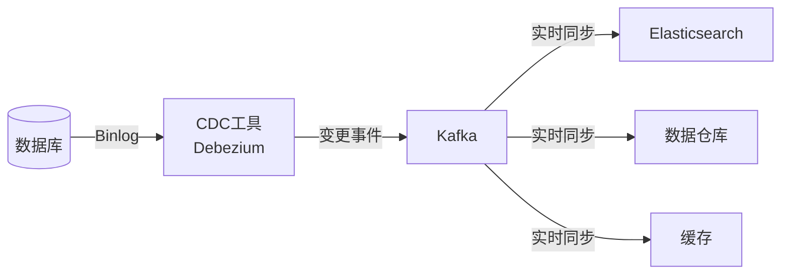
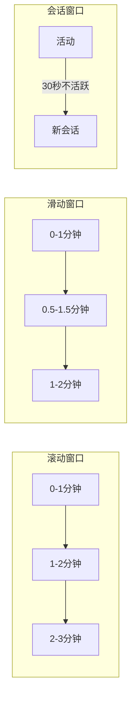
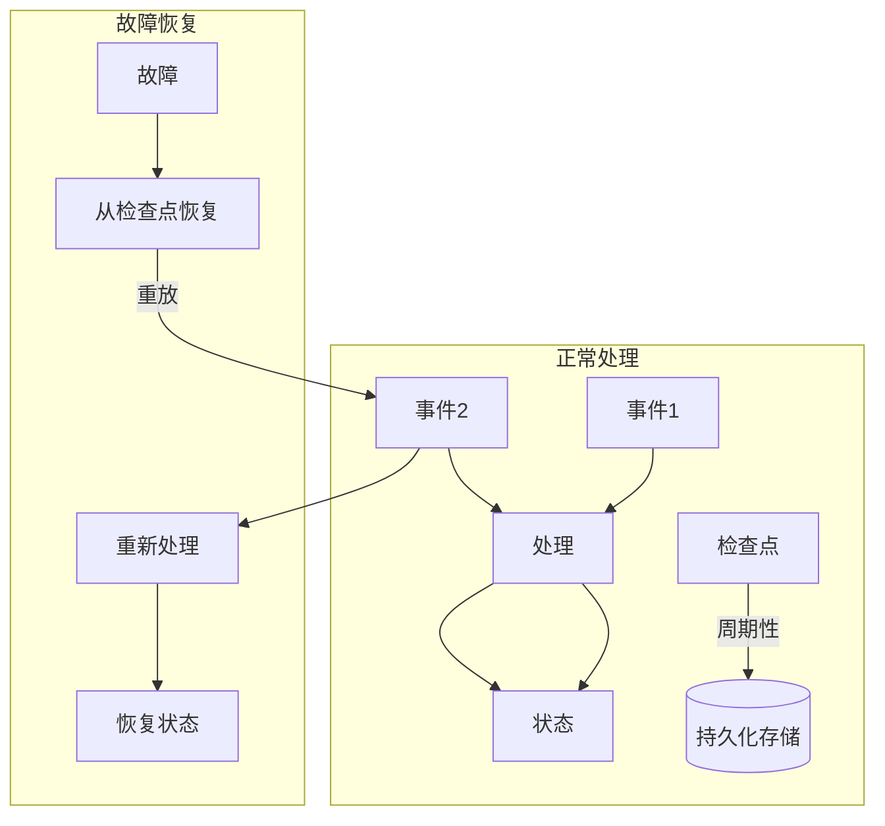
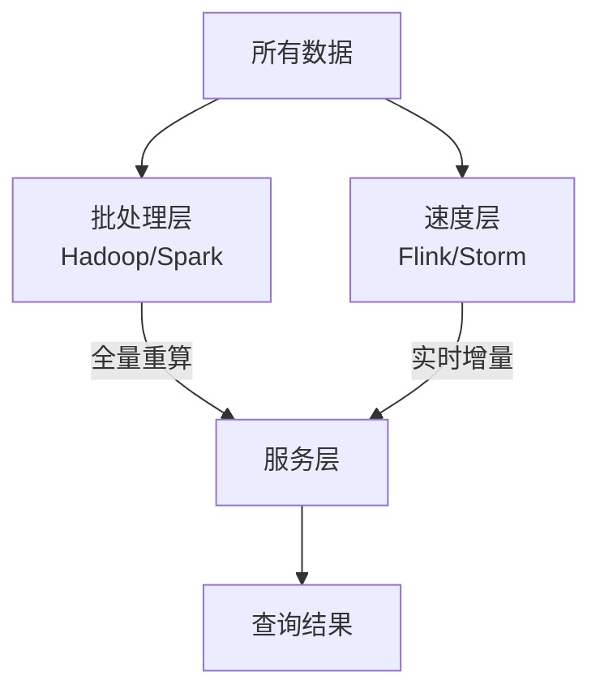
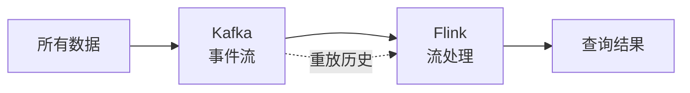
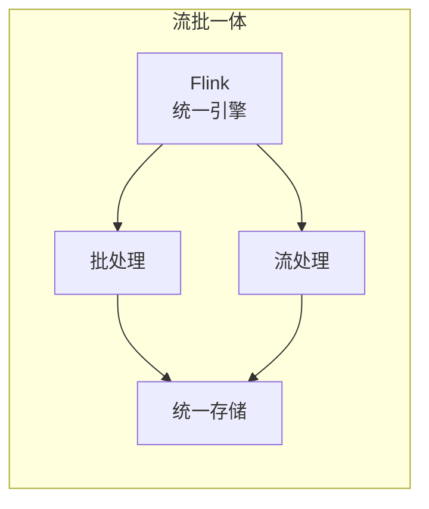

# 流处理——从 Kafka 到 Flink，实时数据处理的演进

> 从批处理到流处理，从 Kafka 到 Flink——实时数据处理如何从“每秒跑一次批处理”演变为“事件发生时立即处理”？

上一篇文章我们聊了**批处理**——读取一组文件作为输入，生成一组新的文件作为输出。批处理是强大的，但它有一个根本性的假设：**输入是有界的**。

但现实世界中的数据，大多是无界的。

用户的点击、传感器的读数、金融的交易——**数据永远不会“完成”** 。如果等到每天凌晨再处理昨天的数据，那些需要秒级响应的场景（风控、推荐、监控）早就错过了最佳时机。

流处理（Stream Processing）要解决的，正是这个问题：**在事件发生时立即处理，而不是等数据攒够了再批量计算**。

> 正如 DDIA 所说：“**流 ≈ 每秒执行一次批处理 + 有状态 + 持久化 + 容错**”。但流处理远比“更频繁的批处理”复杂——它需要处理乱序事件、管理状态、保证容错，还要应对无限的数据。


## 一、什么是流处理？

### 从批处理到流处理

在第十章中，我们讨论了批处理技术，它读取一组文件作为输入，并生成一组新的文件作为输出。批处理的核心假设是输入是**有界的（Bounded）** ——已知且有限的大小，所以批处理知道它何时完成输入的读取。

但很多数据是**无界限的（Unbounded）** ，因为它随着时间的推移而逐渐到达。为了减少延迟，我们可以更频繁地运行处理——在每秒钟的末尾，甚至更连续一些，完全抛开固定的时间切片，**当事件发生时就立即进行处理**。

这就是流处理背后的想法。

### 流 vs 批：核心差异

| 维度 | 批处理 | 流处理 |
|---|---|---|
| **输入数据** | 静态、有界数据集 | 无限、持续的数据流 |
| **时间模型** | 执行时一次性取数据 | 数据产生时间决定处理顺序 |
| **吞吐 vs 延迟** | 高吞吐、高延迟 | 低延迟、持续输出 |
| **运行方式** | 作业运行完成后终止 | **持续运行**，永不停止 |
| **驱动模式** | 文件驱动 | **事件驱动** |
| **容错机制** | 重跑全批次 | 重算单事件/窗口 |
| **典型系统** | Hadoop、Spark | Kafka Streams、Flink、Storm |

### 流处理的应用场景

流处理并不遥远——它就在你每天使用的系统中：

- **实时仪表盘**：订单量、活跃用户数、系统指标
- **风控系统**：秒级检测异常交易行为
- **实时推荐**：根据用户行为立刻更新推荐内容
- **设备监控与告警**：IoT 数据的实时异常检测




## 二、事件流：流处理的基本单元

### 什么是事件？

在流处理中，记录通常被称为**事件（Event）** 。

事件是一个**小的、自包含的、不可变的对象**，包含某个时间点发生的某件事情的细节。一个事件通常包含一个来自日历时钟的**时间戳**，以指明事件发生的时间。

> 事件可以是用户的某个行为（查看页面、购买商品），也可以是机器的传感器读数。事件可能被编码成文本字符串、JSON 或者二进制编码。

### 生产者与消费者

在流处理术语中：

- **生产者（Producer）** ：生成事件的来源，也称为发布者或发送者
- **消费者（Consumer）** ：接收并处理事件的系统，也称为订阅者或接收者
- **主题（Topic）** 或**流（Stream）** ：相关事件的聚合



一个事件由生产者生成一次，然后可能被**多个消费者**处理。这是流处理和批处理的一个重要相似点：在批处理中，文件被写入一次，然后可能被多个作业读取。


## 三、消息传递系统：流处理的“管道”

### 为什么需要消息系统？

想要低延迟的连续处理，就不能用“数据存储 + 轮询”的方式。最好的做法是：**在新事件出现时，直接通知消费者**。

这就是**消息传递系统（Messaging System）** 的作用。



消息系统有两种主要的实现哲学：

### 1. 传统消息队列（如 RabbitMQ）

- **消息即队列**：消息被消费后通常被删除
- **竞争消费**：多个消费者共享一个队列，每条消息只被一个消费者处理
- **适用场景**：异步任务队列、工作分发
- **局限**：缺乏历史数据回溯能力

### 2. 基于日志的消息代理（如 Kafka）

- **消息即日志**：消息被持久化存储，消费者通过**偏移量（Offset）** 跟踪进度
- **独立消费**：多个消费者可以独立读取同一份数据
- **支持重播**：消费者可以“倒带”，重新消费历史消息
- **适用场景**：事件溯源、流处理、数据管道

> Kafka 不仅是消息管道，更成为事件溯源和衍生数据系统的**核心基础设施**。它的**日志压缩（Log Compaction）** 功能可以保留每个键的最新值，重建数据库的完整状态。

### 消费者组与负载均衡

当消费者处理速度跟不上生产者时，可以**增加消费者实例**，组成**消费者组（Consumer Group）** 。Kafka 会**将分区（Partition）分配给消费者组中的不同消费者**，实现并行消费。



**分区是 Kafka 并行处理的基石**。每个分区内的消息是**有序的**，但不同分区之间没有顺序保证。通过增加分区数，可以提高系统的吞吐能力。


## 四、流与数据库：当数据库“流”起来

### 变更数据捕获（CDC）

**变更数据捕获（Change Data Capture, CDC）** 是一种观察数据库中所有数据变更的技术。

CDC 的核心思想是：**把数据库的每一次写入（插入、更新、删除）都变成一个事件，发布到流中**。这样，其他系统就可以实时响应数据库的变更。

CDC 有两种主要实现方式：

- **触发器模式**：通过数据库触发器捕获变更（如 MySQL 的触发器），但存在性能开销大、易受业务逻辑干扰等问题
- **日志解析模式**：直接解析数据库的复制日志（如 MySQL 的 Binlog），代表性工具有 **Debezium**



> 实际应用中，Flink CDC 连接器已支持 MySQL、PostgreSQL 等主流数据库，通过 Kafka 作为中间管道，实现**实时数据同步**至搜索索引或数据仓库。

### 事件溯源（Event Sourcing）

**事件溯源**将业务状态变更记录为**不可变的事件流**。

- 每次状态变化都生成一个事件，追加到事件日志中
- **当前状态 = 重放所有历史事件**
- 典型案例：购物车服务、金融账户管理

> 事件溯源与 **CQRS（命令查询职责分离）** 结合时，写入操作通过事件日志保证一致性，查询则通过物化视图提升性能。

### 流表二象性（Stream-Table Duality）

这是流处理中最深刻的思想之一：

- **流 → 表**：对事件流进行聚合（如统计每个用户的订单总数），得到的就是一张表
- **表 → 流**：对表的每一次变更（插入、更新、删除），都可以生成一个变更事件流

> 流的变更日志可以物化为表，表的变更又可以形成新的流。**流和表是一枚硬币的两面**——流是表的历史，表是流的快照。

```mermaid
flowchart LR
    subgraph 流→表
        S1[事件流<br>订单事件] -->|聚合| T1[表<br>用户订单统计]
    end
    subgraph 表→流
        T2[表<br>用户信息] -->|变更日志| S2[事件流<br>用户变更事件]
    end
```

像 Flink、Kafka Streams 等系统，在同一个引擎中**同时暴露流和表 API**，让这种二元性变得无缝。


## 五、流处理的核心挑战

### 1. 时间的三种维度

流处理中，时间不是一个单一的概念：

- **事件时间（Event Time）** ：事件**本身发生**的时间（如日志中的时间戳）
- **处理时间（Processing Time）** ：系统**处理**事件的时间（受网络、延迟影响）
- **摄取时间（Ingest Time）** ：数据**进入系统**的时间（如 Kafka 消费时间）

**为什么这很重要？** 因为事件可能**乱序到达**。一个早发生的事件可能因为网络延迟，比一个晚发生的事件更晚到达系统。

> 流处理必须引入**水位线（Watermarks）** 来处理迟到数据的问题。水位线是一个“时间标记”，告诉系统：**到这个时间点为止，所有事件应该都已经到达了**。

### 2. 窗口机制

流是无限的，但我们处理时需要用**窗口**来切割时间流。

| 窗口类型 | 说明 | 示例 |
|---|---|---|
| **滚动窗口（Tumbling）** | 固定大小，不重叠 | 每 1 分钟统计一次订单数 |
| **滑动窗口（Sliding）** | 固定大小，有重叠 | 每 10 秒统计最近 1 分钟的数据 |
| **会话窗口（Session）** | 按活动间隙划分 | 用户 30 秒不活跃视为新会话 |



### 3. 流式连接（Stream Joins）

流处理中的连接比批处理中的连接**更难**：

- **流-流连接**：两个无限的数据流如何按 key 关联？
- **流-表连接**：实时事件如何与静态/缓慢变化的维度表关联？
- **表-表连接**：两张变更表的实时关联

连接的难点在于：**两边的事件可能在不同的时间到达，且顺序无法保证**。


## 六、容错与 Exactly-Once 语义

### 三种处理语义

在分布式环境下，**每条事件被处理多少次**，是一个关键问题：

| 语义 | 含义 | 代价 |
|---|---|---|
| **At-most-once** | 最多处理一次（可能丢数据） | 性能最高，数据可能丢失 |
| **At-least-once** | 至少处理一次（可能重复） | 数据不丢，但可能重复 |
| **Exactly-once** | 精确处理一次（无重复无丢失） | **性能最低，实现最复杂** |

> **Exactly-once 是流处理的“圣杯”** 。它意味着每条事件**恰好被处理一次**，即使在故障发生时也不例外。

### 检查点机制（Checkpointing）

Flink 通过**检查点（Checkpoint）** 机制来实现 Exactly-Once 语义：

1. **周期性快照**：系统定期对**所有算子的状态**做一致性快照
2. **持久化存储**：快照被持久化到可靠的存储系统（如 HDFS 或 S3）
3. **故障恢复**：发生故障时，系统从最近的检查点恢复状态，**重新处理**故障之后的数据



> Kafka + Flink 可以实现**端到端的 Exactly-Once**（使用 Kafka 事务 + 状态快照）。


## 七、从 Lambda 到 Kappa：架构的演进

### Lambda 架构：两套系统，两条腿走路

Lambda 架构在原有的离线计算基础上，增加了一条**实时计算链路**：

- **批处理层（Batch Layer）** ：全量重算，保证“最终一定对”
- **速度层（Speed Layer）** ：实时处理，先给个“差不多对”的结果
- **服务层（Serving Layer）** ：合并两层的视图



**Lambda 的问题**：

- **维护两套系统的运维成本高**
- **需要为离线和实时开发两套代码**，学习成本和开发成本高
- **离线和实时的数据一致性难以保证**

> 正如一位工程师所说：“改一个指标口径，流上改一次，批上再改一次，再对齐一次。改到最后，你已经不确定这个口径到底谁才是权威。”

### Kappa 架构：一切皆流

Kappa 架构由 Jay Kreps 于 2014 年提出，核心思想是：**去掉批处理层，只保留流处理层**。

- 所有数据都作为**无限的事件流**引入
- 历史数据通过**消息队列的重放（Replay）** 能力来处理
- Kafka 成为 **“事实的唯一来源”** 



**Kappa 的问题**：

- Kafka 不是无限的：Topic 保存期有限，存储成本高
- **重放历史数据的性能差**：比批处理慢得多
- **复杂指标流式难算**：状态会膨胀，口径变更困难

> Kappa 是“写给工程师的架构”，Lambda 是“写给论文的架构”。但 Kappa 并非银弹。

### 流批一体：第三条路

**流批一体架构**通过使用**流批一体的计算引擎**和**流批一体的存储格式**，解决 Lambda 和 Kappa 的问题：

- **一套代码**：用户只需要写一套代码，就能同时用于实时计算和离线计算
- **统一存储**：避免为离线和实时使用两套不同的存储
- **一致性保证**：统一的计算引擎和代码保证数据一致性

> Apache Flink 从设计之初就提出了 **“批处理是流处理的特殊情况”** 。Flink 同时支持**有界（批）和无界（流）** 的数据处理。




## 八、流处理系统对比

| 系统 | 模型 | 特点 |
|---|---|---|
| **Apache Storm** | 无状态流拓扑 | 早期流处理框架，编程模型原始 |
| **Apache Spark Streaming** | 微批模型（DStreams） | 已被 Structured Streaming 取代 |
| **Apache Flink** | 有状态流 + 时间感知 | **最强大的流处理引擎之一**，流批统一 |
| **Kafka Streams** | 嵌入式流库 | 与 Kafka 紧密集成，适合中小规模应用 |

> 在可预见的未来，**Lambda、Kappa 和流批一体将长期共存**。选择哪种架构，取决于你的业务场景、数据规模和团队能力。


## 九、写在最后

流处理是数据系统的**未来方向**——它让系统能够**实时响应**，而不是事后追溯。

从批处理到流处理，从 Kafka 到 Flink，这条演进路径告诉我们几件事：

1. **流处理 ≠ 更快的批处理**——它需要全新的思维方式：事件时间、窗口、状态、容错
2. **Kafka 不仅是消息队列**——它是事件流的**存储层**，是流处理的基础设施
3. **Exactly-Once 是可能的**——但需要检查点、事务等复杂机制的配合
4. **架构在演进**——从 Lambda 到 Kappa 再到流批一体，每一种都在特定场景下有价值

> Martin Kleppmann 在 2014 年就说过：**“流处理给了我们一条构建可扩展、健壮、易于适应变化的数据系统的道路。”** 

**下一篇预告：数据系统的未来——Flink、Snowflake 与 AI 时代的挑战**