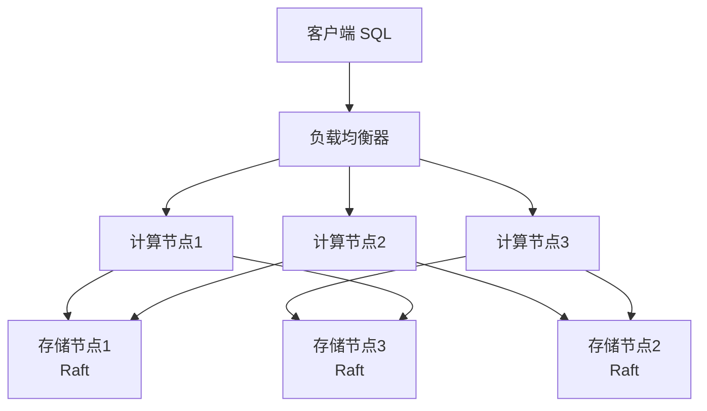
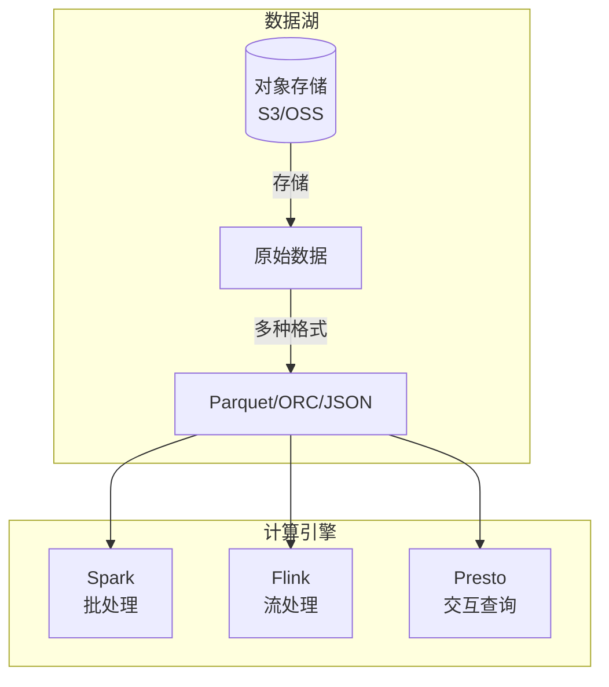
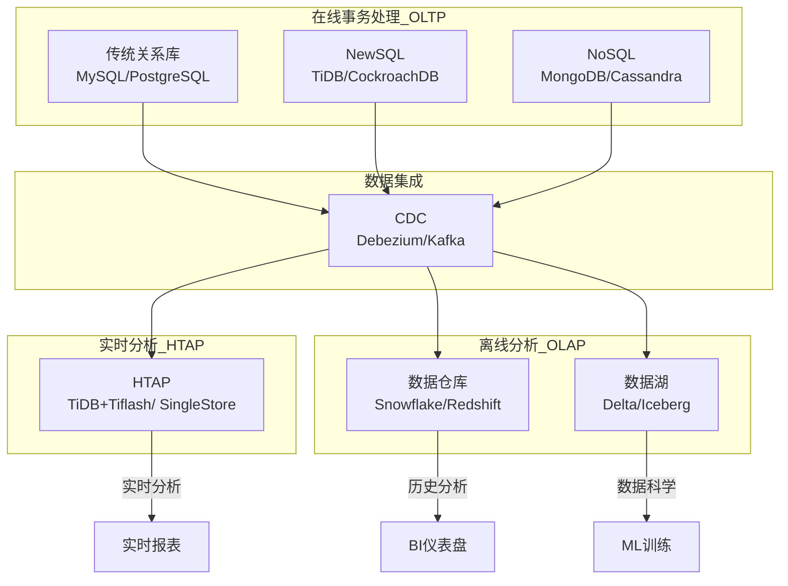

# NoSQL、NewSQL 与数仓——数据系统生态全景图

> 从 NoSQL 的弹性到 NewSQL 的强一致性，从 OLTP 的实时到 OLAP 的分析——数据系统是一个丰富多彩的生态系统，每种系统都有它最擅长的战场。

前十四篇文章，我们沿着 DDIA 的脉络，把数据系统的各个核心组件拆解了一遍。但我们还没有回答一个实际问题：**在真实的生产环境中，这些技术怎么组合？**

今天这篇文章，我们把视角拉高，看看整个数据系统的**生态全景图**。

从 NoSQL 到 NewSQL，从数据仓库到数据湖，从 OLTP 到 OLAP——理解这些技术之间的定位和边界，是做好技术选型的第一步。在可预见的未来，数据系统不会是“一种数据库打天下”，而是 **多种技术共存的混合持久化生态**。


## 一、OLTP vs OLAP：两种工作负载

在讨论具体技术之前，先厘清一个基本分类。

DDIA 第三章提到，数据系统处理的工作负载大致分为两类：

| 维度 | OLTP（在线事务处理） | OLAP（在线分析处理） |
|---|---|---|
| **核心操作** | 点查询、小范围查询、写入（INSERT/UPDATE/DELETE） | 全表扫描、聚合、JOIN、分组 |
| **数据特征** | 最新状态，行级细粒度 | 历史快照，列级粗粒度 |
| **用户群体** | 终端用户、业务人员 | 分析师、数据科学家 |
| **响应时间** | **毫秒级**（在线等待） | **秒~分钟级**（离线批处理） |
| **典型系统** | MySQL、PostgreSQL | Snowflake、ClickHouse |

OLTP 是“**数据库的日常**”——处理每一条订单、每一次登录、每一笔交易。OLAP 是“**数据库的夜班**”——等白天业务结束了，把大量数据拉出来做分析、出报表。

这两类工作负载对存储引擎的需求截然不同：

- OLTP 需要**行式存储**，因为需要快速读写单条记录
- OLAP 需要**列式存储**，因为分析查询只涉及少数列，列式存储可以大幅减少 I/O，同时列内数据同构，压缩率极高


## 二、NoSQL：为“非关系”场景而生的弹性数据库

### 起源与驱动力

NoSQL（最初是 Non-SQL，后来被解读为 Not Only SQL）兴起于 2010 年前后。它的出现不是要取代关系数据库，而是为了应对**关系数据库不擅长的场景**：

- **超大规模数据**：单机放不下，需要水平扩展
- **高吞吐写入**：每秒百万级写入，关系库撑不住
- **灵活的数据模型**：Schema 变化频繁，改表太痛苦
- **高可用**：不能有单点故障

### NoSQL 的四大门派

NoSQL 并不是一种技术，而是一个**技术家族**。

| 类型 | 代表系统 | 数据模型 | 典型场景 |
|---|---|---|---|
| **键值存储** | Redis、Riak | 哈希表 | 缓存、会话存储 |
| **文档存储** | MongoDB、CouchDB | JSON/BSON | 内容管理、用户画像 |
| **列族存储** | Cassandra、HBase | 宽表 | 日志、时序数据 |
| **图数据库** | Neo4j、JanusGraph | 图（顶点+边） | 社交网络、推荐 |

### 何时选 NoSQL？

选 NoSQL，通常是因为以下需求中的**至少一项**：

- **写吞吐极高**（每秒百万级）→ Cassandra、HBase
- **数据量大到单机放不下**（TB 级以上）→ 几乎所有 NoSQL 都支持水平扩展
- **Schema 极其灵活**（每个文档结构都不同）→ MongoDB
- **关系极度复杂**（多跳查询）→ Neo4j

> 代价也很清楚：**大多数 NoSQL 牺牲了事务（ACID）和 JOIN 能力**，换取扩展性和性能。


## 三、NewSQL：既要扩展性，又要 SQL，还要 ACID

### NoSQL 的遗憾

NoSQL 解决了扩展性问题，但它留下了一个巨大的缺口：**很多业务场景既需要水平扩展，又需要 SQL 和 ACID 事务**。

电商、金融、游戏——这些行业的核心系统，不能接受“最终一致性”，也不能接受“不支持 JOIN”。但传统关系数据库在数据量和流量达到一定规模后，确实撑不住了。

### 什么是 NewSQL？

**NewSQL** 是一类**保留了关系模型的 SQL 能力，同时具备 NoSQL 水平扩展能力**的数据库。它对应用程序提供**和传统关系数据库完全相同的 SQL 体验**，底层却用分布式架构来支撑海量数据和超高吞吐。

典型代表：

| 系统 | 特点 |
|---|---|
| **Google Spanner** | 全球分布、TrueTime、强一致性 |
| **TiDB** | MySQL 协议兼容、Raft + MVCC |
| **CockroachDB** | 云原生、PostgreSQL 协议兼容 |
| **OceanBase** | 金融级分布式数据库 |

### NewSQL 的架构共性

大多数 NewSQL 数据库遵循类似的设计：

- **计算与存储分离**：SQL 层（计算）和存储层（KV）分离，各自独立扩展
- **共识算法做复制**：Raft 或多 Paxos 保证数据强一致
- **分布式事务**：用 2PC 或 Percolator 模型支持跨节点事务
- **自动分区与负载均衡**：数据自动分片，自动再平衡



### NoSQL vs NewSQL：选哪个？

| 维度 | NoSQL | NewSQL |
|---|---|---|
| **SQL 支持** | 弱或不支持 | **完整 SQL** |
| **ACID 事务** | 通常不支持 | **完整支持** |
| **水平扩展** | 原生支持 | 原生支持 |
| **一致性模型** | 最终/因果为主 | **强一致** |
| **运维复杂度** | 低 | **高** |
| **适用场景** | 缓存、日志、画像、推荐 | **核心交易系统** |

简单来说：**如果你的业务强依赖 SQL 和事务（电商订单、金融账务、游戏充值），选 NewSQL；如果可以接受弱一致性和弱查询能力，选 NoSQL**。


## 四、数据仓库与数据湖：分析系统的进化

### 传统数据仓库

**数据仓库（Data Warehouse）** 是专门为 OLAP 分析而构建的数据库。

与 OLTP 系统不同，数据仓库不直接服务终端用户，而是汇总来自多个 OLTP 系统的数据，供分析师做 BI 报表和数据挖掘。

核心特点：

- **列式存储**：只读取需要的列，大幅减少 I/O
- **高压缩率**：列内数据同构，压缩比极高
- **批量导入**：定期从 OLTP 系统 ETL 数据

典型代表：Snowflake、Teradata、Redshift、BigQuery。

### 数据湖的挑战：什么是“湖”？

**数据湖（Data Lake）** 是一个存储**海量原始数据**的集中式存储库，能够存储结构化、半结构化和非结构化数据，且通常以低成本对象存储（如 S3）为底座。

数据湖本身并不提供计算能力，而是与各种计算引擎（如 Spark、Presto）配合使用。存储与计算分离是数据湖的最典型特征。



| 维度 | 数据仓库 | 数据湖 |
|---|---|---|
| **数据模型** | 高度结构化（Schema-on-write） | 原始格式（Schema-on-read） |
| **数据质量** | 高（ETL 清洗后入仓） | 低（原始数据直接入湖） |
| **存储成本** | 相对较高 | **极低**（对象存储） |
| **查询性能** | 极快（预建模、预聚合） | 取决于引擎配置 |
| **典型用户** | 分析师、BI | 数据科学家、工程师 |
| **代表系统** | Snowflake、Redshift | Delta Lake、Iceberg、Hudi |

近年来，**Lakehouse（湖仓一体）** 架构试图融合两者的优点——用数据湖的低成本存储 + 数据仓库的高性能查询。

### 列式存储详解

列式存储（Column-Oriented Storage）是 OLAP 系统的核心优化手段。

在行式存储中，一行数据的所有字段在物理上连续存放。在列式存储中，同一列的数据在物理上连续存放。这意味着：

- 查询只需要读**涉及的列**，而非整行
- 同列数据同构，**压缩率极高**

| 查询类型 | 行式存储 I/O | 列式存储 I/O |
|---|---|---|
| `SELECT COUNT(*) FROM orders` | 扫描所有列 | **只扫描一列** |
| `SELECT SUM(amount) FROM orders WHERE date > '2026-01-01'` | 扫描所有列 | **只扫描 date + amount** |
| `SELECT * FROM orders WHERE id = 12345` | 快速点查 | 相对较慢 |

这也是为什么 OLTP 用行式、OLAP 用列式——**不同工作负载，需要完全不同的存储布局**。


## 五、HTAP：一个数据库同时做 OLTP 和 OLAP

### 为什么需要 HTAP？

传统架构中，OLTP 和 OLAP 是分离的：

1. 业务数据写在 OLTP 系统（MySQL）
2. 定期 ETL 将数据同步到数据仓库（Snowflake）
3. 分析师在数据仓库上做 OLAP 查询

这个架构的问题：**ETL 有延迟**。如果业务需要**实时分析**（比如实时风控、实时推荐），等待 ETL 就不行了。

### HTAP（混合事务/分析处理）

**HTAP（Hybrid Transactional/Analytical Processing）** 系统在一个数据库中**同时支持 OLTP 和 OLAP 工作负载**，实现**在最新数据上做实时分析**。

```mermaid
flowchart LR
    subgraph 传统架构
        APP[应用] --> OLTP[(OLTP)]
        OLTP -->|ETL延迟高| DW[(数据仓库)]
    end
    subgraph HTAP
        APP2[应用] --> HTAP[(HTAP<br>OLTP+OLAP)]
        HTAP -->|实时分析| BI[BI报表]
        HTAP -->|实时决策| AI[推荐/风控]
    end
```

代表性系统：TiDB（TiFlash 列存引擎）、CockroachDB、SingleStore、SAP HANA。

### HTAP 的实现方式

HTAP 的实现通常有两种模式：

- **统一存储**：同一份数据同时支持行存和列存，写入时更新行存，异步同步到列存
- **存储分离**：行存处理 OLTP，列存处理 OLAP，两者之间实时同步

> HTAP 适合对数据**实时性要求高**的场景（实时报表、实时风控），但它不是万能的——对极大规模的分析查询，专门的数据仓库仍然性能更好。


## 六、数据系统生态全景图

把以上所有技术放在一张全景图中：



### 如何选择？

系统设计没有标准答案，但有决策框架：

| 场景 | 推荐 |
|---|---|
| 核心交易系统（订单、账务、游戏充值） | **NewSQL**（强一致 + SQL） |
| 缓存、会话、计数器 | **键值存储**（Redis） |
| 用户画像、内容管理、日志存储 | **文档存储**（MongoDB） |
| 日志分析、时间序列 | **列族存储**（Cassandra） |
| 社交关系、推荐、知识图谱 | **图数据库**（Neo4j） |
| 数据分析、BI 报表 | **数据仓库**（Snowflake） |
| 数据科学、AI 训练 | **数据湖**（Delta/Iceberg） |
| 实时分析（风控、实时推荐） | **HTAP**（TiDB + TiFlash） |

> 关键是：**用对工具**。在一个系统里混用多个数据库不是架构混乱——而是用对了工具。


## 七、写在最后

数据系统不是“一种数据库打天下”的世界。

从 OLTP 到 OLAP，从 NoSQL 到 NewSQL，从数据仓库到数据湖——每一种技术都是对**特定场景下特定问题**的回应。理解这个生态，不是要记住每一个产品的名字，而是要明白：

- **数据系统本质上是为工作负载设计的**——不同工作负载需要不同的存储和计算架构
- **技术演进的驱动力是新的场景和新的需求**——NoSQL 回应了扩展性，NewSQL 回应了扩展性与 SQL 的双重需求，HTAP 回应了实时分析
- **多系统共存是常态**——核心交易走 NewSQL，用户画像走 MongoDB，日志分析走 Cassandra，BI 报表走 Snowflake——这不是混乱，是成熟

> 正如 DDIA 所说：**“没有单一的数据系统能够同时满足所有需求。我们需要根据应用场景，选择合适的工具组合。”**

**下一篇预告：DDIA 核心思想串讲——全书知识体系一张图**