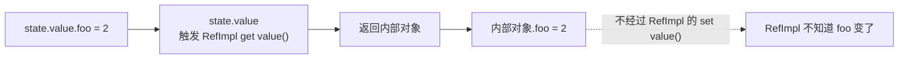
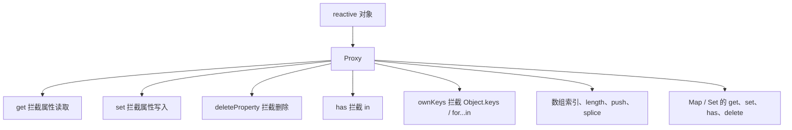
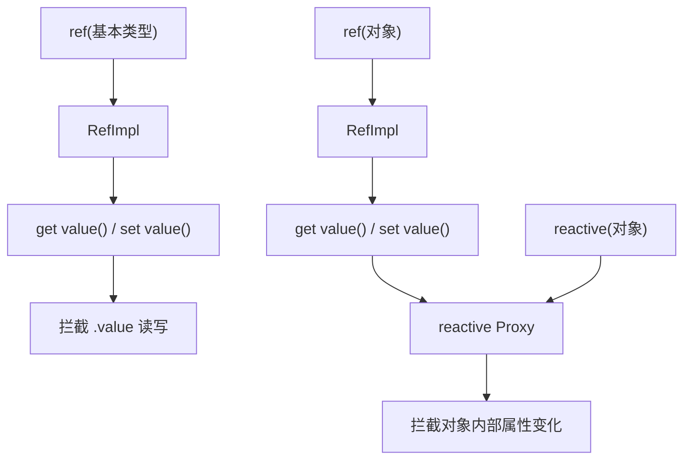

# Vue3 响应式拦截：为什么对象不能用 .value 的 get set？

如果 Vue3 只用 `RefImpl` 的 `.value` get/set 来拦截对象，会怎样？

答案很简单：**拦不住。**

`RefImpl` 的 get/set 只能拦住 `.value` 这一个操作。对象内部的属性变化，它完全感知不到。

这就是为什么 Vue3 里 `ref` 和 `reactive` 要分工合作——一个管外层，一个管内部。

## RefImpl 能拦什么？

先看一个例子：

```js
const state = ref({ foo: 1 })
```

访问 `.value` 的时候：

```js
state.value        // 触发 RefImpl 的 get value()
state.value = {}   // 触发 RefImpl 的 set value()
```

但访问内部属性的时候：

```js
state.value.foo      // 先 get value()，然后读内部对象的 foo
state.value.foo = 2  // 先 get value()，然后改内部对象的 foo
```

关键就在这里：



`RefImpl` 只知道 `.value` 被整体替换：

```js
state.value = { foo: 2 }  // 这会触发 set value()
```

但下面这种，它完全无感：

```js
state.value.foo = 2       // 这不会触发 set value()
```

所以，如果对象也只用 `RefImpl` 的 `.value` get/set，内部属性变化根本追踪不到。

## 那给对象每个属性都做 get/set 行不行？

理论上可以想：那我不拦 `.value`，我拦对象里的每个属性。

问题是：

- 对象属性是动态的，新增属性没法提前知道
- 删除属性拦不住
- `in`、`Object.keys`、`for...in` 拦不住
- 数组的索引、`length`、`push`、`splice` 很难优雅拦截
- `Map`、`Set` 的 `get`、`set`、`has`、`delete` 拦不住
- 深层对象初始化时要递归铺开所有属性，开销大
- 访问到哪一层才代理哪一层？get/set 访问器很难做到惰性

这条路走不通。

而 `Proxy` 是对象级拦截：



一句话：

> `RefImpl` 的 get/set 是“某个已知属性”的拦截。
> `Proxy` 是“整个对象各种操作”的拦截。

对象内部属性是动态、多操作、可增删的，所以必须用 `Proxy` 才拦得住。

## 为什么基本类型不也用 Proxy？

因为 `Proxy` 的 target 必须是对象：

```js
new Proxy(1, {})  // TypeError
```

基本类型不是对象，不能直接代理。

所以只能造一个包装对象，用 `get value()` / `set value()` 拦住 `.value`。

## 所以 Vue3 的真实结构长这样



三条路径，各有各的活：

- **ref(基本类型)**：`RefImpl` 的 `.value` get/set 就够了
- **reactive(对象)**：`Proxy` 管对象内部
- **ref(对象)**：外层 `RefImpl` 管 `.value`，内层 `reactive Proxy` 管对象内部

## 一句话总结

> 基本类型没法被 `Proxy` 代理，所以 `ref` 用 `RefImpl` 的 `.value` get/set。
> 对象内部属性变化太复杂，`.value` get/set 管不到，必须用 `Proxy`。
> 所以不是不用 `RefImpl`，而是 `RefImpl` 管外层 `.value`，`Proxy` 管对象内部。
> `ref(对象)` 实际上就是：**外层 `RefImpl` + 内层 `reactive Proxy`。**

下次再看到 `.value` 和 `Proxy` 并存的设计，你就不会觉得奇怪了——它们不是重复造轮子，而是各管一段，谁也替代不了谁。
