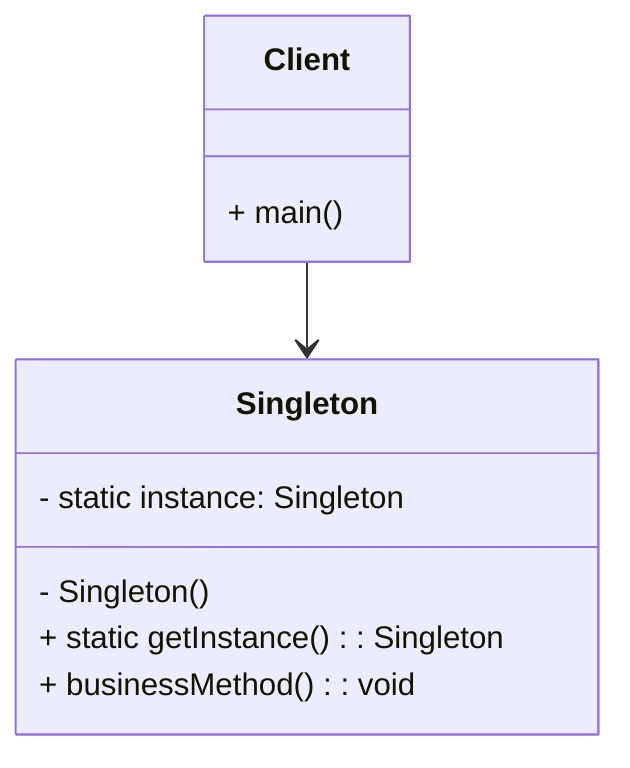

# 单例模式：一个“唯一”的倔强

> 你可能天天在用，却从没想过它为什么这么设计 —— 单例模式，创建型模式里的“钉子户”

## 开篇：一个类，只能有一个“我”

你有没有遇到过这种场景：某个类在系统里只应该有一份，比如配置管理器、日志记录器、数据库连接池？如果一不小心 new 出两个，轻则资源浪费，重则数据错乱。

这时候，单例模式（Singleton Pattern）就登场了。它的核心思想异常简单：**确保一个类只有一个实例，并提供一个全局访问点**。

听起来像是个“皇帝”模式 —— 天下只能有一个皇帝，而且人人都知道去哪找到他。


## 一张图看懂



角色就两个：
- **Singleton**：自己管自己，私有构造，静态方法返回唯一实例
- **Client**：想用？别 new，直接 `getInstance()` 拿


## 怎么实现？多种语言，多种姿势

单例的实现有很多变种，核心分歧就两点：**何时创建**（懒汉 vs 饿汉）和**是否线程安全**。下面我用几种主流语言展示，让你一次看个够。

### Python —— 魔术方法

```python
class Singleton:
    _instance = None
    def __new__(cls):
        if cls._instance is None:
            cls._instance = super().__new__(cls)
        return cls._instance
```

装饰器版本更 Pythonic：

```python
def singleton(cls):
    instances = {}
    def get_instance(*args, **kwargs):
        if cls not in instances:
            instances[cls] = cls(*args, **kwargs)
        return instances[cls]
    return get_instance

@singleton
class MyClass: pass
```

### JavaScript —— 构造函数拦截

```javascript
class Singleton {
    constructor() {
        if (Singleton.instance) return Singleton.instance;
        Singleton.instance = this;
    }
}
```

IIFE 闭包方式也很常见：

```javascript
const SingletonIIFE = (function() {
    let instance;
    function createInstance() { /* ... */ }
    return {
        getInstance: function() {
            if (!instance) instance = createInstance();
            return instance;
        }
    };
})();
```

### TypeScript —— 类型安全的懒汉与饿汉

```typescript
// 懒汉式
class Singleton {
    private static instance: Singleton;
    private constructor() {}
    public static getInstance(): Singleton {
        if (!Singleton.instance) {
            Singleton.instance = new Singleton();
        }
        return Singleton.instance;
    }
}

// 饿汉式
class EagerSingleton {
    private static readonly instance: EagerSingleton = new EagerSingleton();
    private constructor() {}
    public static getInstance(): EagerSingleton {
        return EagerSingleton.instance;
    }
}
```

### C# —— 推荐 Lazy`<T>`

```csharp
public sealed class LazySingleton
{
    private static readonly Lazy<LazySingleton> lazy = 
        new Lazy<LazySingleton>(() => new LazySingleton());
    public static LazySingleton Instance => lazy.Value;
    private LazySingleton() {}
}
```
`.NET 4+` 后这是最优雅、线程安全、延迟加载的方式。


## 什么时候该用它？

- 系统只需要一个实例，比如**配置管理器**、**日志记录器**、**缓存**。
- 创建对象成本很高，比如**数据库连接池**、**线程池**。
- 需要全局访问点，而且希望控制实例数量。


## 优点与槽点

👍 **优点**：
- 资源节约，避免重复创建
- 全局唯一访问点，用起来方便
- 自己管理生命周期

👎 **缺点**（别假装没看见）：
- **违背单一职责原则** —— 又管业务又管实例创建
- **耦合增加**，模块之间通过单例隐式依赖
- **单元测试噩梦**，很难 mock 替换
- **多线程麻烦**，要考虑双检锁、volatile、原子操作
- **内存常驻**，可能导致内存泄漏（尤其移动端）


## 和那些“兄弟模式”的关系

- **工厂模式**：工厂类本身常常做成单例
- **抽象工厂**：同上
- **建造者模式**：建造者也可以是单例
- **原型模式**：这俩是死对头，一个要唯一，一个要复制


## 真实世界里的单例们

| 语言/框架 | 例子 |
|--||
| JavaScript | Redux store、Vuex store、React Context |
| TypeScript | Angular 服务（默认单例）、NestJS 的 `@Injectable()` 服务 |
| C# | ASP.NET Core 的 `IConfiguration`、`ILogger`（默认） |
| Python | Django 的配置对象、Flask app、SQLAlchemy Engine |

### 活学活用：各语言应用场景示例

#### JavaScript：全局状态管理

```javascript
const GlobalState = (function() {
    let instance;
    let state = {};
    function createInstance() {
        return {
            setState(key, value) { state[key] = value; },
            getState(key) { return state[key]; },
            clearState() { state = {}; }
        };
    }
    return {
        getInstance() {
            if (!instance) instance = createInstance();
            return instance;
        }
    };
})();

// 使用
const s1 = GlobalState.getInstance();
const s2 = GlobalState.getInstance();
console.log(s1 === s2); // true
s1.setState('user', 'admin');
console.log(s2.getState('user')); // admin
```

#### TypeScript：配置管理器

```typescript
class ConfigManager {
    private static instance: ConfigManager;
    private config: Record<string, any> = {};
    private constructor() { this.loadConfig(); }
    private loadConfig() {
        this.config = {
            apiUrl: process.env.API_URL || 'https://api.example.com',
            timeout: parseInt(process.env.TIMEOUT || '5000'),
        };
    }
    public static getInstance() {
        if (!ConfigManager.instance) {
            ConfigManager.instance = new ConfigManager();
        }
        return ConfigManager.instance;
    }
    public get(key: string) { return this.config[key]; }
    public set(key: string, value: any) { this.config[key] = value; }
}

// 使用
const config = ConfigManager.getInstance();
console.log(config.get('apiUrl'));
```

#### C#：日志管理器

```csharp
public sealed class Logger
{
    private static readonly Logger instance = new Logger();
    private readonly string logFilePath;
    static Logger() { }
    private Logger() {
        logFilePath = Path.Combine(AppDomain.CurrentDomain.BaseDirectory, "app.log");
    }
    public static Logger Instance => instance;
    public void Log(string message) {
        string entry = $"[{DateTime.Now:yyyy-MM-dd HH:mm:ss}] {message}";
        lock (this) {
            File.AppendAllText(logFilePath, entry + Environment.NewLine);
        }
        Console.WriteLine(entry);
    }
}

// 使用
Logger.Instance.Log("Application started");
```

#### Python：配置管理器

```python
class ConfigManager:
    _instance = None
    _config = {}
    def __new__(cls):
        if cls._instance is None:
            cls._instance = super().__new__(cls)
            cls._load_config()
        return cls._instance
    @classmethod
    def _load_config(cls):
        import os
        cls._config = {
            'api_url': os.environ.get('API_URL', 'https://api.example.com'),
            'timeout': int(os.environ.get('TIMEOUT', '5000')),
        }
    def get(self, key, default=None):
        return self._config.get(key, default)
    def set(self, key, value):
        self._config[key] = value

# 使用
config = ConfigManager()
print(config.get('api_url'))
```


## 写在最后

单例模式是设计模式里最“简单”的一个，也是被**滥用**最多的一个。它的核心价值在于**控制实例数量**，而不是“因为方便所以全局”。

如果你发现项目里到处都是单例，测试越来越难写，模块间耦合越来越紧 —— 那可能是时候审视一下，是否真的需要这么多“唯一”了。

**用得好是利器，用不好是枷锁。** 单例如此，设计模式皆如此。
