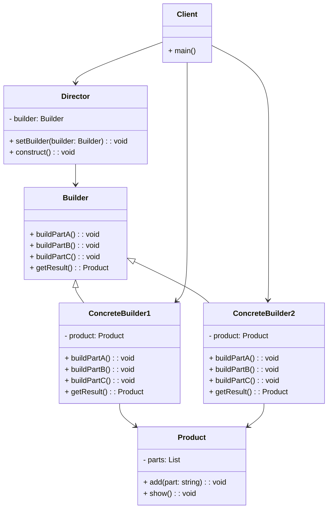

---
tags:
  - 设计模式
  - 创建型模式
  - GOF
category: 设计模式
categories:
title: 建造者模式：像定制奶茶一样构建复杂对象
date: 2026-08-08T11:02:00
banner: /images/image.webp
description: 从奶茶定制的故事入手，深入浅出地讲解建造者模式的原理、结构和实践，帮你彻底掌握这个创建型设计模式。附 Java、Python、Go、Rust 等多语言代码示例。
type: 创建型模式
---

# 建造者模式：像定制奶茶一样构建复杂对象

你有没有遇到过这样的情况：创建一个对象需要传入十几个参数，其中大部分还是可选的？或者一个对象由多个部件组成，而这些部件的组装顺序还有严格要求？

反正我遇到过。面对这种场景，构造函数要么长到令人窒息，要么需要重载几十个版本，简直是一场灾难。

这时候，建造者模式（Builder Pattern）就该登场了。它就像一个耐心的奶茶店店员——你说“少冰、七分糖、加珍珠、换椰奶底”，他一项项记下来，最后给你一杯完美定制的奶茶。而你不必关心他先加茶还是先加奶，也不用操心珍珠什么时候放。

今天，我就带你把这套“定制流程”彻底搞清楚。

## 定义：把“怎么建”和“建什么”分开

先看官方的说法：

> **建造者模式**：将一个复杂对象的构建过程与它的表示分离，使得同样的构建过程可以创建不同的表示。

翻译成人话就是：**把“造东西的步骤”和“造出来的东西长什么样”拆开。**

这样一来，同样的步骤（先加茶、再加奶、最后加珍珠）可以造出不同口味的产品（奶茶、拿铁、果茶）。你只需要告诉建造者“我要什么”，它帮你搞定一切细节。

## 核心结构：四个角色一台戏

建造者模式里有四个关键角色，各司其职：



| 角色 | 职责 |
|------|------|
| **Product（产品）** | 要构建的复杂对象，由多个部件组成 |
| **Builder（抽象建造者）** | 定义构建产品的接口，声明“造什么部件”的方法 |
| **ConcreteBuilder（具体建造者）** | 实现 Builder 接口，负责具体的部件构建和产品装配 |
| **Director（指挥者）** | 安排构建的顺序和步骤——知道“先做什么，后做什么” |
| **Client（客户端）** | 创建建造者和指挥者，指挥建造者干活 |

说白了：**客户端告诉指挥者“我要什么”，指挥者指挥建造者“一步步来”，建造者最终交出产品。**

## 代码实现：实战中的三种语言

理论说再多，不如一段代码来得实在。下面我用 Python、JavaScript 和 C# 这三种主流语言，分别实现一个经典的“电脑组装”场景。你会发现，虽然语法各异，但建造者模式的核心思想如出一辙。

### Python 实现：优雅的链式调用

Python 的动态特性让建造者模式写起来格外简洁。我们定义一个 `Computer` 类，内部嵌套 `Builder`，支持链式设置属性，最后调用 `build()` 产出成品。

```python
class Computer:
    """产品类：电脑"""
    def __init__(self, builder):
        self.cpu = builder.cpu
        self.motherboard = builder.motherboard
        self.ram = builder.ram
        self.hard_drive = builder.hard_drive
        self.graphics_card = builder.graphics_card
        self.power_supply = builder.power_supply
        self.case_type = builder.case_type

    def __str__(self):
        return (f"Computer(cpu={self.cpu}, motherboard={self.motherboard}, "
                f"ram={self.ram}, hard_drive={self.hard_drive}, "
                f"graphics_card={self.graphics_card}, power_supply={self.power_supply}, "
                f"case_type={self.case_type})")

    class Builder:
        """建造者类"""
        def __init__(self):
            self.cpu = "Intel Core i5"
            self.motherboard = "MSI B560"
            self.ram = "16GB DDR4"
            self.hard_drive = "512GB SSD"
            self.graphics_card = "集成显卡"
            self.power_supply = "500W"
            self.case_type = "Mid Tower"

        def set_cpu(self, cpu):
            self.cpu = cpu
            return self

        def set_motherboard(self, motherboard):
            self.motherboard = motherboard
            return self

        def set_ram(self, ram):
            self.ram = ram
            return self

        def set_hard_drive(self, hard_drive):
            self.hard_drive = hard_drive
            return self

        def set_graphics_card(self, graphics_card):
            self.graphics_card = graphics_card
            return self

        def set_power_supply(self, power_supply):
            self.power_supply = power_supply
            return self

        def set_case_type(self, case_type):
            self.case_type = case_type
            return self

        def build(self):
            return Computer(self)

# 客户端使用
if __name__ == "__main__":
    # 构建游戏电脑
    gaming_pc = Computer.Builder() \
        .set_cpu("Intel Core i9") \
        .set_motherboard("ASUS ROG Strix") \
        .set_ram("32GB DDR4") \
        .set_hard_drive("1TB NVMe SSD") \
        .set_graphics_card("NVIDIA RTX 3090") \
        .set_power_supply("850W Gold") \
        .set_case_type("ATX Mid Tower") \
        .build()

    print(gaming_pc)

    # 构建办公电脑（只设置必要项）
    office_pc = Computer.Builder() \
        .set_cpu("Intel Core i5") \
        .set_motherboard("MSI B560") \
        .set_ram("16GB DDR4") \
        .set_hard_drive("512GB SSD") \
        .build()

    print(office_pc)
```

### JavaScript 实现：灵活的对象构建

JavaScript 的弱类型和对象字面量让建造者模式可以更加轻量。这里同样使用链式调用，最终返回一个配置好的对象。

```javascript
// 产品类：电脑
class Computer {
    constructor(builder) {
        this.cpu = builder.cpu;
        this.motherboard = builder.motherboard;
        this.ram = builder.ram;
        this.hardDrive = builder.hardDrive;
        this.graphicsCard = builder.graphicsCard;
        this.powerSupply = builder.powerSupply;
        this.caseType = builder.caseType;
    }

    toString() {
        return `Computer(cpu=${this.cpu}, motherboard=${this.motherboard}, ram=${this.ram}, hardDrive=${this.hardDrive}, graphicsCard=${this.graphicsCard}, powerSupply=${this.powerSupply}, caseType=${this.caseType})`;
    }
}

// 建造者类
class ComputerBuilder {
    constructor() {
        this.cpu = "Intel Core i5";
        this.motherboard = "MSI B560";
        this.ram = "16GB DDR4";
        this.hardDrive = "512GB SSD";
        this.graphicsCard = "集成显卡";
        this.powerSupply = "500W";
        this.caseType = "Mid Tower";
    }

    setCpu(cpu) {
        this.cpu = cpu;
        return this;
    }

    setMotherboard(motherboard) {
        this.motherboard = motherboard;
        return this;
    }

    setRam(ram) {
        this.ram = ram;
        return this;
    }

    setHardDrive(hardDrive) {
        this.hardDrive = hardDrive;
        return this;
    }

    setGraphicsCard(graphicsCard) {
        this.graphicsCard = graphicsCard;
        return this;
    }

    setPowerSupply(powerSupply) {
        this.powerSupply = powerSupply;
        return this;
    }

    setCaseType(caseType) {
        this.caseType = caseType;
        return this;
    }

    build() {
        return new Computer(this);
    }
}

// 客户端使用
// 游戏电脑
const gamingPc = new ComputerBuilder()
    .setCpu("Intel Core i9")
    .setMotherboard("ASUS ROG Strix")
    .setRam("32GB DDR4")
    .setHardDrive("1TB NVMe SSD")
    .setGraphicsCard("NVIDIA RTX 3090")
    .setPowerSupply("850W Gold")
    .setCaseType("ATX Mid Tower")
    .build();

console.log(gamingPc.toString());

// 办公电脑
const officePc = new ComputerBuilder()
    .setCpu("Intel Core i5")
    .setMotherboard("MSI B560")
    .setRam("16GB DDR4")
    .setHardDrive("512GB SSD")
    .build();

console.log(officePc.toString());
```

### C# 实现：强类型的严谨之美

C# 的静态类型和属性语法让建造者模式显得格外严谨。我们采用经典的嵌套 Builder 类，并在 `build()` 方法中做必要的参数校验。

```csharp
using System;

// 产品类：电脑
public class Computer
{
    public string Cpu { get; private set; }
    public string Motherboard { get; private set; }
    public string Ram { get; private set; }
    public string HardDrive { get; private set; }
    public string GraphicsCard { get; private set; }
    public string PowerSupply { get; private set; }
    public string CaseType { get; private set; }

    private Computer(Builder builder)
    {
        this.Cpu = builder.Cpu;
        this.Motherboard = builder.Motherboard;
        this.Ram = builder.Ram;
        this.HardDrive = builder.HardDrive;
        this.GraphicsCard = builder.GraphicsCard;
        this.PowerSupply = builder.PowerSupply;
        this.CaseType = builder.CaseType;
    }

    public override string ToString()
    {
        return $"Computer(Cpu={Cpu}, Motherboard={Motherboard}, Ram={Ram}, HardDrive={HardDrive}, GraphicsCard={GraphicsCard}, PowerSupply={PowerSupply}, CaseType={CaseType})";
    }

    // 建造者类
    public class Builder
    {
        public string Cpu { get; private set; } = "Intel Core i5";
        public string Motherboard { get; private set; } = "MSI B560";
        public string Ram { get; private set; } = "16GB DDR4";
        public string HardDrive { get; private set; } = "512GB SSD";
        public string GraphicsCard { get; private set; } = "集成显卡";
        public string PowerSupply { get; private set; } = "500W";
        public string CaseType { get; private set; } = "Mid Tower";

        public Builder SetCpu(string cpu)
        {
            this.Cpu = cpu;
            return this;
        }

        public Builder SetMotherboard(string motherboard)
        {
            this.Motherboard = motherboard;
            return this;
        }

        public Builder SetRam(string ram)
        {
            this.Ram = ram;
            return this;
        }

        public Builder SetHardDrive(string hardDrive)
        {
            this.HardDrive = hardDrive;
            return this;
        }

        public Builder SetGraphicsCard(string graphicsCard)
        {
            this.GraphicsCard = graphicsCard;
            return this;
        }

        public Builder SetPowerSupply(string powerSupply)
        {
            this.PowerSupply = powerSupply;
            return this;
        }

        public Builder SetCaseType(string caseType)
        {
            this.CaseType = caseType;
            return this;
        }

        public Computer Build()
        {
            // 可在此增加校验逻辑
            if (string.IsNullOrEmpty(this.Cpu))
                throw new InvalidOperationException("CPU不能为空");
            return new Computer(this);
        }
    }
}

// 客户端使用
class Program
{
    static void Main(string[] args)
    {
        // 游戏电脑
        Computer gamingPc = new Computer.Builder()
            .SetCpu("Intel Core i9")
            .SetMotherboard("ASUS ROG Strix")
            .SetRam("32GB DDR4")
            .SetHardDrive("1TB NVMe SSD")
            .SetGraphicsCard("NVIDIA RTX 3090")
            .SetPowerSupply("850W Gold")
            .SetCaseType("ATX Mid Tower")
            .Build();

        Console.WriteLine(gamingPc);

        // 办公电脑
        Computer officePc = new Computer.Builder()
            .SetCpu("Intel Core i5")
            .SetMotherboard("MSI B560")
            .SetRam("16GB DDR4")
            .SetHardDrive("512GB SSD")
            .Build();

        Console.WriteLine(officePc);
    }
}
```

## 适用场景：什么时候该用它？

不是所有场景都需要建造者模式。根据我的经验，以下情况值得考虑：

- **对象的构造参数过多**（特别是超过 4 个，且有大量可选参数）
- **对象的部件需要按特定顺序装配**（如先装主板再插 CPU，顺序不能乱）
- **同样的构建过程能产出不同的表示**（比如同一个步骤，既能造游戏电脑也能造办公电脑）
- **你想隐藏复杂对象的创建细节**，让客户端只管“要什么”，不用管“怎么造”

一个简单的判断方法：如果某个类的构造函数又长又臭，参数列表超过屏幕宽度——别犹豫，上建造者。

## 优缺点：好在哪里，痛在哪里

### 优点

- **清晰的构建过程**：每一步做了什么，代码里写得明明白白
- **复用性高**：同样的导演（指挥者）搭配不同的建造者，就能产出不同的产品
- **封装性好**：客户端不需要知道对象的内部结构和装配细节
- **符合开闭原则**：新增产品类型只需添加新的具体建造者，无需修改已有代码

### 缺点

- **代码量增加**：需要额外创建 Builder 类和多个具体建造者实现
- **复杂度提升**：对于部件很少的简单对象，用建造者模式反而显得冗余
- **客户端需要知道具体建造者类型**：增加了客户端的使用门槛

## 实际应用：你每天都在用

建造者模式并不是什么冷门概念，相反，它在主流框架和库中无处不在：

**Java / C#**：`StringBuilder`、`AlertDialog.Builder`（Android）、`OkHttp.Request.Builder`、Entity Framework Core 的查询构建器

**Python**：Django 的 `QuerySet`、SQLAlchemy 的查询构建器、`requests` 的 Session 配置

**JavaScript / TypeScript**：jQuery 的链式 DOM 操作、axios 的配置、RxJS 的 Observable 操作链

**Go**：`strings.Builder`、gorm 的查询构建器、gin 的路由构建器

**Rust**：reqwest 的 `RequestBuilder`、diesel 的查询构建器

下次你写 `new StringBuilder().append("Hello").append(" ").append("World").toString()`，心里应该清楚——这就是建造者模式在帮你的忙。

## 和其他模式的关系

- **抽象工厂模式 vs 建造者模式**：抽象工厂关心“产品族”，建造者关心“产品的构建过程”。打个比方，抽象工厂是“我要一套北欧风格的家具”，建造者是“我要一张桌子，先做桌腿再装桌面”。
- **工厂方法模式**：工厂方法只管“创建”，建造者管“怎么一步步创建”。
- **模板方法模式**：指挥者的 `construct()` 方法就像模板方法，定义了构建步骤的骨架。

## 总结

建造者模式解决了一个很实际的问题——**当对象的构建变得越来越复杂时，如何让代码依然清晰、灵活、易维护**。

它把“造什么”和“怎么造”分开，让变化的部分（具体的建造者）和稳定的部分（构建步骤）各自独立演化。这正是设计模式的核心价值——**找到变化，封装变化**。

回到开头那个奶茶店的比喻：你点的每一杯奶茶都是一次“构建”。配方变了？加个新的建造者就行。步骤换了？改一下指挥者的流程。而作为客户端，你永远只需要说一句：“我要一杯少冰七分糖加珍珠的奶茶。”

简单，优雅，刚刚好。
