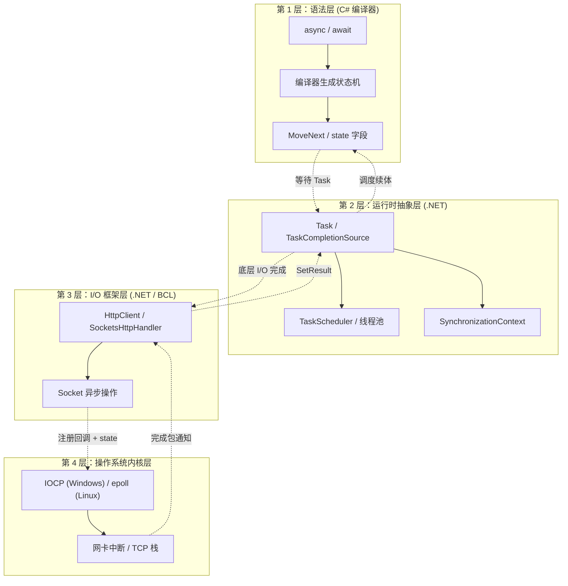
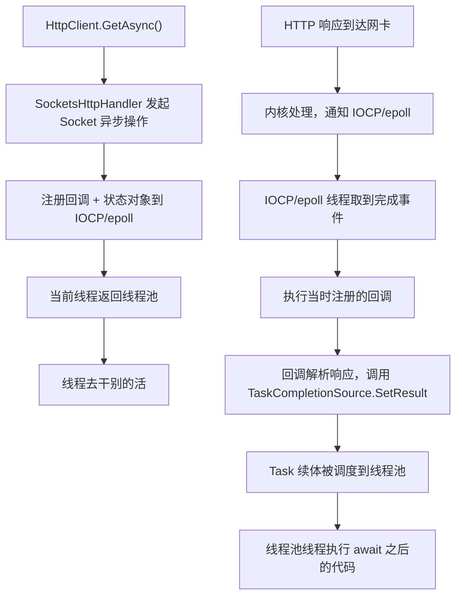
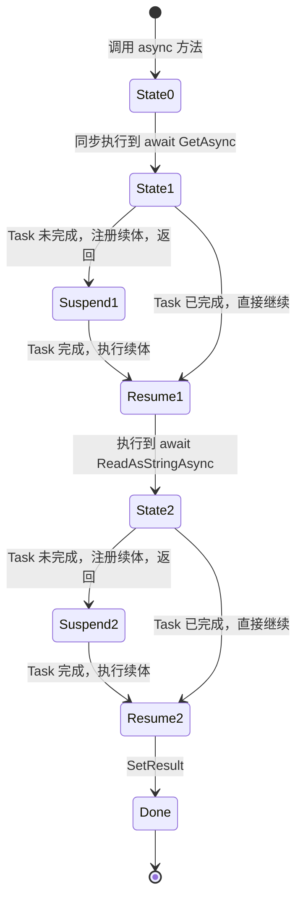
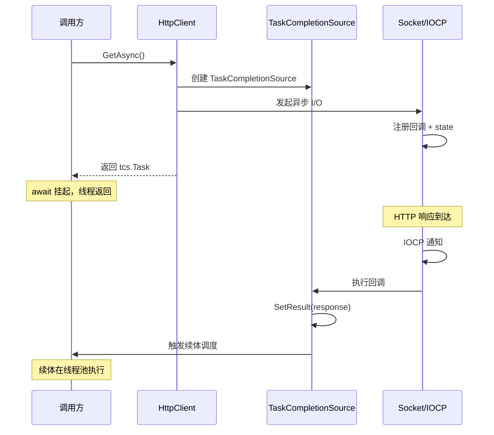
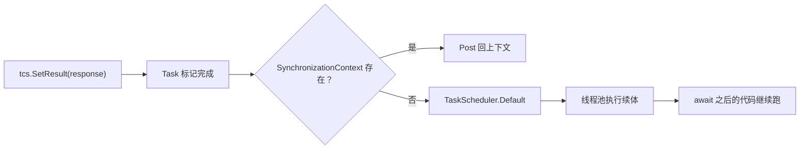
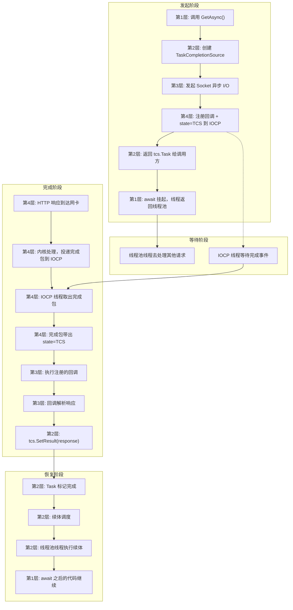

---
tags:
  - 异步编程
  - 操作系统
category: 后端开发
categories:
  - .NET Core
banner: /images/aspnetcore1.webp
title: 从 async/await 到 IOCP：一次 HTTP 异步请求的完整旅程
date: 2026-10-03T11:02:00
description: 请求发出去了，线程也回了线程池，那响应回来时系统怎么知道该唤醒哪个 Task？答案不是“找回来”的，而是发起时就绑定好的。从 C# 语法糖一路钻到操作系统内核。
pub-blog: true
ai: true
status: published
---
# 从 async/await 到 IOCP：一次 HTTP 异步请求的完整旅程

有一个 dotnet 异步编程的问题卡了我很久。

`await httpClient.GetAsync(url)` 这行代码，请求发出去之后，当前线程就回线程池了，去干别的活了。那等 HTTP 响应回来的时候，系统怎么知道该唤醒哪个 Task？线程池里有成百上千个线程，成千上万个未完成的 Task，它是怎么找到对应的那一个的？

后来把这个问题彻底搞明白，才发现答案其实很简单：

**不是“找”回来的，而是一开始就绑定好了。**

在发起 I/O 的那一刻，系统就已经把“回调”和“状态对象”注册到底层了。响应回来时，操作系统通知 .NET，.NET 找到当时注册的回调，回调里唤醒对应的 Task。

这套机制从 C# 语言层的语法糖，一路钻到操作系统内核的 I/O 机制。如果把 `async/await` 比作冰山，之前理解的状态机只是海平面上的那部分，`IOCP/epoll` 和 `TaskCompletionSource` 才是海平面下真正的底座。

## 四层架构总览



| 层级 | 所在位置 | 职责 |
|:---|:---|:---|
| 语法层 | C# 编译器 | 把 `async/await` 改造成状态机，负责挂起和恢复 |
| 运行时抽象层 | .NET | `Task` / TCS / TaskScheduler / 线程池，负责调度 |
| I/O 框架层 | .NET / BCL | `HttpClient` / `Socket`，负责发起 I/O 和解析响应 |
| 内核层 | 操作系统 | IOCP / epoll，负责真正的 I/O 等待和完成通知 |

## 整体链条

先看全貌，再逐层拆解：



关键在第三步：**回调不是响应回来时才找的，而是发请求时就注册好的。**

## 第 1 层：语法层，编译器帮你干了什么

这是写代码时直接接触的层：

```csharp
var response = await httpClient.GetAsync(url);
var content = await response.Content.ReadAsStringAsync();
```

看起来平平无奇，但编译器在背后做了一堆事：

- `async` 方法被改造成状态机
- `await` 被展开成 `GetAwaiter()` / `OnCompleted()` / `GetResult()`
- 它只负责“挂起”和“恢复”，不负责“等待什么”



这一层是 `async/await` 的**语法实现**。它解决了“怎么把一段代码切成可以暂停、可以恢复的片段”这个问题，但完全不关心底层等的是网络 I/O 还是别的什么。

## 第 2 层：运行时抽象层，Task 和它的桥

这一层是 `Task` / `TaskCompletionSource` / `TaskScheduler` / 线程池所在的位置。

- `await` 等待的是一个 `Task`
- 谁来让这个 `Task` 完成？是 `TaskCompletionSource`
- Task 完成后，谁来跑续体？是 `TaskScheduler` 和线程池
- 要不要回同步上下文？是 `SynchronizationContext` 决定的

### TaskCompletionSource 的角色

操作系统只认回调和状态对象，不认 `Task`。所以 .NET 需要一座桥，把“回调”翻译成“Task 完成”。这座桥就是 `TaskCompletionSource`（简称 TCS）。

简化后的伪代码：

```csharp
var tcs = new TaskCompletionSource<HttpResponseMessage>();

// 发起底层异步 I/O，把回调注册进去
socket.BeginReceive(buffer, (asyncResult) =>
{
    var bytesRead = socket.EndReceive(asyncResult);
    var response = ParseResponse(buffer, bytesRead);

    // 唤醒 Task
    tcs.SetResult(response);
}, state: tcs);

// 返回 Task 给调用方
return tcs.Task;
```

调用方 `await` 的其实是 `tcs.Task`。当底层 I/O 完成，回调执行，`tcs.SetResult(response)` 被调用，Task 状态变成已完成，续体被调度。



### SetResult 之后发生什么

`tcs.SetResult(response)` 做两件事：

1. 把 Task 状态标记为已完成，保存结果
2. 触发续体调度

续体调度的逻辑：

- 如果 `SynchronizationContext.Current != null`，通过 `Post` 投递
- 否则如果 `TaskScheduler.Current != TaskScheduler.Default`，通过该调度器投递
- 否则交给 `TaskScheduler.Default`，也就是线程池

在 ASP.NET Core 里，通常直接落到线程池。线程池某个线程执行续体，也就是 `await httpClient.GetAsync(...)` 之后的代码。



这一层是 `async/await` 的**调度实现**。

## 第 3 层：I/O 框架层，把 Task 和 Socket 连起来

`HttpClient`、`SocketsHttpHandler`、`Socket` 在这里。

它们做的事情：

- 把“发起 HTTP 请求”翻译成“发起 Socket 异步 I/O”
- 创建 `TaskCompletionSource`，把回调注册到底层
- 负责解析响应，然后 `SetResult`

关键一步是**注册回调时，把 TCS 作为 state 传进去了**：

```csharp
socket.BeginReceive(buffer, callback, state: tcs);
```

底层 I/O 完成时，完成包里带着 `state`，也就是 `tcs`。回调被调用时，能拿到 `tcs`，于是知道该唤醒哪个 Task。

这一层是 `async/await` 的**业务实现**。

## 第 4 层：操作系统内核层，真正的等待发生在这里

IOCP（Windows）、epoll（Linux）、网卡中断、TCP 协议栈在这里。

`HttpClient` 最终走的是 Socket。Socket 的异步 I/O 在操作系统层面靠两种机制：

- **Windows**：IOCP（I/O Completion Port，I/O 完成端口）
- **Linux**：epoll

它们的共同点是：**不是线程去轮询“好了没”，而是内核在 I/O 完成时主动通知。**

以 IOCP 为例：

1. 发起异步读取时，把一个**完成回调**和**状态对象**绑定到 socket 上
2. 线程返回，不阻塞
3. 数据到达，内核处理完 TCP/IP 栈，把“完成包”投递到 IOCP
4. IOCP 有专门的线程在等待，它取出完成包
5. 完成包里带着当时绑定的状态对象
6. IOCP 线程执行对应的回调

**状态对象就是“归谁处理”的答案。** 它不是靠请求 ID 去查表，而是完成包里直接带着。

这一层是 `async/await` 的**物理实现**。

## 回调怎么精准找到 Task

回到最初的那个问题。

关键在注册那一步：**把 TCS 作为 state 传进去了。**

```csharp
socket.BeginReceive(buffer, callback, state: tcs);
```

底层 I/O 完成时，完成包里带着 `state`，也就是 `tcs`。回调被调用时，能拿到 `tcs`，于是知道该唤醒哪个 Task。

所以“归谁处理”不是靠事后查找，而是靠：

- **发起时绑定**：回调 + state 一起注册
- **完成时带回**：完成包把 state 原样带回
- **回调里唤醒**：用 state 里的 TCS 设置结果

这就是为什么可以同时有成千上万个未完成的 HTTP 请求而不会乱：每个请求都有自己的 TCS，各自绑定到底层，完成时各自唤醒。

## 一次请求的四层旅程



## 各层之间怎么交接

| 交接点 | 从哪层到哪层 | 交的是什么 |
|:---|:---|:---|
| 状态机注册续体 | 第 1 层 → 第 2 层 | 一个续体委托，挂到 Task 上 |
| 发起 Socket 异步 I/O | 第 2 层 → 第 3 层 | 等待 Task 完成，转为等待 Socket 完成 |
| 注册回调 + state | 第 3 层 → 第 4 层 | 回调委托 + TCS 对象，绑定到底层 |
| 完成包通知 | 第 4 层 → 第 3 层 | 完成包带回 state（TCS） |
| SetResult | 第 3 层 → 第 2 层 | 把结果写入 Task，触发续体调度 |
| 调度续体 | 第 2 层 → 第 1 层 | 线程池执行状态机 MoveNext |

## 几个容易混淆的点

**不是轮询。** 不是有个线程不停问“好了没”。是内核在 I/O 完成时主动通知，效率高得多。

**不是靠请求 ID 查表。** 完成包里直接带着发起时绑定的 state 对象，不需要全局查找。

**回调不在发起线程上执行。** 发起线程早就回线程池了。回调由 IOCP 线程（Windows）或 epoll 事件循环线程（Linux）执行。

**SetResult 之后续体不一定立刻执行。** 它只是被调度。在 ASP.NET Core 里，续体排队到线程池，由某个空闲线程执行。

**HttpClient 内部比这复杂。** 实际有连接池、HTTP 解析、重定向、超时、取消等逻辑，但“回调 + TCS + 续体”这个核心机制是一样的。

**TCS 的 state 绑定是关键。** “归谁处理”不是事后找的，而是发起时就绑定好的。这是理解整套机制的核心。

## 为什么要钻这么深

只懂第 1 层，只能写出能跑的异步代码。懂了第 2 层，才能理解 `ConfigureAwait`、线程池、死锁。懂了第 3、4 层，才能理解：

- 为什么异步 I/O 不占线程
- 为什么同步阻塞会拖垮线程池
- 为什么 HTTP 响应回来能精准唤醒对应的 Task
- 为什么 `HttpClient` 能支撑成千上万并发请求

这就像开车。会踩油门是第 1 层，懂发动机是第 2 层，懂变速箱和传动轴是第 3 层，懂燃油喷射和点火时序是第 4 层。日常开不用懂那么多，但出了问题、要调优、要设计高并发系统，就得往下钻。

## 总结

`async/await` 是**语法糖**，`Task` / `TaskCompletionSource` 是**调度机制**，`HttpClient` / `Socket` 是**I/O 封装**，`IOCP/epoll` 是**内核通知**。

HTTP 请求发出时，`HttpClient` 在底层注册了**回调**和**状态对象（TCS）**。响应回来时，操作系统通过 IOCP/epoll 通知 .NET，.NET 执行回调，回调用 TCS 唤醒对应的 Task，Task 再触发续体调度。

**“归谁处理”不是事后找的，而是发起时就绑定好的。**

这就是异步 I/O 能做到“等待不占线程，完成精准唤醒”的根本原因。四层各司其职，共同实现了这套机制。
