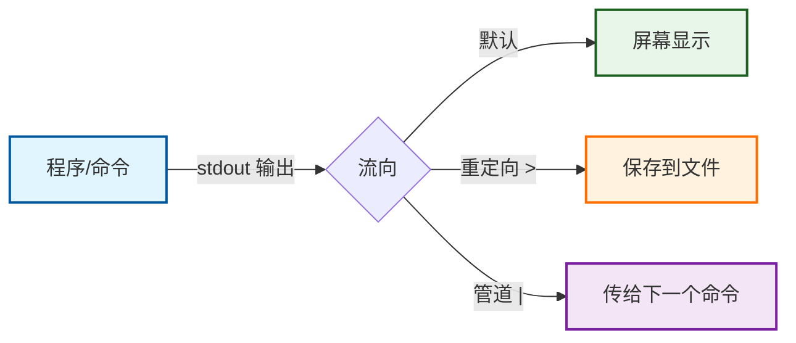

---
tags:
  - stdout
  - 标准输出
  - Linux
  - 命令行
  - 编程基础
  - 重定向
category: 技术科普
categories:
  - 编程基础
  - Linux
banner: /images/科技4.webp
title: 程序说话用的那个“麦克风”：彻底搞懂 stdout 是什么
date: 2026-08-20T11:02:00
description: stdout（标准输出）是程序“说话”的默认通道。它是什么、长什么样、和 stderr 有什么区别、重定向和管道怎么用——一篇让你彻底搞懂。
pub-blog: true
ai: true
status: published
---

# 程序说话用的那个“麦克风”：彻底搞懂 stdout 是什么

你在终端里敲下一行命令，屏幕上“唰”地冒出一堆文字。你从来没想过它们是怎么来的，反正它们就在那儿。

但如果有一天，你不想让这些文字显示在屏幕上，而是想存进文件里呢？如果你想把这些文字直接塞给另一个程序接着处理呢？

这时候，你就得认识一下 **stdout** 了。

它是程序“说话”的默认通道。搞懂它，你的命令行操作会从“能用”变成“好用”，从“会敲命令”变成“会玩命令”。

## 一句话先说明白

**stdout**，全称 Standard Output，标准输出。

它是计算机操作系统里，进程与外部环境通信的默认数据流之一。

用人话翻译一下：**它是程序把“正常结果”打印出来的地方。**

你运行一个命令，屏幕上出现的那堆文字——如果它不是报错信息——基本上都是通过 stdout 出来的。

> 记住这个区分：正常结果走 stdout，报错和警告走 stderr。

## 默认长什么样？——连着你的屏幕

在默认情况下，stdout 指向**当前终端，也就是屏幕**。

当你打开一个终端窗口，输入 `ls`，文件列表出现在眼前。那个列表就是从 stdout 流出来的。

如果你输入 `echo "Hello"`，“Hello”出现在屏幕上。那也是 stdout。

说白了，在没做任何特殊设置之前，**stdout 就是“屏幕上看到的普通输出”。**

## 技术上的身份证：文件描述符 1

在 Linux、macOS 这类 Unix 系统里，stdout 有一个数字编号：**1**。

这背后有个很巧妙的设计思路：Unix 把“屏幕”也当成一个文件来看待。程序做的事情很简单——往文件描述符 1 里写东西，系统就帮你把内容显示在屏幕上。

所以，当你在代码里写 `print("Hello")` 或者 `System.out.println("Hello")`，那些数据最终都会流向这个编号为 1 的“文件”，然后呈现在你眼前。

## 分两个通道，不是炫技是分工

程序其实有两个默认的输出通道：

| 通道 | 编号 | 用途 | 例子 |
|:---|:---|:---|:---|
| **stdout** | 1 | 输出正常结果 | `ls` 列出的文件列表 |
| **stderr** | 2 | 输出错误和警告 | 文件不存在时的报错信息 |

为什么要把正确信息和错误信息分开走两条路？

**因为你可以分别处理它们。**

比如，你只想保存正确的文件列表，不想把报错也存进去。那你可以把 stdout 保存到文件里，让 stderr 依然显示在屏幕上提醒你。

如果你只有一条通道，正确结果和报错就会混在一起，后期处理起来非常头疼。

## 两个核心玩法：重定向和管道

stdout 最强大的地方在于——**它不是锁死的。** 你可以改变它的流向。

### 玩法一：重定向（`>`）

把本来应该显示在屏幕上的内容，写进文件里。

```bash
echo "你好" > log.txt
```

屏幕上没动静了。“你好”被写进了 `log.txt` 这个文件里。这就是“重定向”——你把 stdout 的终点从“屏幕”改成了“文件”。

补充一个细节：`>` 会覆盖文件原有内容，`>>` 会追加在末尾。

### 玩法二：管道（`|`）

把一个程序的 stdout，直接输送给另一个程序当作输入。

```bash
cat data.txt | grep "关键词"
```

`cat` 把文件内容吐出来，本来应该显示在屏幕上。但管道符 `|` 截住了它，直接送给了 `grep` 程序处理。屏幕上显示的，就是 `grep` 筛完的结果。

这就是管道——**把一个程序的“说”，变成另一个程序的“听”。**

## 来几个实操，加深印象

### 1. 保存命令输出

```bash
# 覆盖写入
ps aux > processes.txt

# 追加写入
ps aux >> processes.txt
```

### 2. 分别处理 stdout 和 stderr

```bash
# stdout 存文件，stderr 依然显示在屏幕
find / -name "*.log" 1> success.txt

# stdout 和 stderr 分别存到不同文件
find / -name "*.log" 1> success.txt 2> error.txt

# 把 stderr 也合并到 stdout 里（常用）
find / -name "*.log" > output.txt 2>&1
```

### 3. 管道组合操作

```bash
# 查看日志文件，只显示包含“ERROR”的行
cat app.log | grep "ERROR"

# 再进一步，统计错误行数
cat app.log | grep "ERROR" | wc -l

# 查看占用 CPU 最高的 10 个进程
ps aux | sort -k3 -r | head -10
```

## 在代码里它长什么样？

如果你写过程序，你跟 stdout 早就打过照面了：

```python
# Python
print("这条消息走 stdout")
```

```java
// Java
System.out.println("这条消息走 stdout");
```

```c
// C
printf("这条消息走 stdout");
```

```javascript
// JavaScript (Node.js)
console.log("这条消息走 stdout");
```

这些代码做的事情完全一样：把数据送到 stdout。至于 stdout 最终流向哪里——屏幕、文件还是另一个程序——完全取决于调用方怎么重定向，跟程序本身没关系。

## 一个容易混淆的问题

有人会问：“那我正常 `print` 出来，想同时显示在屏幕并存到文件，怎么办？”

可以用 `tee` 命令。它像一个“分线器”——数据同时流向屏幕和文件：

```bash
echo "Hello" | tee log.txt
```

屏幕显示 “Hello”，`log.txt` 里也写入了 “Hello”。这个场景在调试和日志记录里非常实用。

## 一句话总结

**stdout 是程序说“我做完了，这是结果”时用的那个“麦克风”。**

这个麦克风默认连接着你的屏幕。但你可以随时把线拔下来——插到文件里，或者插到另一个程序的耳朵里。

给本文画个简单的流程图：



## 三个实操建议

1. **下次看到错误信息想忽略**：`command 2> /dev/null`，把报错扔进“黑洞”
2. **想保留正确输出同时看到报错**：`command 1> output.log`，报错自然留在屏幕上
3. **想一次性处理大量文本文件**：`cat *.log | grep ERROR | sort | uniq -c`，四个命令串成一条流水线

搞懂了 stdout，你就懂了命令行世界里“数据怎么流动”。这不是一个知识点，这是一把钥匙——打开了之后，你能玩的就多了。