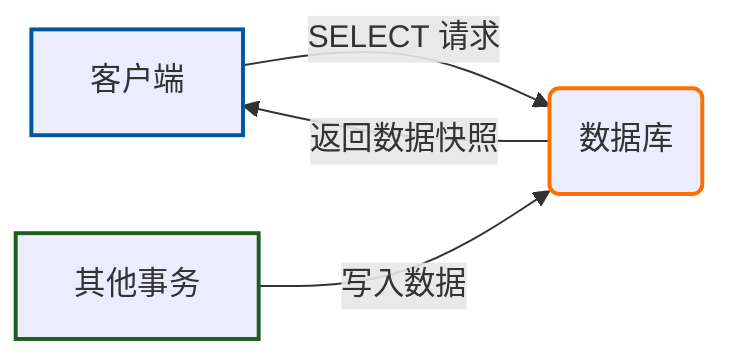
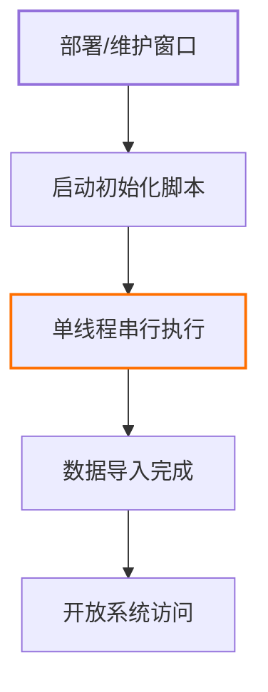
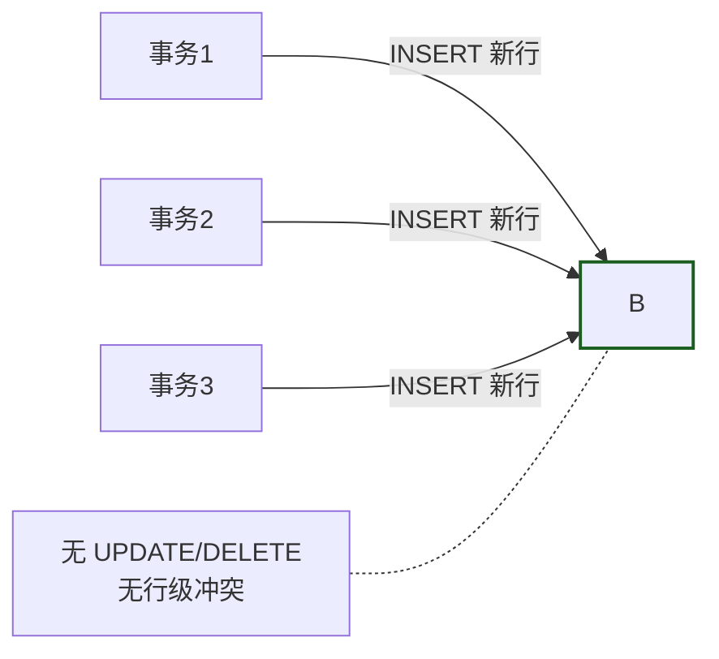
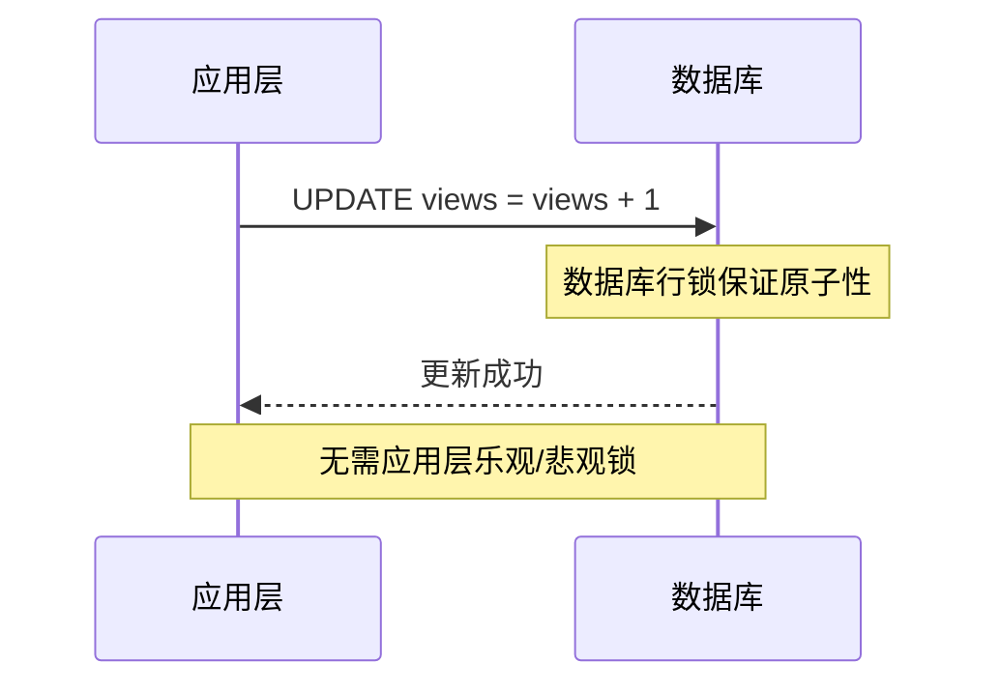
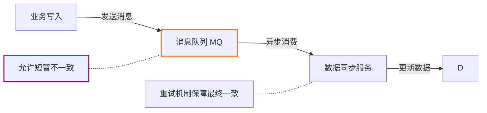
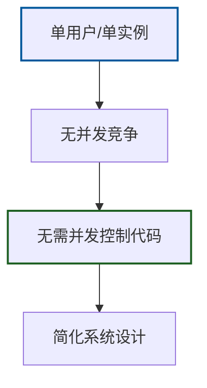
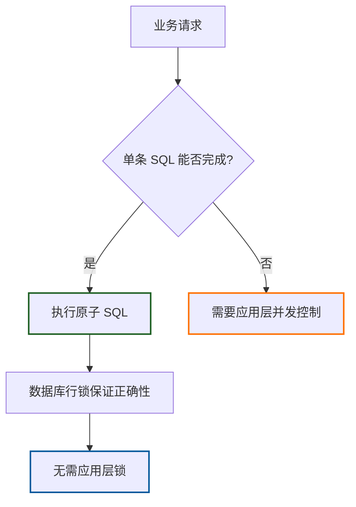
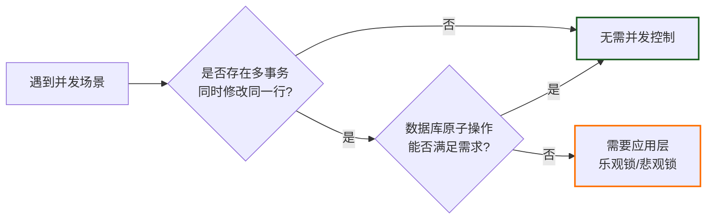
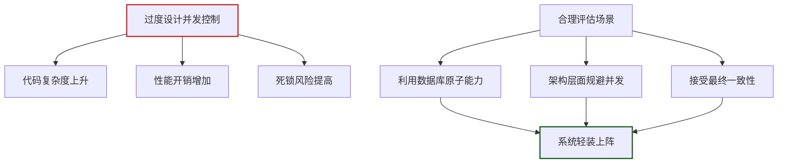

# 什么场景不需要并发控制？

在系统设计中，我们往往过度关注“如何加锁”，却忽略了“何时不该加锁”。并发控制的本质是**防止多个事务同时修改同一数据时产生不一致**。但如果场景中根本不存在并发修改风险，或者业务对数据一致性的要求极低、可以容忍短暂的异常，那么强行引入乐观锁或悲观锁，反而会带来不必要的性能开销和代码复杂度。

以下 7 类场景，通常**不需要**显式的应用层并发控制：

### 1. 纯只读操作

- **报表查询与 BI 展示**：仅执行 `SELECT`，读取历史快照或当前数据，自然没有写冲突。
- **API 只读接口**：如商品详情页、文章内容展示。

> **注意**：即使读取过程中有其他事务在写入，除非业务严格要求“可重复读”或“完全无幻读”，否则普通的读操作无需加锁。隔离级别的选择（如 Read Committed）通常已足够应对。

### 2. 一次性数据导入/初始化

- **系统初始化脚本**：仅在部署时运行一次。
- **离线数据迁移**：在维护窗口期由单一任务执行，期间屏蔽其他写操作。

> 这类场景本质上是**单线程串行执行**，物理上不存在并发，自然无需并发控制。

### 3. 仅追加的日志/审计表

- **操作日志、点击流、消息存档**：这类表的设计模式是 **Append-Only**（仅追加），从不更新或删除已有行。

> 由于每个事务都在插入新行，不存在对同一行的并发更新，行级冲突概率为零。无论是乐观锁还是悲观锁，在这里都是多余的。

### 4. 低一致性要求的统计字段

- **页面访问计数器、点赞数**：允许少量丢失或短暂不精确。

> **关键区分**：这里说的“不需要并发控制”，是指**不需要应用层的乐观/悲观锁**。如果你使用 `UPDATE table SET views = views + 1`，数据库底层的行锁已经保证了这条语句的原子性。只有当你采用“先 SELECT 再在内存计算后 UPDATE”的贫血模型时，才需要应用层锁。

### 5. 分布式最终一致性场景

- **异步数据同步**：通过消息队列（MQ）异步更新数据，允许短暂不一致，且更新顺序可能乱序，但业务可接受。
- **缓存更新**：缓存与数据库之间不要求严格实时一致。

> 这类场景的解法通常是**消息队列 + 重试机制**，而非数据库层面的锁。用业务层的最终一致性换取系统的高吞吐。

### 6. 单用户/单线程环境

- **桌面单机应用**：只有一个用户操作本地数据库。
- **单实例后台任务**：通过调度框架确保同一时刻只有一个任务实例运行。

> 既然从架构上已经杜绝了并发，代码中就可以完全省略并发控制逻辑。

### 7. 利用数据库原子操作替代应用层锁

这是最容易被忽视的一点。很多开发者习惯在应用层加锁，其实数据库自身的能力往往更可靠：

- **库存扣减**：`UPDATE stock SET num = num - 1 WHERE id = ? AND num > 0`。这一条语句本身就是原子的，数据库行锁保证了不会超卖，无需应用层重试。
- **幂等更新**：`INSERT ... ON DUPLICATE KEY UPDATE`。
- **条件更新**：`UPDATE ... SET version = version + 1 WHERE id = ? AND version = ?`。这本质上是乐观锁，但如果你不关心是否更新成功（无需重试），它就只是一条普通的原子 SQL。

> **原则**：如果单条 SQL 就能完成业务逻辑，并且结果正确性仅依赖数据库的原子性，那么不需要额外的并发控制。

---

### 场景决策速查表

|场景|是否需要应用层并发控制|核心原因|
|:--|:-:|:--|
|纯只读查询|不需要|无写冲突|
|一次性导入/初始化|不需要|单线程，物理无并发|
|仅追加的日志表|不需要|不同行无冲突 (Append-Only)|
|非关键计数器 (`+=1`)|不需要|数据库行锁已保证原子性|
|最终一致性异步更新|不需要|业务容忍短暂不一致|
|单用户/单线程应用|不需要|架构层面已规避并发|
|单条原子 SQL 更新|不需要|数据库自身已处理并发|

---

### 总结

**不要为了并发而并发。**

只要没有多个事务同时修改同一行数据，或者数据库的原子操作（Atomic Operation）已经足够保证业务正确性，就可以大胆地去掉乐观锁或悲观锁。

大多数简单的增减库存、计数器更新，**一条 `UPDATE` 语句足矣**。过度设计并发控制，往往是系统复杂度和性能瓶颈的万恶之源。

