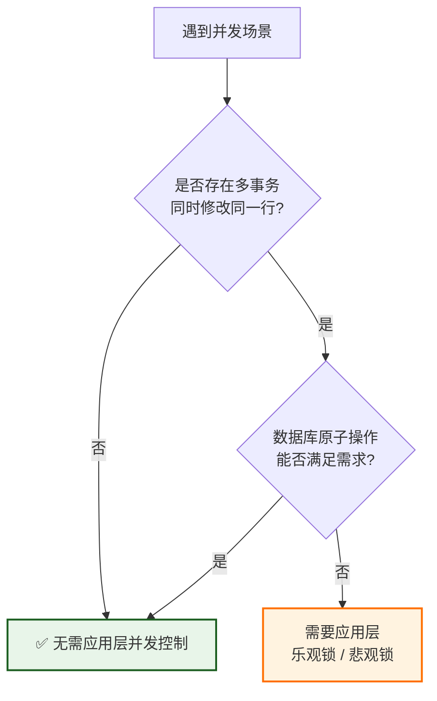

# 别急着加锁：这 7 种场景压根不需要并发控制

> 过度设计并发控制，往往是系统复杂度和性能瓶颈的万恶之源。

一提到并发控制，很多人的第一反应就是“加锁”。遇到库存扣减？加锁。遇到订单状态更新？加锁。遇到任何涉及数据修改的操作？先锁上再说。

但真相是：**大多数业务场景并不需要应用层的并发控制。**

锁从来不是免费的。悲观锁会阻塞其他事务，影响吞吐量；乐观锁引入了版本字段和重试逻辑，增加了代码复杂度。如果场景中根本不存在并发修改风险，或者业务对数据一致性的要求极低，强行加锁就是典型的“用战术勤奋掩盖战略懒惰”。

今天这篇文章，我们来聊聊**什么时候不该加锁**。搞懂这件事，比学会怎么加锁更重要。

## 并发控制的本质：为什么要锁？

在深入讨论“不需要”之前，先明确“为什么需要”。

并发控制的核心目的是：**防止多个事务同时修改同一数据时产生不一致。**

这个前提有两个关键条件：

1. **多个事务**——确实存在并发
2. **同时修改同一数据**——存在资源竞争

如果其中任何一个条件不成立，并发控制就是多余的。接下来我们就按这个逻辑，把“不需要加锁”的场景逐一拆解。

## 7 种不需要应用层并发控制的场景

### 1. 纯只读操作

这是最显然的一类。报表查询、BI 展示、商品详情页、文章内容展示——这些操作只执行 `SELECT`，不写入任何数据。

**没有写，就没有冲突。** 一个只读操作无论如何都不会破坏数据的一致性。

需要注意的是，即使读取过程中有其他事务正在写入，普通的读操作也无需加锁。数据库的隔离级别（如 Read Committed）已经提供了足够的语义保证。只有当你业务上严格要求“可重复读”或“完全无幻读”时，才需要考虑在读取侧加锁——但那属于隔离级别控制的范畴，而非并发控制的核心战场。

### 2. 一次性数据导入 / 初始化

系统初始化脚本、离线数据迁移、维护窗口期的批量导入——这类任务通常在部署时或维护窗口期由单一任务串行执行，物理上不存在并发。

**单线程天然串行，无并发放置，无锁可言。**

流程很清晰：启动维护窗口 → 执行单一线程的导入任务 → 数据就绪 → 恢复系统访问。这个过程中不会有两个任务同时操作数据，应用层的并发控制完全是多余的。

### 3. 仅追加的日志 / 审计表

操作日志、点击流、消息归档——这类表遵循 **Append-Only** 模式。

每个事务都在插入新行，不存在对同一行的更新或删除操作。你永远不会执行 `UPDATE log SET ... WHERE id = ?`，也不会执行 `DELETE FROM log WHERE ...`。

既然行级冲突的概率为零，乐观锁和悲观锁就是摆设。

### 4. 低一致性要求的统计字段

页面访问量、点赞数、转发数——这类字段允许少量丢失或短暂不精确。

但这里有一个容易被误解的关键点：

**“不需要应用层并发控制”不等于“不需要任何并发保护”。**

如果你直接用 `UPDATE table SET views = views + 1`，数据库底层的行锁已经保证了这条语句的原子性。这是数据库自身的能力，不是应用层的乐观锁或悲观锁。

只有当你采用“先 SELECT 读取当前值 → 在内存中计算新值 → 再 UPDATE 写回”这种贫血模型时，才需要应用层锁来保证读-改-写操作的原子性。

> **原则**：一条原子 SQL 能搞定的，就别在应用层画蛇添足。数据库比你更懂并发控制。

### 5. 分布式最终一致性场景

异步数据同步、消息队列驱动的数据更新、缓存与数据库之间的同步——这类场景的核心设计原则是**最终一致性**。

业务上允许短时间内数据不一致，系统的正确性不依赖于每个单次操作的强一致性。

这类场景的解药是**消息队列 + 重试机制**，而非数据库层面的锁。用业务层的最终一致性换取系统的高吞吐，是现代分布式系统的常见取舍。

### 6. 单用户 / 单线程环境

桌面单机应用、单实例后台任务——如果从架构层面已经杜绝了并发，代码里就不需要任何并发控制逻辑。

**架构能解决的问题，不要用代码绕路解决。** 如果系统只有一个用户，或者任务调度框架保证了同一时刻只有一个实例在运行，那么物理上就没有并发，加锁就是额外的负担。

### 7. 利用数据库原子操作替代应用层锁

这是最容易被忽视的一类。很多开发者遇到业务问题第一反应是“写代码加锁”，却忘记了数据库本身的能力。

典型的例子：

- **库存扣减**：`UPDATE stock SET num = num - 1 WHERE id = ? AND num > 0`
- **幂等更新**：`INSERT ... ON DUPLICATE KEY UPDATE`
- **条件更新**：`UPDATE ... SET version = version + 1 WHERE id = ? AND version = ?`

这些操作本身就是原子的。数据库的行锁机制已经保证了多个并发请求执行同一条 SQL 时的正确性，无需在应用层额外加锁。

**判断标准**：如果单条 SQL 就能完成业务逻辑，并且结果的正确性仅依赖数据库的原子性，那么就不需要应用层的并发控制。

## 决策速查表

| 场景            | 是否需要应用层并发控制 | 核心原因                |
| :------------ | :---------: | :------------------ |
| 纯只读查询         |    ❌ 不需要    | 无写冲突                |
| 一次性导入 / 初始化   |    ❌ 不需要    | 单线程，物理无并发           |
| 仅追加的日志表       |    ❌ 不需要    | 不同行无冲突（Append-Only） |
| 非关键计数器（`+=1`） |    ❌ 不需要    | 数据库行锁已保证原子性         |
| 最终一致性异步更新     |    ❌ 不需要    | 业务容忍短暂不一致           |
| 单用户 / 单线程应用   |    ❌ 不需要    | 架构层面已规避并发           |
| 单条原子 SQL 更新   |    ❌ 不需要    | 数据库自身已处理并发          |

## 一条决策路径

遇到并发场景时，按这个流程判断：

**核心逻辑**：先判断是否存在资源竞争，再判断数据库能否处理，最后才是应用层介入。

## 过度设计的代价

很多人可能会想：“多加一把锁又不会怎样，保险一点不好吗？”

问题在于，**锁从来不是免费的**。

过度设计并发控制，会带来三重代价：

| 代价维度 | 具体表现 |
|:---|:---|
| **代码复杂度** | 乐观锁需要维护版本字段，悲观锁需要考虑死锁和超时 |
| **性能开销** | 数据库连接池竞争、事务时间延长、重试带来的额外开销 |
| **运维成本** | 死锁报警、性能瓶颈排查、逻辑理解困难 |

用不必要的锁换所谓的“心安理得”，代价远比想象中大。

## 总结

**不要为了并发而并发。**

只要没有多个事务同时修改同一行数据，或者数据库的原子操作已经足够保证业务正确性，就可以大胆地去掉乐观锁或悲观锁。

大多数简单的增减库存、计数器更新——**一条 `UPDATE` 语句足矣**。把应用层的并发控制留给真正需要它的场景：多步骤事务、跨服务协调、需要人工介入的复杂业务流程。

记住这条原则：

> **数据库能做的，别在应用层再做一遍。**
> **架构能规避的，别用代码硬扛。**
> **业务能容忍的，别追求绝对的强一致性。**

这三句话，比你记住十种加锁方案更有价值。