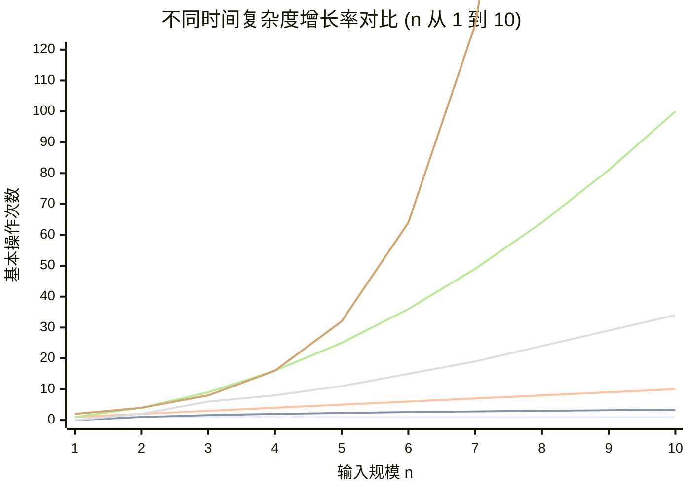
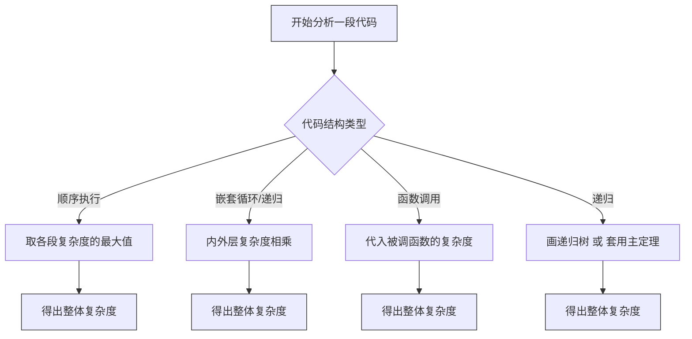
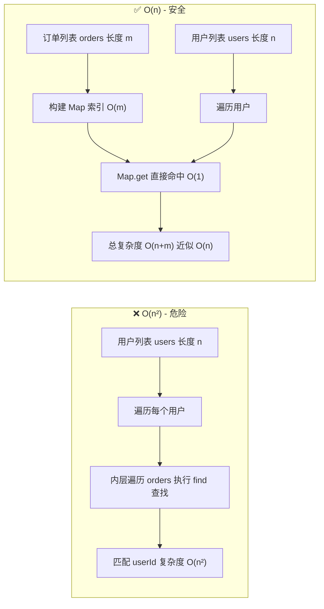
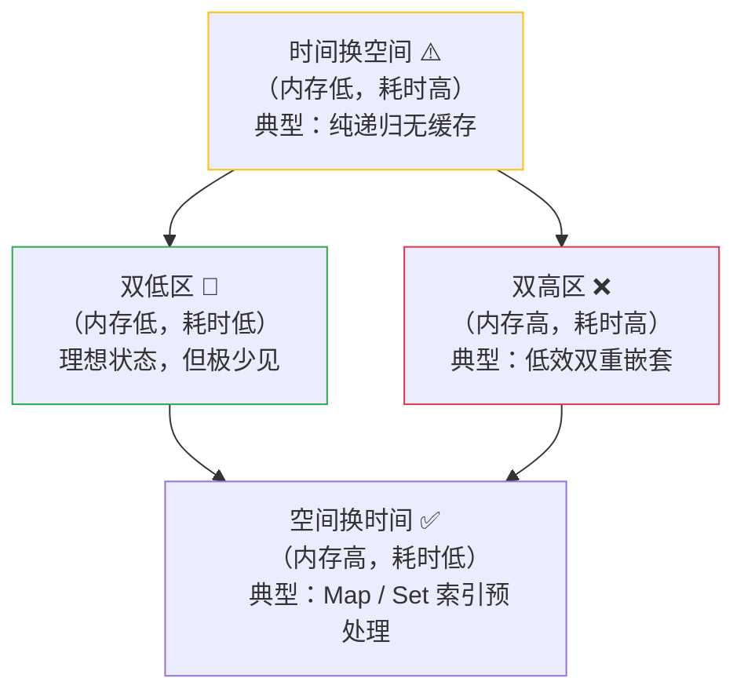

# 时间复杂度，不只是“快不快”那么简单

> 从“这段代码会不会卡死”到“数据量翻十倍还能扛得住吗”，答案都藏在时间复杂度里。

作为一名前端工程师，我们经常自我调侃：**前端谈性能，是不是有点“班门弄斧”？**  
毕竟，后端要扛百万并发，数据库要查亿级记录，而我们可能只是渲染一个列表、处理一次点击事件。  
但恰恰是这种“轻量”的错觉，让很多前端项目在数据量悄悄膨胀时，一夜之间变得卡成 PPT。

还记得那次用 `Array.find` 嵌套在 `Array.map` 里处理一份几千条用户订单数据吗？  
本地调试丝般顺滑，上线后用户一多，页面直接“转圈圈”五分钟。  
那时候我才真正意识到——**时间复杂度不是算法课的考试题，而是线上事故的预言家**。

---

## 什么是时间复杂度？一张图讲清楚“增长”这件事

官方定义很绕口：**算法基本操作执行次数与输入规模 n 之间的渐进行为，用大 O 表示法表达。**  
但说白了，它回答的是一个更实用的问题：

> 当输入数据量从 `n` 变成 `2n` 时，我的程序耗时是翻倍、翻四倍、还是直接上天？

大 O 表示法（Big O）干掉了常数和低阶项，只保留“增长最快的部分”。  
为什么？因为当 `n` 足够大时，`1000n` 和 `n` 没有本质区别，它们都是“线性增长”；而 `n²` 和 `n` 之间的鸿沟，才是真正要命的东西。

我们默认分析**最坏情况**（Worst-case），这可不是悲观主义，而是工程上的**安全边界**。  
就像建筑承重，我们按极端台风设计，而不是指望天天风和日丽。

---

## 一张表看懂常见复杂度

| 大 O | 名称 | 增长感觉 | 典型前端场景 |
|------|------|----------|-------------|
| `O(1)` | 常数时间 | 纹丝不动 | 访问数组下标、`Map.get()` |
| `O(log n)` | 对数时间 | 近乎缓慢 | 二分查找（虽然前端直接用得少，但理解它很重要） |
| `O(n)` | 线性时间 | 按比例增长 | `for` 循环遍历、`Array.filter` |
| `O(n log n)` | 线性对数 | 稍快于线性 | `Array.sort`（V8 快排/归并混合实现） |
| `O(n²)` | 平方时间 | 陡峭上升 | 双层嵌套循环、暴力字符串匹配 |
| `O(2ⁿ)` | 指数时间 | 垂直起飞 | 无剪枝的递归（如斐波那契数列） |
| `O(n!)` | 阶乘时间 | 爆炸到宇宙尽头 | 全排列穷举 |

> 一个形象记忆：当 `n=1000` 时，`O(n²)` 是百万级操作，CPU 勉强能忍；而 `O(2ⁿ)` 已经比宇宙原子总数还大得多，这段代码大概率是“有生之年”系列。

### 📈 增长率曲线（n 从 1 到 10 的直观对比）

下面这张图能让“指数爆炸”变得肉眼可见：



> **看图说话**：当 n 超过 5 以后，指数级（O(2ⁿ)）直接“垂直升空”，而 O(n²) 在 n=10 时也达到了 100 次操作。这也是为什么我们在写业务代码时，要极力避免隐藏的指数级逻辑。

---

## 实战分析：从代码中“嗅出”复杂度

分析代码复杂度其实有一套简单的“积分规则”：

- **顺序执行**：取复杂度最高的那块 —— 一段 `O(n)` 后面接一段 `O(n²)`，整体就是 `O(n²)`。
- **嵌套循环**：复杂度相乘 —— 外层 `n` 次，内层 `m` 次，就是 `O(n*m)`，如果都是 `n`，就是 `O(n²)`。
- **递归**：画递归树或用**主定理**，这个稍微进阶，但搞懂后能秒杀很多动态规划题。

### 🧠 分析决策流

照着下面这张流程图走一遍，基本不会漏掉任何结构：



---

### 前端最经典的“坑”与“解”

假设我们有一个用户列表和一个订单列表，需要把每个用户的最近订单挂上去：

```javascript
// ❌ 危险写法：O(n²)
const usersWithOrders = users.map(user => ({
  ...user,
  order: orders.find(order => order.userId === user.id)
}));
```

`Array.find` 是 O(n)，外面再套一层 `map`，总复杂度 O(n²)。  
用户量 100 时毫无感觉，10000 时浏览器已经想报警了。

```javascript
// ✅ 优雅优化：O(n)
const orderMap = new Map(orders.map(order => [order.userId, order]));
const usersWithOrders = users.map(user => ({
  ...user,
  order: orderMap.get(user.id)
}));
```

这就是典型的**空间换时间**——用 `Map` 把查找从 O(n) 降为 O(1)，整体变成 O(n)。  
多占一点内存，换回流畅的交互，这笔账怎么算都划算。

### ⚔️ 优化前后对比图

左半部分是“暴力双重循环”，右半部分是“哈希索引优化”，一目了然：



---

## 复杂度 ≠ 实际性能，但它是“第一性原理”

经常会有人问：**“我的循环才几千次，O(n²) 怎么了？反正很快啊。”**  
没错，在数据量小的实验中，常数因子、CPU 缓存、解释器优化都会让 O(n²) 跑得比 O(n) 还快。  
但**复杂度分析的价值在于预见性**——它告诉你当数据量增长 10 倍、100 倍时，瓶颈会从哪里率先崩溃。

前端尤其需要这种“前瞻”：

- 在 **React 渲染函数** 中写 O(n²) 的派生计算，会导致每次 state 更新都卡顿。
- 在 **滚动事件** 里做 O(n) 的 DOM 查询，会直接拖垮帧率。
- 虚拟列表、懒加载、分页……这些优化手段，本质就是**把 n 限制在一个可控的常数范围内**。

### ⚖️ 时间与空间的“爱恨情仇”

前端工程中，我们经常要在“快”和“省”之间做权衡。下面这张菱形四象限图帮你理清思路（**兼容所有 Mermaid 版本**）：



> **怎么读这张图**：横向箭头代表空间占用增加（从左到右），纵向箭头代表时间消耗下降（从上到下）。  
> 我们追求的是**右下角（空间换时间）**——用少量内存换取大幅性能提升；  
> 而**右上角（双高区）**是我们要极力避免的黑洞。

---

## 面试爱问，但更要紧的是“能教给别人”

学时间复杂度的终极检验，不是能背出所有大 O 等级，而是**能否向非技术同事解释清楚为什么某个功能不能做**。  
比如产品经理说：“把全量用户和他们的所有订单都拉到一个页面里，加个搜索框就行了。”  
这时候，你就可以拿出草稿纸，画一条 O(n²) 的曲线，再画一条 O(n log n) 的曲线，告诉他：“前者会让用户等半分钟，后者只要 2 秒。”

如果能做到这一步，那才是真正内化了。

---

## 自测小练习（遮住答案试试）

- **Q：`Array.includes()` 的时间复杂度？**  
  A：O(n) —— 它遍历数组直到找到目标。

- **Q：如何把双重循环优化到 O(n)？**  
  A：用哈希表（`Set` / `Map`）把内层查找变成 O(1)。

- **Q：O(n log n) 比 O(n) 慢多少？当 n=10⁶ 时？**  
  A：大约慢 20 倍（log₂10⁶ ≈ 20），这是可以接受的；而 O(n²) 会慢 10⁶ 倍，完全不是一个量级。

---

## 延伸：复杂度不是孤岛

- **空间复杂度**：它和时间复杂度是一对“冤家”，经常需要 trade-off。  
  缓存是时间换空间，哈希表是空间换时间，选择取决于你的资源约束。

- **摊还分析**：有些操作偶尔很慢（如数组扩容），但平均下来是 O(1)，这也是需要了解的高级话题。

- **实际测量**：`console.time()` 可以帮你验证理论，但要小心——它测的是“当下环境”，受很多因素干扰，不能替代复杂度分析。

---

## 写在最后

时间复杂度不是象牙塔里的数学符号，它是工程师手中的**安全绳**。  
在写每一段循环、每一层嵌套之前，心里默默算一下大 O，就像开车前系上安全带——平时可能觉得多余，但关键时候能救命。

下次遇到性能问题，别急着用 `setTimeout` 或 `requestAnimationFrame` 去“伪装”流畅，先问自己一句：  
**“我的算法复杂度是什么？数据量翻倍了，它还 hold 住吗？”**

答案往往就在那里。

---

**延伸阅读**（如果你还想深挖）：
- 主定理（Master Theorem）—— 递归复杂度的终极武器
- 摊还分析（Amortized Analysis）—— 理解动态数组、哈希表扩容的“平均”表现
- V8 引擎的排序算法实现 —— 看看 `Array.sort` 为什么是 O(n log n) 却那么快

> 如果你能把今天学到的讲给身边的同事听，那这篇文章就没白写。  
> 学习最好的方式，就是教别人。
