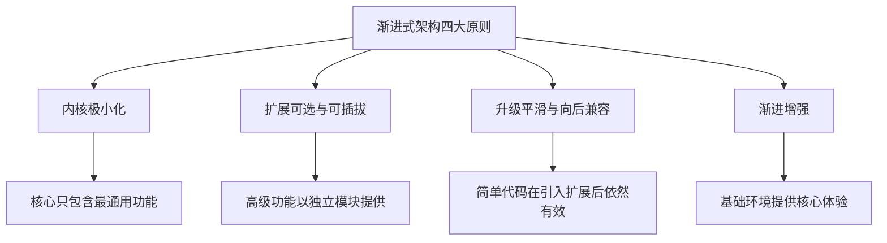
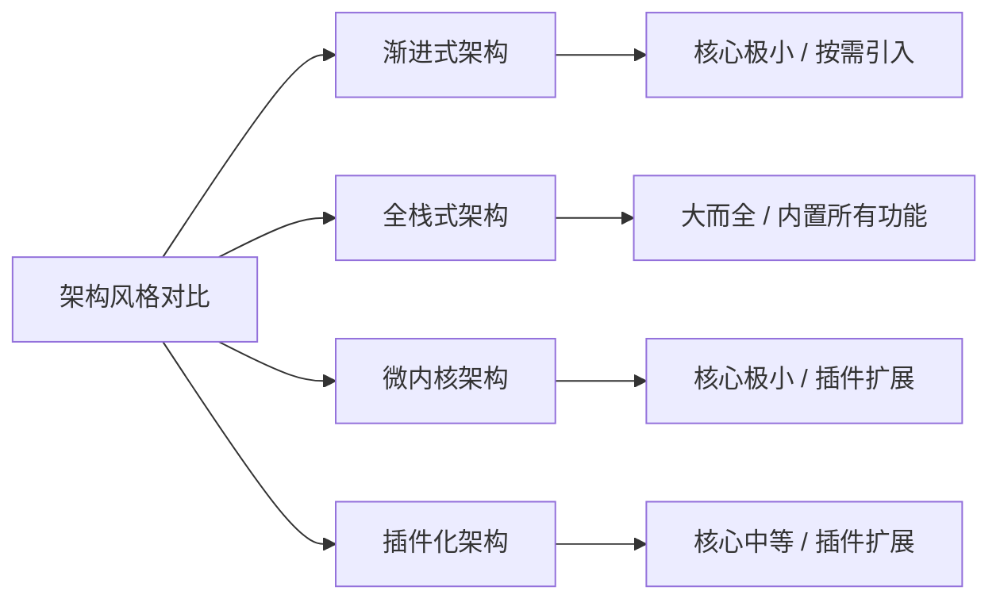
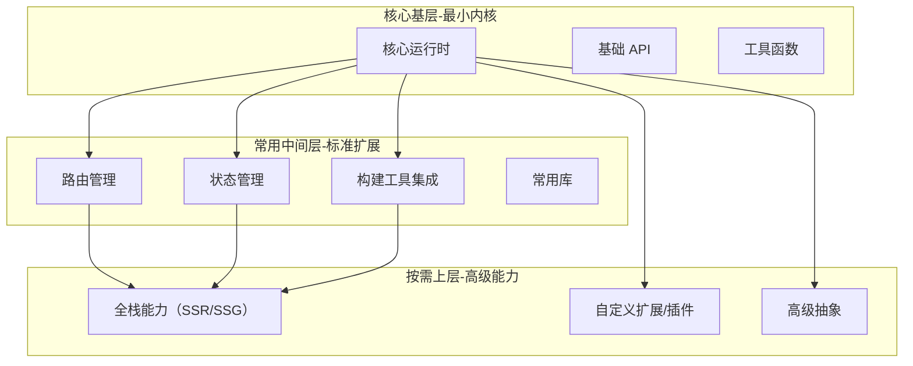
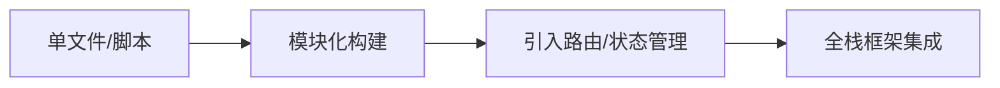
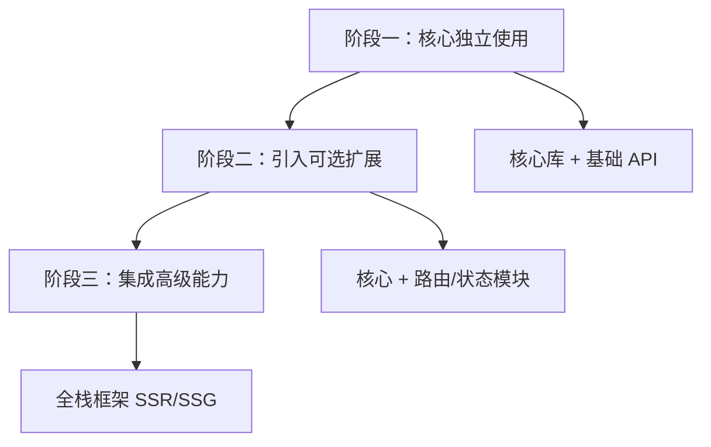
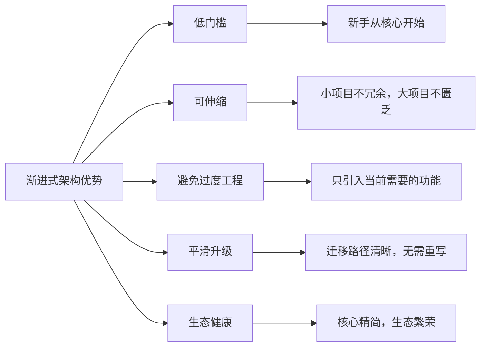
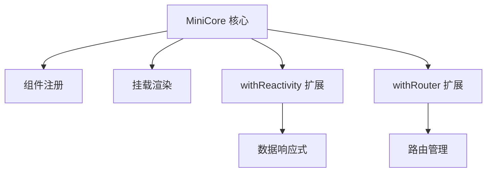
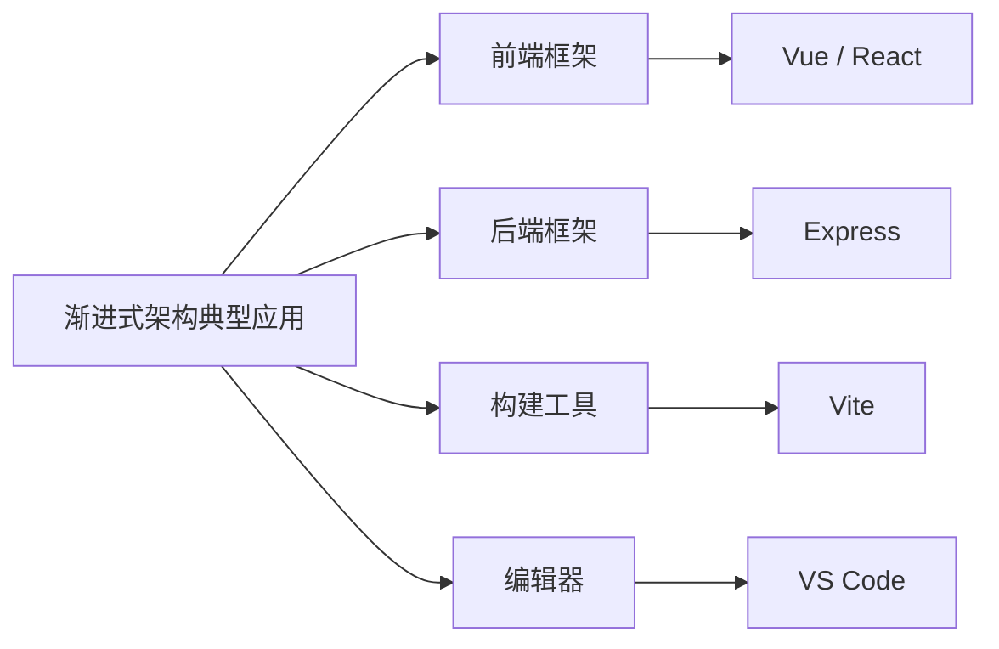

# 什么是渐进式架构？从最小内核到复杂系统的演进之道

在软件工程中，我们常常面临一个两难的选择：是为未来的复杂性提前构建庞大的基础设施，还是为了快速交付而采用极简的脚本？前者容易导致“过度设计”和沉重的学习负担，后者则可能在项目扩张时面临重构的阵痛。

**渐进式架构（Progressive Architecture）** 正是为了解决这一矛盾而生。它是一种“由简到繁，可伸缩，不强制”的设计理念：系统的核心保持精简且可独立运行，同时提供清晰的扩展机制，允许开发者根据项目需求逐步、按需地引入更多功能。你不需要为了喝牛奶而养一头奶牛，渐进式架构让你可以先拿一杯牛奶，未来有需要时，再慢慢扩建牧场。

## 核心特征与设计原则

渐进式架构并非单纯的“简单”，而是一种高度可伸缩的弹性设计。它通常遵循以下四大核心原则：



1. **内核极小化**：核心只包含最通用、最基础的功能，任何非必需的功能都不应进入内核。内核应能独立完成最基本的使用场景。
2. **扩展可选与可插拔**：高级功能以独立模块、插件或服务的形式提供。扩展模块可以按需安装、加载，且不应污染内核的命名空间或增加内核体积。
3. **升级平滑与向后兼容**：从简单到复杂的迁移路径应是连续的。使用简单方式编写的代码，在引入扩展后依然有效，绝不应出现“必须全部重写才能升级”的断层。
4. **渐进增强**：基础环境提供核心体验，当环境支持或业务需要时，自动启用增强功能，且增强功能不应破坏基础功能。

## 渐进式架构 vs 其他架构风格

为了更清晰地理解渐进式架构的定位，我们可以将其与常见的架构风格进行对比：



|对比项|渐进式架构|全栈式架构|微内核架构|插件化架构|
|:--|:--|:--|:--|:--|
|**核心规模**|极小|大而全|极小|中等|
|**扩展方式**|按需引入模块|内置所有功能|插件扩展|插件扩展|
|**学习曲线**|平缓|陡峭|中等|中等|
|**适用场景**|从原型到大型项目|大型企业应用|需要高度定制的系统|生态丰富的平台|

## 能力金字塔与演进路径

在渐进式架构中，系统的能力通常呈现为一个金字塔结构。开发者可以根据项目的实际复杂度，自由选择停留在哪一层。



这种分层设计保证了项目的演进路径是平滑的。每一步都是在上一步的基础上增加能力，而非推翻重来：



## 实践中的渐进式演进

在实际开发中，渐进式架构通常表现为代码引入方式的逐步升级。以下是一个典型的三阶段演进过程：



**阶段一：核心独立使用**  
在最简单的场景下，你只需要引入核心库，即可快速搭建一个基础应用。

```javascript
// 最简用法：核心库 + 基础 API
import core from 'some-core'

const app = core.createApp({
  data: { count: 0 },
  methods: {
    increment() { this.count++ }
  }
})
app.mount('#app')
```

**阶段二：引入可选扩展**  
当业务复杂度上升，需要管理页面跳转或全局状态时，按需引入官方或社区的扩展模块。

```javascript
// 按需引入路由模块
import core from 'some-core'
import router from 'some-router'

const app = core.createApp()
app.use(router)
```

**阶段三：集成高级能力**  
当项目发展为大型应用，需要服务端渲染（SSR）或静态站点生成（SSG）时，无缝切换到全栈框架。

```javascript
// 引入全栈框架
import { createApp } from 'some-fullstack'

const app = createApp({
  // 自动获得 SSR、SSG 等能力
})
```

## 核心优势

采用渐进式架构，能够为团队和项目带来显著的红利：



- **低门槛**：新手可以从最简单的核心开始，不需要一开始就理解复杂的架构概念。
- **可伸缩**：小型项目不冗余，大型项目不匮乏，架构能够随业务共同成长。
- **避免过度工程**：只引入当前需要的功能，拒绝“大炮打蚊子”。
- **平滑升级**：从简单到复杂的迁移路径清晰，无需推翻重来。
- **生态健康**：核心保持精简，生态围绕核心繁荣发展，第三方插件百花齐放。


## 手写迷你示例：模拟渐进式架构

为了更直观地理解其底层原理，我们可以用几十行代码模拟一个渐进式架构的雏形。在这个例子中，核心 `MiniCore` 只提供最基础的组件注册和挂载；响应式和路由都是可选的扩展，按需添加。



```javascript
// 阶段1：最小内核
class MiniCore {
  constructor() {
    this.components = {}
  }
  component(name, def) {
    this.components[name] = def
  }
  mount(selector) {
    const root = document.querySelector(selector)
    const Comp = this.components['App']
    if (Comp && Comp.render) {
      root.innerHTML = Comp.render()
    }
  }
}

// 阶段2：添加响应式扩展（可选）
function withReactivity(core) {
  const originalComponent = core.component.bind(core)
  core.component = (name, def) => {
    if (def.data) {
      const data = def.data()
      def.render = () => `<div>${data.count}</div>`
    }
    originalComponent(name, def)
  }
  return core
}

// 阶段3：添加路由扩展（可选）
function withRouter(core, routes) {
  core.router = { 
    current: '/', 
    push(path) { 
      this.current = path; 
      // 实际场景中这里会触发视图重新渲染
    } 
  }
  return core
}

// 组装使用
let app = new MiniCore()
app = withReactivity(app)
app = withRouter(app)

app.component('App', { data: () => ({ count: 0 }) })
app.mount('#app')
```

## 典型应用与总结

渐进式架构并非纸上谈兵，它已经成为现代软件工程中的主流设计范式。



**总结来说，渐进式架构是一种“核心精简、按需扩展”的设计智慧。** 它通过最小化内核、提供可插拔的扩展以及平滑的升级路径，成功地在“简单”与“复杂”之间找到了平衡。无论是从零开始的原型验证，还是支撑千万级流量的大型系统，渐进式架构都能提供恰到好处的支撑。

> **思考与复盘**：
> 
> - 思考你常用的工具或框架中，还有哪些体现了“渐进式”设计？
> - 如果让你设计一个渐进式架构的库，你会如何划分核心和扩展的边界？
> - 对比“渐进式”与“一体化”设计，在你的实际业务中，各有什么优缺点？