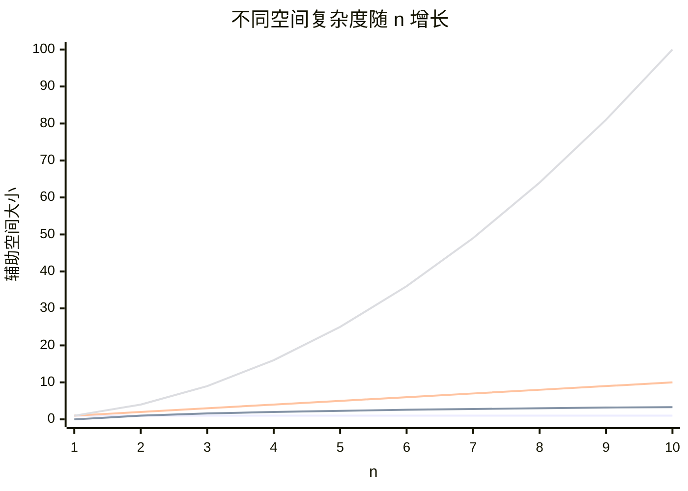
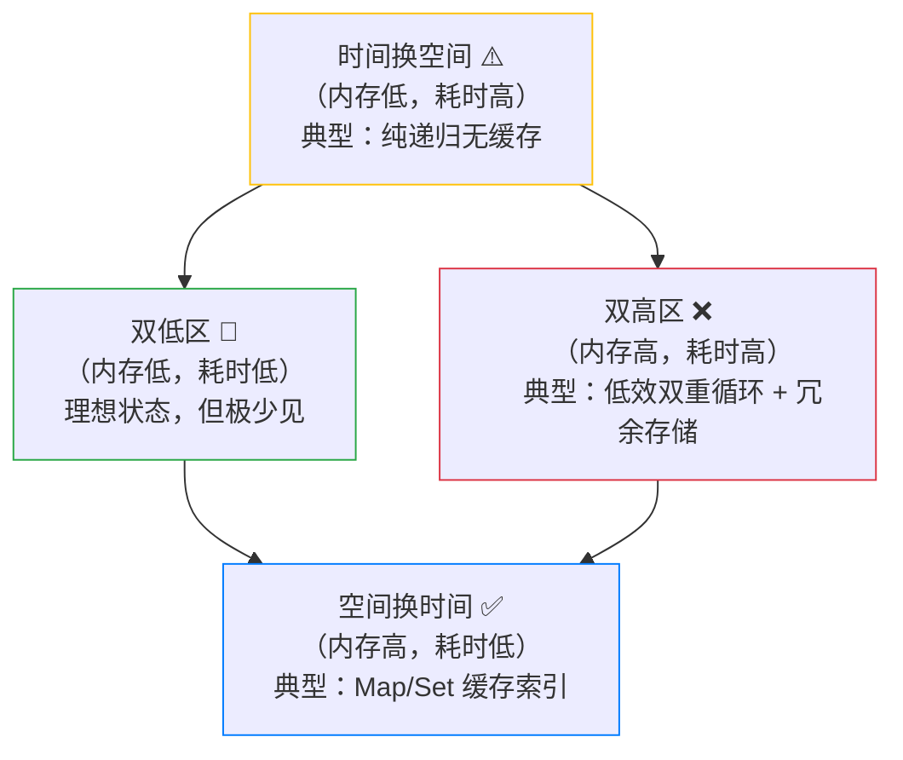

# 空间复杂度：内存不够用了怎么办？

> 当你的页面因为一个递归函数突然崩溃，或者后端服务因为缓存了太多数据而 OOM，  
> 空间复杂度就是那个提前拉响警报的人。

作为前端，我们往往对 **时间** 更敏感 —— 页面卡顿、动画掉帧，用户立刻就能感知。  
但 **内存** 问题却像温水煮青蛙：一开始毫无感觉，等内存占用悄然攀升，GC 频繁触发，页面开始“一顿一顿”，甚至直接白屏崩溃。

记得有一次，我用一个递归函数处理树形数据，本地测试只有几十个节点，丝般顺滑。上线后，某位用户上传了一棵包含几千个节点的树，页面瞬间卡死，控制台报出 `Maximum call stack size exceeded`。  
那时我才真正理解：**空间复杂度不只关乎内存，更关乎程序的生存边界**。

---

## 什么是空间复杂度？

**空间复杂度** 描述算法在执行过程中 **额外占用的内存空间** 与输入规模 `n` 之间的增长关系。  
我们依然用 **大 O 表示法** 来表达。

这里有一个非常重要的概念区分：

- **输入空间**：存储输入数据本身占用的内存（比如数组、字符串）。  
  我们通常 **不把它计入空间复杂度**，因为那是“必须花”的成本，优化空间有限。
- **辅助空间**（Auxiliary Space）：算法在执行过程中 **额外申请** 的内存，比如新建的变量、数组、对象，以及递归调用栈。  
  **这才是空间复杂度真正关心的对象**。

> 举个栗子：你写一个排序算法，输入数组本身不算，但如果你额外创建了一个临时数组用来合并，那这个临时数组的大小就是辅助空间。

---

## 一张表看懂常见空间复杂度

| 复杂度 | 解释 | 典型场景 |
|--------|------|----------|
| `O(1)` | 常数空间，只需固定几个变量 | 原地交换、迭代求和、指针操作 |
| `O(log n)` | 对数空间，常见于递归分治（栈深度） | 二分查找（递归版，但注意 JavaScript 无尾递归优化） |
| `O(n)` | 线性空间，额外分配与 `n` 成正比的内存 | 复制数组、`Map` 缓存、普通递归（栈深度 `n`） |
| `O(n²)` | 平方空间，例如二维矩阵 | 图的邻接矩阵存储 |

> ⚠️ **特别提醒**：JavaScript 引擎（如 V8）**尚未原生支持尾递归优化（TCO）**，所以递归的调用栈深度依然等于递归层数，空间复杂度是 `O(n)` 而不是 `O(1)`。这个坑要牢记。


空间复杂度对比图（n 从 1 到 10）



> **看图说话**：O(n²) 空间在 n=10 时就达到 100 单位，而 O(1) 纹丝不动。  
> 如果你的代码里隐藏了一个 O(n²) 的二维缓存结构，数据量稍大就会撑爆内存。

---

## 如何分析一段代码的空间复杂度？

### 分析三步走

1. **忽略输入数据**（它不算）。
2. **统计额外变量、数据结构、递归栈** 的空间总和。
3. **取主导项**，用大 O 表示。

### 代码实战：原地反转 vs 新数组

```javascript
// ✅ O(1) 空间 —— 只用了两个指针
function reverseInPlace(arr) {
  let left = 0, right = arr.length - 1;
  while (left < right) {
    [arr[left], arr[right]] = [arr[right], arr[left]];
    left++;
    right--;
  }
}
```

```javascript
// ❌ O(n) 空间 —— 创建了一个副本
function reverseNew(arr) {
  return arr.slice().reverse(); // slice() 产生新数组
}
```

虽然两者时间都是 O(n)，但内存占用差了一个数量级。  
在移动端或低内存环境下，选择 `O(1)` 版本可能直接避免崩溃。

### 递归的“隐形”空间消耗

```javascript
function fib(n) {
  if (n <= 1) return n;
  return fib(n - 1) + fib(n - 2);
}
```

时间复杂度 O(2ⁿ)，**空间复杂度 O(n)** —— 因为调用栈最深会同时存在 `n` 个帧。  
这就是为什么递归深度过大时，会爆栈。

---

## 时间 vs 空间：永恒的权衡

我们常说“用空间换时间”或“用时间换空间”，在工程中经常面临抉择。

| 策略 | 含义 | 前端例子 |
|------|------|----------|
| **空间换时间** | 多缓存一些数据，减少重复计算 | 用 `Map` 缓存计算结果（如斐波那契 memo），时间复杂度从指数降到线性，但内存占用从 O(1) 升到 O(n) |
| **时间换空间** | 不存储中间结果，需要时重新计算 | 流式处理大文件，分块读取，避免一次性加载全部数据到内存 |

### 权衡四象限（Mermaid 菱形图）



> **解读**：我们通常追求 **右下角（空间换时间）**，因为用户对等待时间更敏感；  
> 只有在内存极度受限的环境（如嵌入式、老旧设备）才会考虑 **左上角（时间换空间）**。

---

## 空间复杂度在前端的“大杀器”场景

### 1. 虚拟列表 —— 用 `O(可视区数量)` 代替 `O(总数据量)`
- 长列表只渲染可见的几十条 DOM，内存占用从 `O(n)` 降到常数级。

### 2. 防抖 / 节流 —— 避免闭包陷阱
- 防抖函数内部保存定时器引用，如果滥用可能导致闭包长期占用内存，造成泄漏。

### 3. 大数据计算 —— 使用流式 API
- `fetch` 配合 `ReadableStream`，可以边下载边处理，而不是等待全部数据加载到内存再操作。

### 4. 递归替代方案
- 当树形结构很深时，用 **迭代（栈或队列）** 替代递归，可以控制栈深度，避免爆栈。

---

## 自测：你真的理解了吗？

- **Q：空间复杂度是否包括输入数据？**  
  A：通常 **不包括**，只计算额外辅助空间。

- **Q：递归版二分查找的空间复杂度是多少？**  
  A：O(log n)（调用栈深度为 log₂n），迭代版为 O(1)。

- **Q：`Array.map()` 会占用多少额外空间？**  
  A：O(n)，因为它返回一个新数组。

- **Q：为什么“空间换时间”在前端项目中常见？**  
  A：因为用户对卡顿极其敏感，内存通常相对充裕（手机内存已普遍 8GB+），用一点内存换来丝滑体验是划算的。

---

## 延伸学习

- [时间复杂度](什么是空间复杂度) —— 与空间复杂度对照理解，双剑合璧。
- [内存泄漏] —— 前端性能的隐形杀手。
- [垃圾回收机制] —— JS 引擎如何自动回收内存，以及如何避免干扰 GC。

---

## 写在最后

空间复杂度不是高高在上的理论，它就在你每一个 `new Array()`、每一次递归调用、每一份缓存数据里。  
它提醒我们：**算法不仅要快，还要“瘦”**。

下次你再写一个递归函数，或者决定把全量数据放进 `Map` 里缓存时，先问自己一句：  
**“当数据量扩大 100 倍，我的内存还 hold 住吗？”**

答案能帮你避免一次线上事故，也能让你在面试中更加从容。

> 如果你能把这些知识讲给你的同事或朋友听，那它才算真正长在了你身上。

