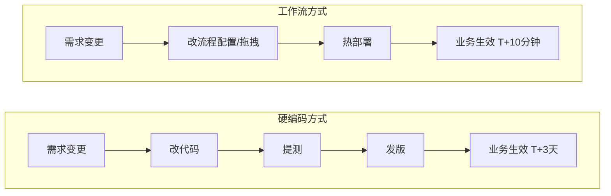

# 工作流（Workflow）完全解读：为什么你需要的不是"画一张图"？

我们经常听到"工作流"这个词——做 OA 系统的人在聊，搞电商订单的在聊，连搭 AI 管道的也在聊。但如果你追问一句："到底什么是工作流？它和 BPM 有什么区别？什么时候该用它，什么时候不该用？"——能说清楚的人并不多。

今天，我想用一篇文章，把工作流这件事彻底讲透。它不是一篇工具教程，而是一张**认知地图**：帮你理解工作流是什么、为什么有价值、什么时候该用、什么时候千万别用。

## 它到底是什么？

先说定义：**工作流是对"一组业务活动按既定规则、顺序或条件自动或半自动执行"的抽象建模。**

听着有点绕，翻译成人话就是：把现实世界中的业务流程，变成系统里的一张数字蓝图。这张蓝图回答三件事：

- **做什么**——有哪些节点任务；
- **谁来做**——每个节点由哪个角色或系统执行；
- **按什么顺序和条件做**——节点之间怎么流转、什么条件下走哪条路。

比如员工请假：员工提交 → 主管审批 → 总监审批（超过 3 天时）→ HR 备案 → 考勤系统同步。这就是一个典型的工作流。

## 从业务语言到引擎可执行：三层抽象

一个工作流从"业务方口述"到"引擎真正跑起来"，通常会经历三层抽象。理解这一层，你就能看懂团队里不同角色到底在干什么：

| 层级 | 表达形式 | 谁在产出 | 谁在使用 |
| --- | --- | --- | --- |
| 业务模型 | 流程图、泳道图 | 业务分析师 | 业务方评审 |
| 定义模型 | BPMN 2.0、JSON DSL | 流程工程师 | 工作流引擎 |
| 执行模型 | DAG + Token 状态机 | 引擎运行时 | 引擎调度器 |

业务方看泳道图，工程师配 BPMN，引擎跑 DAG——各司其职，互不越界。这正是工作流能把"业务"和"技术"解耦的根基。

## 引擎视角的本质公式

如果你是个程序员，看工作流可以更干脆一点——在引擎眼里，工作流就是这样一个东西：

```
Workflow = Nodes（节点集合）
         + Edges（流转边，含条件）
         + Roles（参与角色）
         + Constraints（时限、SLA、权限）
         + Listeners（扩展点）
```

其中 `Edges` 就是有向无环图（DAG）的边，节点之间通过稳定的 `key` 相互引用。为什么强调 DAG？因为工作流引擎调度节点时，必须保证不出现循环依赖——否则执行路径就成了"先有鸡还是先有蛋"的死循环。

## 配置化 vs 硬编码：工作流的核心价值

工作流之所以能成为一个独立的"中间件"品类，是因为它解决了一个本质问题：**把易变的业务逻辑，从稳定的技术底座中抽离出来。**

想象一下这两种场景的对比：



差距不是"快一点"，而是"从周级到分钟级"的质变。这正是工作流在 OA、电商、金融等领域成为刚需的根本原因。

## 为什么"可视化"本身就是价值？

有时候我们会听到一种声音："图不图的无所谓，代码也能表达流程逻辑。"这话对了一半——代码确实能表达，但丢失了三个关键价值：

- **对齐**：业务、开发、测试基于同一张图沟通，消除"我以为你懂了"的信息损耗。一张图胜过一千行注释。
- **可审计**：流程即文档，文档即流程。避免"代码跑起来和文档说的不一样"的尴尬。
- **可优化**：瓶颈节点在图上肉眼可见。哪个审批常超时？哪个节点经常回退？一眼就能看到，持续改进才有抓手。

当然，要清醒地认识到：**工作流 ≠ BPM 全栈**。工作流是 BPM 的执行内核，但 BPM 还包括流程挖掘、绩效考核、流程仿真等更广的能力。不要把"画了一张图"等同于"建好了 BPM 体系"。

## 什么时候该用工作流？

根据我的经验，下面四类场景是工作流的"甜区"：

**1. OA / 行政审批类（最典型）**
员工请假、报销、采购申请……这类流程的特点是规则随公司制度频繁调整，而且人工环节多。用工作流最大的价值是：制度变了，运营自己改流程配置就行，不用等开发排期。

**2. 跨系统业务编排**
电商下单后触发支付、库存、物流、发票、积分五个异构系统，任一步失败需要补偿。如果用代码硬编码这些调用关系，很容易变成"意大利面条式"的调用链。工作流把这张调用网显式化，谁依赖谁、失败了怎么补偿，一目了然。

**3. 数据 / AI 管道**
数据采集 → 清洗 → 质检 → 入仓 → 通知。每一步都可能并行、可能重试、可能失败后从某一步重新跑。工作流让这些步骤可复用为子流程，失败时支持单步重跑，不用全量回退。

**4. 合规强约束流程**
金融放款需要"双录 + 风控 + 人工复核 + 合规抽查"四道关，每步必须留痕。工作流的审计日志天然与流程节点绑定，监管问询时可以直接导出完整的执行轨迹。

## 避坑指南：四个容易踩的坑

这些年我见过不少团队在工作流上"翻车"，总结下来，坑主要集中在四个地方：

**坑一：把工作流当"万能胶"**
高频、毫秒级、纯计算的链路（比如交易撮合、行情计算）硬塞进工作流，会因"每步落库 + 调度开销"被严重拖垮。**经验值供参考**：单步 P99 耗时低于 100ms，且无需人工参与或跨系统调用的链路，别上工作流。

**坑二："伪配置化"**
嘴上说用工作流，实则把整段业务判断逻辑写进某个节点的脚本里。改一处逻辑，仍然要改代码、发版。**真配置化的标志**：业务方在 UI 上拖拽就能改顺序、加节点、调条件，无需开发介入。

**坑三：过度设计**
三步以内、永远不变的小流程也建个工作流，反而增加了运维负担和认知成本。保持简单，用状态机甚至 `if-else` 就够了。

**坑四：忽视治理**
流程定义无限增长，旧版本无人下线，最终"图比业务还乱"。建立流程定义的版本管理和生命周期治理，和建流程本身同样重要。

## 给你一个简单的选型标准

如果你正在纠结"这个场景要不要上工作流"，可以用这个清单快速判断：

✅ **建议上工作流**：步骤 > 3 步 ＋ 涉及 ≥ 2 个角色或系统 ＋ 规则易变 ＋ 需要可追溯的执行记录。

❌ **别上工作流**：步骤固定且很少变动、纯计算链路、对延迟极度敏感。

还有一个更硬核的"配套铁律"：**可视化设计器 + 版本管理 + 运行时/历史数据分离 + 审计日志**，这四件套缺一不可。少了任何一个，工作流就变成了"上了等于没上"的面子工程。

## 总结一下

工作流本质上是一种**抽象**——它把业务流程从代码中抽离出来，让业务逻辑的变化不再依赖代码发版。这种抽象带来了对齐效率的提升、变更速度的质变、以及持续优化的可视化基础。

但它不是银弹。理解它的边界，知道什么时候不用它，往往比知道怎么用它更重要。

如果你正在设计一个涉及多人协作、多系统交互、规则频繁变化的业务流程，工作流会是你的得力助手。而作为起点，搞清楚"工作流到底是个什么东西"——恭喜你，你已经迈出了正确的那一步。

---

**行动建议**：
1. 画一画你当前业务中最常变的一个流程，数一数节点数和角色数，对照选型标准做一次自我诊断。
2. 如果你们已经在用工作流引擎，去看看流程定义库里有多少是"僵尸流程"（长期无人使用），考虑做一次清理。
3. 下次业务方提审批规则变更时，记录一下"从提需求到生效"的耗时，思考工作流能否把这个时间缩短一个数量级。
