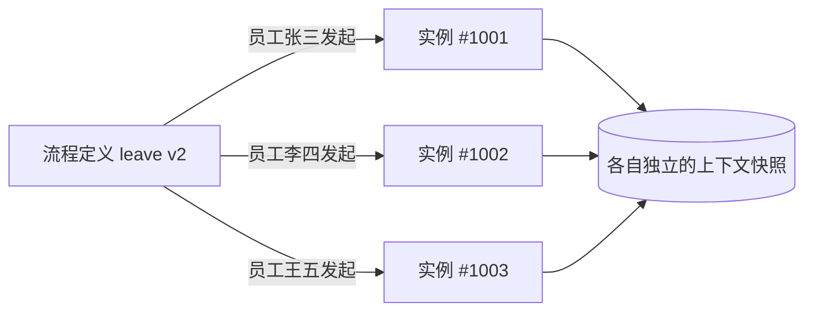
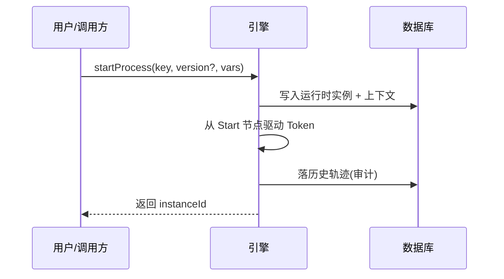

---
tags:
  - 流程引擎
  - BPM
category: 工作流
title: 工作流实例（Instance）：当“蓝图”变成“施工”，一次真实的运行之旅
date: 2026-08-08T11:02:00
banner: /images/workflow.webp
description: 深入解读工作流实例的核心概念——从定义与实例的“类与对象”关系，到运行时数据结构、发起时序、上下文隔离和存储形态，帮你理解实例如何成为引擎调度的基本单位。
---

# 工作流实例（Instance）：当“蓝图”变成“施工”，一次真实的运行之旅

上一篇文章我们聊了工作流定义——那张描述“做什么、谁来做、按什么顺序做”的数字蓝图。蓝图画好了，但真正有价值的是它被跑起来的那一刻。

就像建筑图纸和实际施工的关系：图纸是静态的设计，而施工是动态的建造过程。在工作流的世界里，**工作流定义是蓝图，工作流实例就是一次真实的施工记录**。

今天，我们来聊聊这个“施工过程”——工作流实例。它是引擎调度的基本单位，是计费的依据，是审计的线索，也是你排查问题时第一个要找的东西。

## 它到底是什么？

先给一个干净的定义：**工作流实例是某一工作流定义的一次具体运行记录。**

还是用请假来举例。HR 在系统里画了一张“员工请假审批流程图”——这就是工作流定义。然后张三发起了一个请假申请，系统根据这张图跑起来，产生了一条记录：张三、请假 3 天、主管已批、总监待批……这条记录，就是**一个工作流实例**。

李四随后也发起了一个请假申请，系统又跑了一遍同样的图，产生了**另一个独立的实例**。两个人共用同一张蓝图，但各有各的运行轨迹。

## “类”与“对象”：最易懂的类比

如果你有面向对象编程的背景，这个关系会格外亲切：

定义是“类”，实例是“对象”。类定义了有哪些属性、有哪些方法；对象是类的一次具体实例化，拥有独立的属性值。定义是模板，实例是模板跑出来的具体过程——彼此独立，互不干扰。

## 实例的核心数据结构：引擎怎么记住一个实例？

在引擎内部，一个实例通常被描述为这样一组数据：

| 字段 | 类型 | 说明 |
| --- | --- | --- |
| `instanceId` | String | 全局唯一主键，所有轨迹和审计都靠它关联 |
| `definitionKey` | String | 逻辑名（如 `leave`），与具体版本解耦 |
| `version` | Integer | 启动时绑定的定义版本——**快照，不随定义升级变化** |
| `businessKey` | String | 业务单号（如 `LEAVE-2026-0001`），用于跨系统关联 |
| `status` | Enum | CREATED / RUNNING / SUSPENDED / COMPLETED / TERMINATED / FAILED |
| `startTime / endTime` | DateTime | 生命周期的起止时间 |
| `currentNodeKeys` | Set | 当前激活的节点（并行时可能有多个） |
| `context` | Map | 上下文变量，存储表单数据等 |
| `initiator` | String | 发起人 |

这里有两个细节特别值得注意：

**版本是快照，不随定义升级变化。** 实例一旦启动，就绑定了启动时的定义版本。哪怕后续定义升级到 v3，这个实例仍然按 v2 的规则跑完。这是正确的行为——否则一张已经在审批途中的单子，中间突然换了规则，业务上没法交代。

**`businessKey` 和 `instanceId` 是两码事。** `instanceId` 是引擎内部生成的编号，`businessKey` 是业务系统自己的单号。对外系统（比如支付回调）应该用 `businessKey` 来关联，因为系统重启或数据迁移后，`instanceId` 可能会变化。

## 一次“发起”背后发生了什么？

当用户点击“提交”按钮时，引擎在背后做了一连串事情：

时序很清晰：先落库生成实例记录，然后驱动流程从开始节点往下走，每一步都记录审计轨迹，最后返回实例 ID 给调用方。整个过程是原子性的——要么全部成功，要么全部回滚。

## 上下文隔离：万人同跑一张图，互不干扰

这是工作流能支撑大规模并发业务的根基：**每个实例持有自己的上下文副本，彼此完全隔离。**

张三提交的 3000 元报销实例，和李四提交的 10 万元报销实例，虽然跑的是同一个报销流程定义，但各自的表单数据、审批路径、变量值完全独立。互不共享运行时状态——除非你显式地通过全局变量或外部存储去共享。

这就像同一份考试卷子，100 个考生各答各的，互不影响。

## 实例的两种存储形态：运行时 vs 历史

一个实例在整个生命周期中，会存在于两种存储形态中：

- **运行时实例**：当前还处于活跃状态（RUNNING / SUSPENDED），存放在运行时表。这个表的数据会频繁更新——节点推进、状态变更、变量修改都在这里发生。
- **历史实例**：已经结束（COMPLETED / TERMINATED / FAILED），迁移到历史表。历史表只增不删，用于审计和复盘。

一次流程结束，本质上就是运行时表里的那一行数据“搬家”到历史表，而不是被物理删除。这也是工作流能够提供完整审计追溯的基础。

## 什么时候需要关注实例？

**1. 千人千单，各自为政**

同一个请假定义被 1000 名员工各发起一次，产生 1000 个独立实例。每个实例走到不同节点、被不同人审批、有各自的起止时间——这是最典型的工作流实例应用场景。

**2. 中途干预，精准打击**

某员工的请假单走到总监时，发现日期填错了。他可以撤回这个**实例**，修改后重新提交，完全不影响其他人的单子。这种“定向干预”能力，正是实例作为独立调度单位的价值。

**3. 跨系统对账，精准定位**

支付系统完成扣款后，用 `businessKey=ORDER-2026-888` 回调引擎。引擎据此精准定位“是哪个实例的哪一步在等支付结果”，实现幂等推进——不会因为支付系统的重复回调而重复执行。

**4. 批量治理，发现问题**

HR 月底对“所有 RUNNING 的请假实例”做 SLA 统计：哪些单子超时了、卡在哪个节点、是谁审批的。定位到瓶颈，然后有针对性地优化。

## 避坑指南：四个常见的错误

这些年我见过不少团队在实例管理上踩坑，最典型的四个：

**坑一：混淆“定义版本”与“实例版本”**

前面已经强调过：实例一旦启动就绑定启动时的版本。如果后续定义升到 v3，旧实例仍然按 v2 跑。**这是对的，不要试图让旧实例“偷偷”套用新定义**——否则同一张审批单前后规则不一致，业务上会出大问题。

如果确实需要统一规则，用实例迁移（详见后续章节）。

**坑二：用物理删除代替终态**

业务驳回的实例应该进入 `TERMINATED` 终态并留痕，而不是 `DELETE FROM` 删掉。否则审计断链，事后复盘时根本查不到“这张单子为什么没批”。

**坑三：运行时表和历史表不分家**

所有实例堆在同一张表里，几年后单表千万行数据，待办查询全表扫描，性能急剧下降。务必在实例结束时迁移到历史表，实现运行时/历史分离。

**坑四：把 `instanceId` 当 `businessKey` 用**

对外系统回调时，别只传 `instanceId`——系统重启或数据迁移后，这个内部 ID 可能失联。对外永远用业务单号 `businessKey`，引擎内部再通过 `businessKey` 反查 `instanceId`。

## 设计铁律

从第一天开始，就把实例当作“有始有终的一等公民”：

- **明确的终态**：每个实例最终都要到达 COMPLETED / TERMINATED / FAILED 三者之一，没有“永远挂起”的僵尸实例。
- **规划归档策略**：运行时和历史分离，定期清理过期数据。
- **绑定版本快照**：实例启动时记录定义版本，不受后续升级影响。
- **留好业务单号**：`businessKey` 是连接工作流和业务系统的桥梁，必须设计好。

## 总结一下

如果说工作流定义是一张“静态的图纸”，那么实例就是一次“动态的施工”。它记录了谁、在什么时候、按照哪个版本的流程、走到了哪一步、带着什么数据——整个执行过程被完整地保留下来。

实例是引擎调度的基本单位，是审计追溯的最小颗粒度，也是你排查线上问题时最先定位的对象。理解实例，就理解了工作流从“设计态”到“运行态”的关键一跳。

---

**行动建议**：
1. 打开你正在用的工作流引擎后台，找一个正在运行的实例，看看它的 `status`、`currentNodeKeys`、`context` 里分别存了什么。
2. 检查你的历史表里有没有 `TERMINATED` 状态的实例被物理删除过——如果有，审计链路可能已经断了。
3. 确认你对外提供的回调接口使用的是 `businessKey` 而不是 `instanceId`——这是分布式系统里最基本的“防失联”设计。