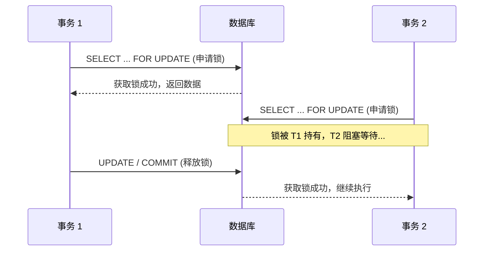
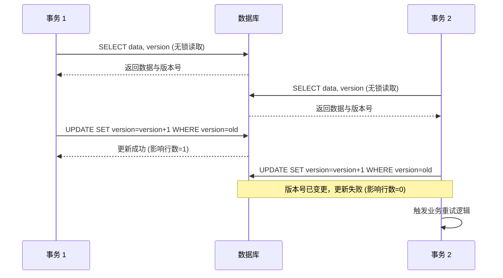
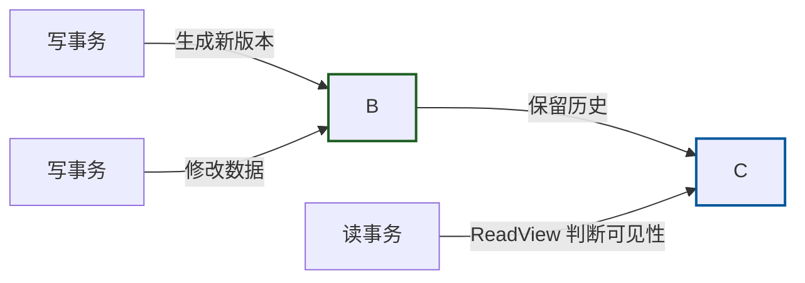
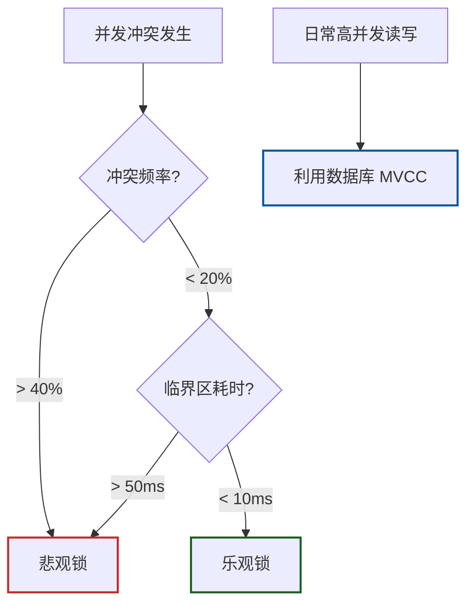

# 并发控制选型指南：悲观锁、乐观锁与 MVCC 的实战抉择

在上一篇《[什么场景不需要并发控制](什么场景不需要并发控制.md)？》中，我们探讨了如何“做减法”。但在真实的复杂业务中，当多个事务确实可能同时修改同一份数据时，如何优雅地处理冲突就成了架构师必须面对的考题。

并发控制并没有绝对的“银弹”，悲观锁、乐观锁以及现代数据库底层的 MVCC 各有其适用疆界。本文将为你提供一份实战视角的选型指南，帮助你在性能与一致性之间找到最佳平衡。

---

### 悲观锁：防御至上的“先占坑”策略

悲观锁的核心哲学是“先假设冲突一定会发生”。它在操作数据前会主动加锁，强制让其他试图修改该数据的线程排队等待。

- **典型实现**：数据库层面的 `SELECT ... FOR UPDATE`，或应用层的 `synchronized`、分布式锁（Redis/Zookeeper）。
- **适用场景**：
    - **高冲突场景**：例如秒杀库存扣减、银行核心账户转账。这类场景下数据竞争极其频繁，如果用乐观锁会导致大量请求在重试中消耗 CPU。
    - **强一致性要求**：必须保证事务的 ACID 特性，不允许任何中间状态被其他事务感知。
    - **长事务逻辑**：如果业务处理耗时较长（如超过 50ms），持有锁的时间变长，此时悲观锁能避免乐观锁在提交阶段才发现冲突导致的资源浪费。
- **实战陷阱**：
    - **死锁风险**：多个事务以不同顺序申请多把锁时极易形成死锁。破解之道是统一加锁顺序，或设置锁等待超时（`tryLock(timeout)`）。
    - **吞吐量瓶颈**：在高并发下，锁竞争会导致线程大量阻塞，系统吞吐量断崖式下跌。

---

### 乐观锁：拥抱并发的“后验证”策略

乐观锁假设“冲突是小概率事件”，因此读操作不加锁，只在最终提交更新时检查数据是否被他人修改过。

- **典型实现**：
    - **版本号机制**：`UPDATE goods SET stock = stock - 1, version = version + 1 WHERE id = 1 AND version = 10`。
    - **CAS 指令**：Java 中的 `AtomicInteger`，底层依赖 CPU 的原子指令。
- **适用场景**：
    - **读多写少**：例如商品详情页的点赞数、社交动态的评论数。
    - **低冲突概率**：冲突率低于 20% 的场景。
    - **短临界区**：业务逻辑执行极快（<10ms），重试成本低。
- **实战陷阱**：
    - **ABA 问题**：数据从 A 变成 B 又变回 A，CAS 会误以为没变过。解决方案是引入版本号或时间戳。
    - **重试风暴**：在高冲突场景下，大量线程不断重试，CPU 飙升但业务无进展。此时应果断降级为悲观锁。

---

### MVCC：现代数据库的“读写分离”基石

多版本并发控制（MVCC）是现代 OLTP 数据库（如 MySQL InnoDB、PostgreSQL、Oracle）的标配。它通过保留数据的多个历史版本，实现了“读不阻塞写，写不阻塞读”。

- **核心机制**：每行数据带有隐藏的事务 ID 和回滚指针。读事务通过 ReadView 判断哪个历史版本对自己可见，写事务则生成新版本。
- **选型意义**：
    - **绝大多数常规业务**：你不需要在应用层手动实现 MVCC，直接使用数据库默认的隔离级别（如 Read Committed 或 Repeatable Read）即可享受其红利。
    - **高并发读写混合**：MVCC 极大提升了系统的并发吞吐量，是支撑互联网高并发业务的底层功臣。
- **注意事项**：MVCC 依赖 Undo Log 存储历史版本。如果存在超长事务迟迟不提交，会导致历史版本无法清理，引发数据库空间膨胀或查询性能下降（如 Oracle 的 ORA-01555 错误）。

---

### 选型决策矩阵

在实际架构设计中，你可以参考以下维度进行快速决策：

|评估维度|推荐方案|核心考量|
|:--|:--|:--|
|**冲突频率**|>40% 选悲观锁，<20% 选乐观锁|冲突率高时，乐观锁的重试成本不可接受|
|**临界区耗时**|>50ms 选悲观锁，<10ms 选乐观锁|长事务用乐观锁会导致大量无效计算|
|**一致性要求**|金融级强一致选悲观锁，最终一致选乐观锁/MQ|业务容忍度决定了锁的严格程度|
|**系统吞吐需求**|极高频读写优先利用数据库 MVCC|避免应用层锁成为新的瓶颈|

---

### 进阶：混合架构与数据湖的并发智慧

在复杂的分布式系统中，单一的锁策略往往捉襟见肘，**混合架构**才是常态：

- **分层防御**：入口层使用乐观锁过滤大部分无冲突请求，核心关键路径使用悲观锁保障安全，日志层使用无锁结构（如 ConcurrentLinkedQueue）记录流水。
- **动态降级**：通过监控冲突率指标，当系统检测到乐观锁重试率飙升时，自动切换为悲观锁模式。

此外，在大数据与数据湖场景（如 Apache Hudi、Iceberg、Delta Lake）中，并发控制演变为**表级别的乐观并发控制（OCC）**。多个写入端独立生成元数据，提交时通过原子交换（Atomic Swap）检测冲突。若失败则基于最新状态重试。这种设计将锁的粒度从“行”提升到了“文件/元数据”级别，完美适配了海量数据的并发写入需求。

---

### 总结

并发控制选型没有绝对的对错，只有**场景的适配**。

- 遇到高冲突、强一致的核心交易，**悲观锁**是你的坚实盾牌。
- 面对读多写少、低冲突的互联网业务，**乐观锁**能助你释放吞吐。
- 而在日常开发中，信任并利用好数据库原生的 **MVCC**，往往能省去 90% 的烦恼。

记住：最好的并发控制，是结合业务痛点，在“一致性”与“可用性”之间做出的最恰当妥协。
