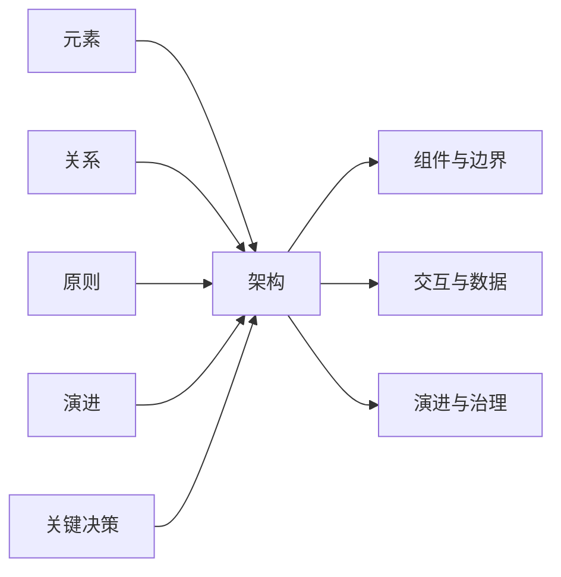
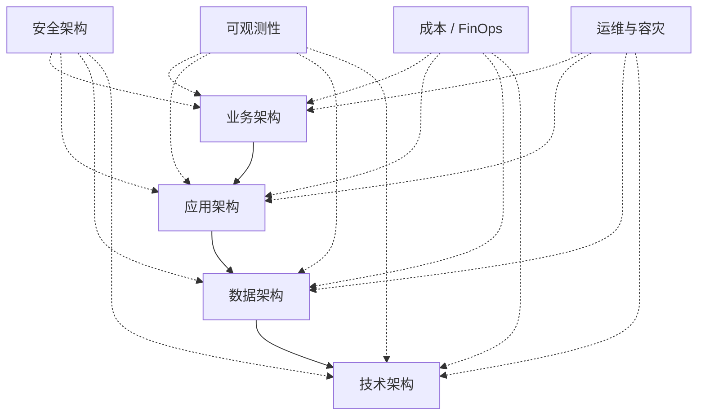
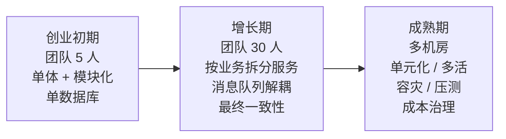

# 架构到底是什么：从代码、约束到关键决策

> 本文是「架构设计」板块的第 1 篇。  
> 适合人群：3～8 年开发者、技术负责人、架构师预备役。  
> 关键词：架构定义、质量属性、架构决策、系统设计、演进式架构。

---

很多人第一次被问“架构是什么”时，都会愣一下。

有人回答：架构就是技术栈。  
有人回答：架构就是微服务。  
有人回答：架构就是画几张图。  
还有人回答：架构是架构师的事，跟我写代码没关系。

这些回答都不算全错，但都只摸到了大象的一条腿。

如果只用一句话回答：

**架构，是系统在特定约束下，为了实现目标而做出的一组关键决策，以及这些决策所定义的组件、关系、交互和演进原则。**

再直白一点：

**架构不是一张图，而是一组被记录的决策。它不是追求最先进，而是在约束下做最合适的权衡。**

---

## 一、为什么“架构是什么”很难回答

因为“架构”这个词，在不同人嘴里，指的不是同一个东西。

| 视角 | 关注点 |
|---|---|
| 业务负责人 | 业务能力、流程、组织、成本 |
| 开发人员 | 模块、接口、依赖、代码结构 |
| 运维人员 | 部署、监控、故障恢复、容量 |
| 安全人员 | 权限、边界、合规、数据保护 |
| 老板/客户 | 交付速度、稳定性、投入产出比 |

从层级上看，架构又可以分为：

- 企业架构：公司级系统全景、战略与治理
- 业务架构：业务能力、价值流、组织与流程
- 应用架构：系统、服务、模块、接口、依赖
- 数据架构：数据模型、数据所有权、流转与一致性
- 技术架构：基础设施、中间件、网络、部署、运行时

所以，讨论“架构是什么”之前，先要问：**你说的是哪一层架构？站在谁的视角？解决什么问题？**

国际标准 ISO/IEC/IEEE 42010 对架构有一个经典定义：

> 架构是系统在其环境中的基本概念或属性，体现在其元素、关系以及设计和演进的原则中。

翻译成人话就是：

**架构 = 元素 + 关系 + 原则 + 演进。**

但我觉得还可以再加一个更重要的东西：

**架构 = 元素 + 关系 + 原则 + 演进 + 关键决策。**

因为真正让架构有价值的，不是“画出了什么”，而是“为什么这么画”。

**图 1：架构公式——元素、关系、原则、演进与关键决策**

---

## 二、五个常见误解

### 误解 1：架构就是技术栈

“我们用的是 Spring Cloud + Kubernetes + MySQL + Redis，所以我们的架构很先进。”

技术栈只是架构的原材料，不是架构本身。

同样一套技术栈，可以设计出清晰可演进的系统，也可以堆出一座无法维护的泥山。架构关心的是：为什么选它、怎么用它、边界在哪里、代价是什么。

### 误解 2：架构就是微服务

微服务只是一种架构风格，不是架构的目的。

如果一个团队只有 5 个人，业务还在快速试错，强行上微服务，通常会得到：

- 更复杂的部署
- 更难排查的故障
- 更高的一致性成本
- 更慢的交付速度

架构的目标是解决业务问题，不是收集技术名词。

### 误解 3：架构就是架构图

架构图是架构的表达方式之一，但不是架构本身。

一张漂亮的图，如果不说明约束、质量属性、关键取舍和演进路线，它就只是图。真正有价值的架构文档，必须能回答：

- 为什么这么拆分？
- 为什么不那么拆分？
- 出故障时怎么办？
- 未来怎么演进？

### 误解 4：架构是架构师的事

架构师负责关键决策，但架构的落地靠所有人。

如果开发人员不理解边界，接口就会乱调；  
如果测试人员不理解质量属性，故障就测不出来；  
如果运维人员不理解部署模型，上线就会变成灾难。

架构不是一个人的作品，而是一个团队的共识。

### 误解 5：架构一次设计好，后面就不用管了

这是最危险的误解。

业务在变，规模在变，团队在变，成本在变，架构也必须变。

好的架构不是“一次设计完美”，而是“能持续演进”。这就是演进式架构的核心思想。

---

## 三、架构的本质：六个关键词

如果把架构拆开，我认为它离不开六个关键词。

### 1. 利益相关者与目标

架构不是自嗨，它要服务人。

用户要什么？业务要什么？老板要什么？运维要什么？安全要什么？

不同利益相关者的目标经常冲突。架构师的工作，不是让所有人满意，而是在冲突中找到可接受的平衡。

### 2. 约束

没有约束，就没有架构。

约束可能是：

- 团队规模：5 人还是 500 人？
- 交付时间：两周上线还是两年上线？
- 预算：能买多少机器、用多少云服务？
- 合规：是否涉及支付、医疗、隐私数据？
- 技术债：旧系统能不能动？
- 组织架构：团队边界往往决定系统边界。

架构不是凭空设计，它是在约束中求解。

### 3. 质量属性

功能决定系统能做什么，质量属性决定系统做得好不好。

常见质量属性包括：

- 性能：响应时间、吞吐量
- 可用性：SLA、故障恢复时间
- 可扩展性：能否水平扩展
- 一致性：数据准确到什么程度
- 安全性：认证、授权、加密、审计
- 可维护性：改一个需求要动多少地方
- 可观测性：出问题能不能快速定位
- 成本：机器、人力、运维、云账单

质量属性必须场景化，否则就是空话。

比如：

> 95% 的订单查询请求在 200ms 内返回，峰值支持 1 万 QPS。  
> 支付链路可用性 99.99%，故障后 5 分钟内恢复。  
> 敏感数据加密存储，满足 PCI DSS 合规要求。

这些才是架构可以拿来决策的依据。

### 4. 边界与职责

架构的核心工作之一，是划分边界。

哪些功能放在一起？哪些拆开？  
哪个模块拥有哪份数据？  
谁可以调用谁？谁不能调用谁？

边界不清，系统就会变成一团乱麻。所有代码都能调所有代码，所有服务都能改所有表，最后没人敢改。

### 5. 交互与数据

边界划完后，要定义它们怎么协作。

- 同步调用还是异步消息？
- 请求/响应还是事件驱动？
- 数据是共享还是私有？
- 一致性用强一致、最终一致还是补偿事务？
- 失败时重试、降级还是熔断？

架构不只是静态结构，更是动态协作。

### 6. 决策与演进

架构是一系列决策的集合。

每个决策都应该记录：

- 背景是什么？
- 考虑了哪些方案？
- 为什么选这个？
- 代价是什么？
- 什么时候需要重新评估？

这就是 ADR（Architecture Decision Record，架构决策记录）的价值。

没有记录的决策，会随着人员离职而消失。没有演进原则的架构，会在业务变化中迅速腐化。

---

## 四、架构的四个视角

一个完整的架构，通常可以从四个视角描述。

| 视角 | 回答的问题 | 典型产出 |
|---|---|---|
| 业务架构 | 业务怎么运转？ | 业务能力图、价值流、组织流程 |
| 应用架构 | 系统由哪些应用/服务组成？ | 服务清单、接口契约、依赖图 |
| 数据架构 | 数据从哪来、到哪去、谁拥有？ | 数据模型、数据流、一致性策略 |
| 技术架构 | 跑在什么基础设施上？ | 部署图、网络、中间件、运行时 |

此外还有横切关注点：

- 安全架构
- 可观测性
- 成本与 FinOps
- 运维与容灾

这些不是第五个视角，而是贯穿所有视角的约束和需求。

**图 2：架构四视角与横切关注点**

---

## 五、架构的核心产出

架构师不能只靠嘴说，必须有可交付物。

常见的架构产出包括：

1. **架构图**：推荐 C4 模型（Context、Container、Component、Code）
2. **ADR**：记录关键决策和取舍
3. **接口契约**：API、事件、消息格式
4. **数据模型**：实体、关系、所有权、生命周期
5. **质量属性场景**：可度量、可验证的非功能需求
6. **演进路线**：从当前状态到目标状态的阶段计划
7. **架构评审清单**：上线前检查风险
8. **运行手册**：故障处理、降级、扩容、回滚

其中，我最建议初学者先掌握两个：

- **C4 画图**：让别人快速看懂系统
- **ADR**：让别人理解你为什么这么设计

**图 3：架构决策闭环**

---

## 六、一个例子：订单系统到底该怎么架构

假设你要做一个电商订单系统。

**图 4：订单系统三阶段演进**

### 阶段一：创业初期

约束：

- 团队 5 人
- 需求变化快
- 预算有限
- 日订单几千

目标质量属性：

- 快速交付
- 可维护
- 成本低

架构决策：

- 单体应用 + 模块化
- 订单、库存、支付放在同一个应用
- 单数据库
- 先不拆微服务

这不是“落后”，这是当前约束下的合理选择。

### 阶段二：增长期

约束：

- 团队变成 30 人
- 日订单几十万
- 订单、库存、支付团队独立
- 发布冲突频繁
- 故障隔离要求提高

目标质量属性：

- 可扩展
- 高可用
- 团队独立交付

架构决策：

- 按业务能力拆分订单、库存、支付服务
- 引入消息队列做异步解耦
- 支付独立数据库
- 跨服务采用最终一致性 + 补偿事务
- 增加网关、限流、熔断、监控

代价：

- 分布式复杂度上升
- 运维成本增加
- 一致性问题更难排查

但为了团队自治和弹性，这些代价是值得的。

### 阶段三：成熟期

约束：

- 多机房部署
- 合规审计
- 大促峰值
- SLA 要求 99.99%

架构决策：

- 单元化/多活
- 数据同步与容灾
- 全链路压测
- 自动化故障演练
- 精细化成本治理

你看，架构不是一步到位，而是随着约束和目标不断演进。

---

## 七、如何判断一个架构好不好

没有完美的架构，只有适合当前约束的架构。

判断一个架构，可以问七个问题：

1. 它是否支撑业务目标？
2. 它是否满足关键质量属性？
3. 它是否在当前约束下做到了合理最优？
4. 它是否容易演进？
5. 它是否容易被团队理解和治理？
6. 它的成本是否可控？
7. 它的风险是否可接受？

如果这七个问题都有清晰答案，即使它看起来不“高级”，也是一个好架构。

反之，如果只是堆了一堆流行技术，却说不清取舍和代价，那大概率不是好架构。

---

## 八、架构师到底做什么

架构师不是“画图工具人”，也不是“技术栈推销员”。

架构师的核心工作包括：

- **识别问题**：找到真正重要的约束和质量属性
- **做出决策**：在多个方案中权衡并选择
- **沟通共识**：让业务、开发、运维、安全理解并认同
- **推动落地**：确保架构不是 PPT，而是真正运行的系统
- **治理演进**：持续评审、记录、调整架构

一句话：

**架构师通过关键决策，降低系统的不确定性。**

---

## 九、入门架构的 12 个问题清单

当你面对一个新系统时，先别急着画图。先问这 12 个问题：

1. 用户是谁？规模多大？
2. 核心业务链路是什么？
3. 最重要的质量属性是哪三个？
4. 有哪些硬约束？
5. 系统边界怎么划？
6. 每个模块拥有什么数据？
7. 哪些交互同步，哪些异步？
8. 一致性要求是什么？
9. 失败时怎么办？
10. 安全与权限怎么做？
11. 如何部署、监控、扩容、回滚？
12. 未来一年可能怎么演进？

能回答这些问题，架构就已经有了骨架。

---

## 十、总结

架构到底是什么？

它不是技术栈，不是微服务，不是几张图。

它是：

**在约束下，为实现目标而做出的一组关键决策；  
这些决策定义了系统的组件、关系、交互和演进原则；  
它关注重要且不易改变的部分，并通过记录和治理让系统持续演进。**

学架构，不是从背诵名词开始，而是从问问题开始：

- 目标是什么？
- 约束是什么？
- 质量属性是什么？
- 有哪些方案？
- 代价是什么？
- 未来怎么变？

当你能清楚地回答这些问题，你就已经在学架构了。
