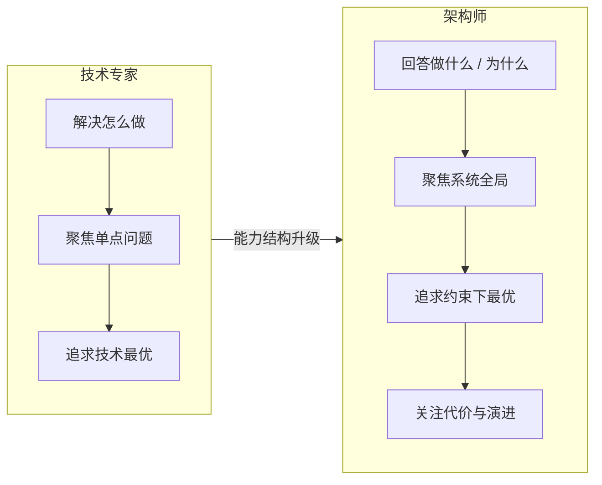
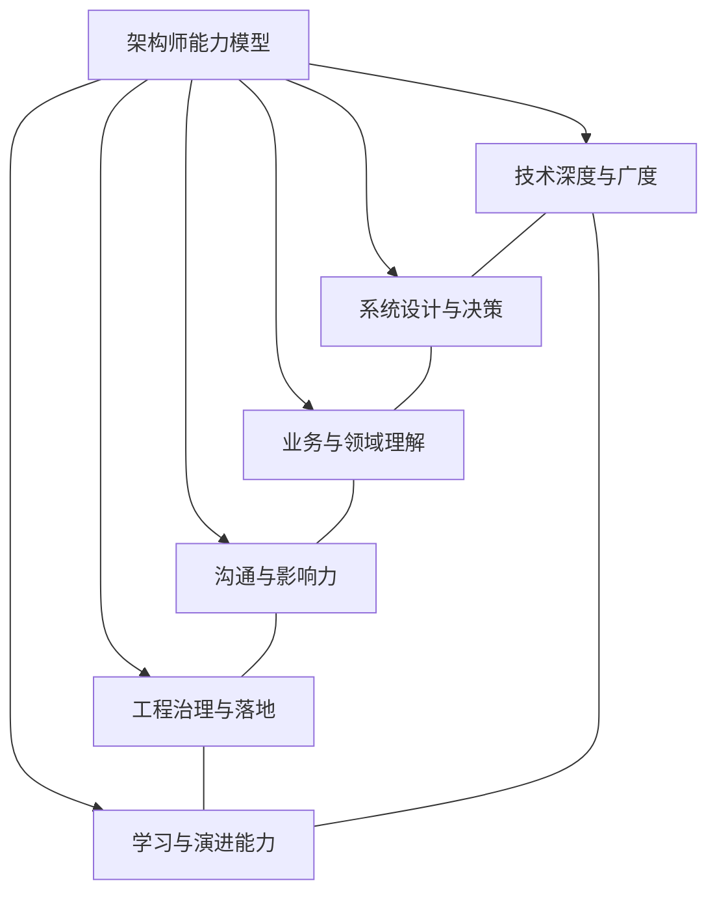

# 架构师能力模型：从写代码到做决策

> 本文是「架构设计」板块的第 2 篇。  
> 适合人群：3～8 年开发者、技术负责人、架构师预备役。  
> 关键词：架构师能力、技术决策、系统设计、沟通协作、职业成长。

---

上一篇我们聊了“架构到底是什么”。

结论是：架构不是技术栈，不是微服务，不是几张图，而是**在约束下做出的一组关键决策**。

那问题来了：

**谁来做这些决策？**

答案通常是架构师。  
但架构师到底需要什么能力？是不是技术最强的人就能当架构师？是不是把微服务、DDD、高并发都背熟就够了？

显然不是。

很多技术很强的人，转架构师时会遇到一个尴尬：

- 代码写得很好，但不知道怎么拆系统；
- 对框架很熟，但说不清业务目标；
- 能解决具体问题，但做不了跨团队决策；
- 技术方案很漂亮，但推不动、落不了地。

这说明，从开发者到架构师，不是简单的“技术升级”，而是一次**能力结构的变化**。

这篇文章，我想给出一份可落地的架构师能力模型。

---

## 一、先破一个误区：架构师不是“超级程序员”

很多人以为：

> 架构师 = 写代码最厉害的人 + 会画图 + 懂很多技术。

这个理解太窄了。

架构师当然需要技术功底，但技术只是底座。真正决定架构师价值的，是另外几件事：

- 能不能识别真正重要的问题？
- 能不能在多个方案中做出取舍？
- 能不能让团队理解并执行决策？
- 能不能让系统在变化中持续演进？

所以，架构师更像一个**技术决策者、系统设计者和协作推动者**，而不是单纯的技术专家。

技术专家解决“怎么做”；  
架构师还要回答“做什么、为什么做、代价是什么、什么时候不做”。

**图 1：从技术专家到架构师——不是技术升级，而是能力结构变化**

---

## 二、架构师能力模型的六个维度

我把它总结为六个维度：

1. 技术深度与广度
2. 系统设计与决策
3. 业务与领域理解
4. 沟通与影响力
5. 工程治理与落地
6. 学习与演进能力

这六个维度不是孤立的，而是相互支撑。

**图 2：架构师能力模型六维度**

下面逐个展开。

---

## 三、维度一：技术深度与广度

### 1. 深度：至少有一到两个看家领域

架构师不需要在所有技术上都比团队强，但必须有一到两个领域足够深。

比如：

- 高并发与性能优化
- 分布式与一致性
- 数据架构与存储
- 云原生与基础设施
- 安全与稳定性

深度带来的是什么？

**判断力。**

当团队说“上 Redis 就能解决”时，你能看出缓存穿透、雪崩、一致性、成本问题；  
当团队说“用 Kafka 解耦”时，你能判断消息可靠性、顺序性、重复消费、积压风险。

没有深度，架构师很容易被技术名词带偏。

### 2. 广度：知道技术全景和边界

广度不是“什么都会一点”，而是知道：

- 这类问题通常有哪些解法？
- 每种解法的适用场景和代价是什么？
- 什么时候该用，什么时候不该用？

比如分布式事务：

- 2PC：强一致，但性能和可用性差；
- TCC：灵活，但业务侵入大；
- 本地消息表：简单可靠，但依赖数据库；
- Saga：适合长流程，但补偿逻辑复杂；
- 最终一致 + 对账：适合支付、订单等场景。

架构师不一定要亲手实现每个方案，但必须能说清它们的取舍。

### 3. 技术判断力的三个问题

面对任何技术选型，先问：

1. 它解决什么问题？
2. 它的代价是什么？
3. 我们当前阶段真的需要它吗？

这三个问题，能过滤掉 80% 的“为了技术而技术”。

---

## 四、维度二：系统设计与决策

这是架构师的核心能力。

### 1. 从需求到架构

架构师要能把模糊需求翻译成系统设计。

过程通常是：

1. 识别利益相关者和目标；
2. 明确质量属性；
3. 找出约束；
4. 划分边界；
5. 设计交互与数据；
6. 评估方案与代价；
7. 记录决策；
8. 推动落地与演进。

这套流程听起来简单，但每一步都需要大量实践。

**图 3：从需求到架构的决策流程**

### 2. 决策能力：没有完美方案，只有权衡

架构师每天面对的都是权衡：

- 一致性 vs 可用性
- 性能 vs 成本
- 交付速度 vs 技术债
- 解耦 vs 复杂度
- 标准化 vs 灵活性
- 自研 vs 采购

好的架构师不会说“这个方案最好”，而会说：

> 在当前约束下，我选择 A，因为它满足 X 和 Y，代价是 Z；  
> 如果未来约束变成 W，我们需要重新评估。

### 3. 决策记录：ADR

架构师必须学会写 ADR（Architecture Decision Record）。

一个简单的 ADR 包括：

- 编号与状态
- 背景
- 决策
- 替代方案
- 后果
- 重新评估条件

ADR 的价值不是形式，而是：

- 让决策可追溯；
- 让新人快速理解上下文；
- 让未来演进有依据。

### 4. 架构图能力

推荐掌握 C4 模型：

- Context：系统与外部的关系
- Container：应用、服务、数据库、消息队列
- Component：服务内部组件
- Code：类图（通常不画）

架构图的目标不是好看，而是**让不同角色快速理解系统**。

---

## 五、维度三：业务与领域理解

很多技术出身的人容易忽略这一点：

**架构是服务业务的，不是服务技术的。**

### 1. 理解业务目标

业务要增长、要降本、要合规、要快速试错，架构策略完全不同。

- 增长期：优先扩展性和交付速度；
- 成熟期：优先稳定性和成本；
- 合规期：优先安全和审计。

### 2. 理解领域模型

推荐学习 DDD（领域驱动设计）：

- 战略设计：限界上下文、上下文映射、领域划分；
- 战术设计：实体、值对象、聚合、领域事件、仓储。

DDD 最大的价值不是“怎么写代码”，而是**怎么划分业务边界**。

### 3. 理解组织与架构的关系

康威定律说：

> 系统架构会反映组织的沟通结构。

如果团队按业务能力划分，系统也更容易按业务能力拆分。  
如果团队边界混乱，系统边界通常也会混乱。

架构师必须理解组织，才能设计出可落地的架构。

---

## 六、维度四：沟通与影响力

这是最容易被低估的能力。

架构师的工作，很大一部分是：

- 和业务对齐目标；
- 和开发讨论方案；
- 和运维确认部署；
- 和安全评审风险；
- 和管理层汇报取舍。

### 1. 技术方案要讲人话

对业务说价值，对开发说边界，对运维说稳定性，对老板说成本和风险。

同一套架构，不同角色关心点不同。

### 2. 推动共识，而不是强行推广

架构师没有绝对权力，更多靠影响力。

影响力来自：

- 技术判断力；
- 对业务的理解；
- 沟通的清晰度；
- 过往的成功记录；
- 愿意倾听和调整。

### 3. 处理冲突

架构评审中经常有冲突：

- 开发想用新技术，运维想稳定；
- 业务想快，安全想严；
- 老板想省钱，团队想扩人。

架构师不是裁判，而是**帮助大家看清代价和收益的人**。

---

## 七、维度五：工程治理与落地

架构不能只停留在 PPT。

### 1. 推动落地

架构师要关注：

- 接口契约是否统一；
- 服务边界是否被遵守；
- 数据所有权是否清晰；
- 监控、日志、链路是否到位；
- 发布、回滚、降级是否可行。

### 2. 技术债管理

技术债不是坏事，关键是要**有意识地借，有计划地还**。

架构师要能识别：

- 哪些债可以暂时欠；
- 哪些债会拖垮系统；
- 什么时候必须还。

### 3. 架构评审

架构评审不是挑刺，而是提前发现风险。

评审清单可以包括：

- 业务目标是否清晰？
- 质量属性是否可度量？
- 边界是否合理？
- 数据一致性怎么保证？
- 故障场景怎么处理？
- 安全合规是否满足？
- 成本是否可控？
- 演进路线是否明确？

### 4. 可观测性与稳定性

现代架构师必须懂：

- Metrics、Logging、Tracing；
- SLO/SLI/Error Budget；
- 限流、熔断、降级、隔离；
- 混沌工程与故障演练。

架构不是画完就结束，而是要在运行中验证。

---

## 八、维度六：学习与演进能力

技术变化很快，架构师必须持续学习。

但学习不是追新，而是：

- 建立知识体系；
- 关注底层原理；
- 从案例中提炼模式；
- 在实践中验证判断。

### 1. 建立知识地图

可以按这些主题组织：

- 架构风格：分层、微核、事件驱动、微服务、Serverless；
- 质量属性：性能、可用、安全、成本、可维护；
- 数据架构：存储、缓存、消息、一致性；
- 云原生：容器、K8s、Service Mesh、Serverless；
- 方法论：DDD、C4、ATAM、ADR、演进式架构。

### 2. 从案例中学习

不要只看成功案例，更要看失败案例。

问：

- 它当时的约束是什么？
- 为什么这么设计？
- 代价是什么？
- 如果换成我，会怎么做？

### 3. 输出倒逼输入

写文章、做分享、画架构图、写 ADR，都是很好的学习方式。

教是最好的学。

---

## 九、架构师的成长阶段

可以粗略分为四个阶段：

**图 4：架构师成长四阶段**

### 阶段一：开发者

- 关注代码质量、模块设计；
- 能独立完成功能；
- 开始理解系统整体。

### 阶段二：技术负责人

- 负责一个模块或服务；
- 能做局部技术选型；
- 开始带人、协调资源。

### 阶段三：架构师

- 负责一个系统或领域；
- 能做跨团队决策；
- 关注质量属性、演进、治理。

### 阶段四：首席架构师/技术总监

- 负责企业级架构；
- 关注战略、组织、成本、合规；
- 推动技术文化与治理体系。

每个阶段的核心能力不同，不能跳级。

---

## 十、如何训练架构能力

### 1. 从现有系统开始

不要一上来就设计新系统。先研究你正在维护的系统：

- 它为什么这么设计？
- 有哪些痛点？
- 如果重来，你会怎么改？
- 改动的代价是什么？

### 2. 做方案对比

针对一个问题，至少写三个方案：

- 方案 A：简单但扩展差；
- 方案 B：复杂但弹性好；
- 方案 C：折中。

然后写清楚每个方案的适用场景和代价。

### 3. 写 ADR

从今天开始，为你做的每个重要技术决策写 ADR。

哪怕只有一页，也能极大提升你的架构思维。

### 4. 画 C4 图

选一个你熟悉的系统，画：

- Context 图
- Container 图
- Component 图

画完你会发现，很多边界问题之前根本没想清楚。

### 5. 做架构评审

找同事一起评审你的设计，主动邀请不同角色：

- 开发
- 测试
- 运维
- 安全
- 业务

不同视角会暴露不同风险。

### 6. 复盘真实故障

每次故障都是学习架构的好机会。

问：

- 哪个假设错了？
- 哪个边界没划清？
- 哪个质量属性被忽略了？
- 架构需要怎么调整？

---

## 十一、架构师能力自检清单

你可以用下面 20 个问题自检：

**技术**
1. 我是否有至少一个技术深度领域？
2. 我是否了解常见架构风格及适用场景？
3. 我是否能说清至少三种分布式事务方案的取舍？
4. 我是否理解缓存、消息队列、数据库的核心原理？
5. 我是否懂可观测性三件套？

**设计**
6. 我能否从需求推导出质量属性？
7. 我能否划分系统边界并说明理由？
8. 我是否会写 ADR？
9. 我是否会画 C4 图？
10. 我能否评估架构方案的代价和风险？

**业务**
11. 我是否理解所在业务的商业模式？
12. 我是否能用 DDD 划分领域边界？
13. 我是否理解组织架构对系统架构的影响？

**协作**
14. 我能否向非技术人员讲清架构方案？
15. 我能否推动跨团队共识？
16. 我能否处理架构评审中的冲突？

**治理**
17. 我是否关注技术债管理？
18. 我是否做过架构评审？
19. 我是否推动过架构落地和演进？
20. 我是否持续学习和输出？

如果大部分问题你能清晰回答，你已经具备架构师的基础。

---

## 十二、总结

架构师能力模型，可以用一句话概括：

**以技术为底座，以决策为核心，以业务为导向，以协作为手段，以演进为目标。**

从写代码到做决策，不是放弃技术，而是从“实现者”变成“设计者”和“推动者”。

你不需要等 title 变成架构师才开始学架构。  
从今天起，对你做的每个技术决策多问一句：

- 为什么这么做？
- 代价是什么？
- 未来怎么变？

当你开始这样思考，你就已经在成为架构师的路上了。

---

**上一篇**：《架构到底是什么：从代码、约束到关键决策》  
**下一篇预告**：《质量属性：功能之外，架构真正关心什么》  
**相关阅读**：架构决策记录、C4 模型、DDD、演进式架构、康威定律  
**建议标签**：架构师、能力模型、技术决策、职业发展、系统设计  
**建议 Slug**：architect-competency-model
