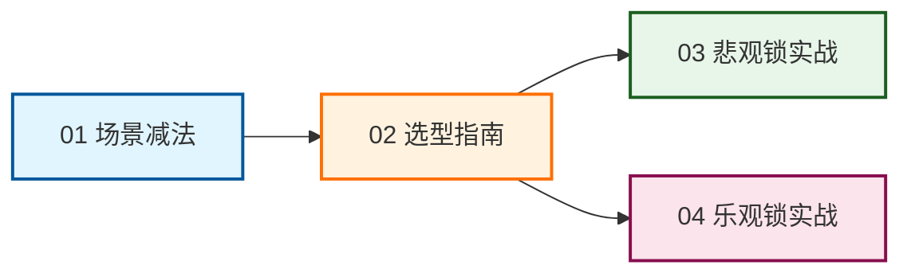

### 并发控制实战系列：从“做减法”到“高并发攻防”

欢迎来到并发控制系列总览。在分布式系统与高并发架构中，并发控制往往是决定系统性能与数据一致性的关键命门。本系列文章将带你从理论选型走向生产实战，构建完整的并发控制知识闭环。

#### 系列导航图

---

#### 01 | 什么场景不需要并发控制？

**核心主题**：架构做减法，拒绝过度设计。  
**内容摘要**：在系统设计中，我们往往过度关注“如何加锁”，却忽略了“何时不该加锁”。本篇梳理了 7 类无需显式并发控制的典型场景（如纯只读查询、仅追加的日志表、单线程任务等），帮助开发者在架构设计初期就剔除不必要的锁开销，让系统轻装上阵。

#### 02 | 并发控制选型指南：悲观锁、乐观锁与 MVCC 的实战抉择

**核心主题**：理论基石，场景化选型决策。  
**内容摘要**：当并发冲突不可避免时，该如何选择武器？本篇深度剖析了悲观锁、乐观锁以及现代数据库底层 MVCC 的核心机制与适用疆界，并提供了一套基于“冲突频率、临界区耗时、一致性要求”的实战选型决策矩阵，助你在性能与一致性之间找到最佳平衡。

#### 03 | 悲观锁实战：用 MySQL 模拟死锁场景并演示排查过程

**核心主题**：防御至上，死锁的复现与根治。  
**内容摘要**：悲观锁虽能保障强一致性，但使用不当极易引发死锁。本篇通过经典的“交叉转账”场景，手把手演示如何利用 MySQL 复现死锁，并借助 `SHOW ENGINE INNODB STATUS` 进行精准排查。最终给出了“统一加锁顺序”这一打破循环等待的根治方案。

#### 04 | 乐观锁实战：高并发下 CAS 重试风暴的监控与降级策略

**核心主题**：拥抱并发，重试风暴的监控与优雅降级。  
**内容摘要**：乐观锁在极端高并发下容易陷入“重试风暴”，导致 CPU 飙升。本篇探讨了如何通过监控重试率让系统“有感知”，并设计了从乐观锁平滑降级为悲观锁/原子 SQL 的防御策略。同时，提出了避免“读-改-写”贫血模型的终极优化方案，从根本上消除无效重试。

---

**阅读建议**：建议按照 01 -> 02 -> 03/04 的顺序阅读。先建立“不盲目加锁”的架构思维，再掌握选型方法论，最后通过两篇实战文章深入理解锁机制在生产环境中的“坑”与“解法”。

---

要不要我把这四篇加上系列总览，一起打包成一份 GitHub README 风格的文档，方便你直接发布？